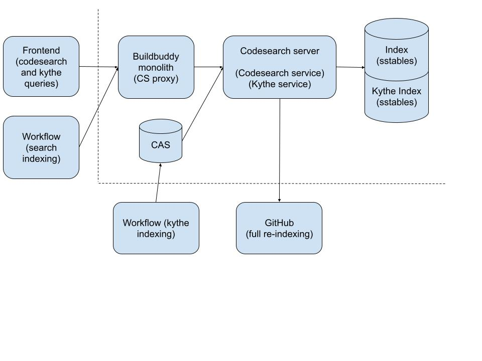

# Introduction

This directory contains the majority of the code used to support codesearch through BuildBuddy.
Codesearch features are accessible through the UI via the "Search" and "Code" sections in the app.
(These options are currently only visible if your organization is enrolled in an experiment, and
codesearch is enabled for your organization.)

# Architecture

Here is a rough high level architecture diagram:


The components of the BuildBuddy architecture which are relevant to search are:

1. Search indexer: indexes documents for efficient regex search querying
2. Search query service: returns ranked document matches for regex search queries
3. Kythe indexer: produces annotation graphs describing the relationships between different code
   entities
4. Kythe query service: queries the annotation graph to return information about related entities
5. Buildbuddy workflow actions: automated jobs that run the search and kythe indexers
6. Frontend: UI code to support searching, browsing, and navigating code
7. Buildbuddy monolith: Mainly acts as a proxy for search/kythe queries

# Search Indexer and Query Service

The index creation and query code is heavily based on Russ Cox's
[codesearch implementation](https://github.com/google/codesearch).

Additionally, this implementation uses "sparse ngrams" for some fields. Sparse n-grams are
essentially a method to index a deterministic subset of n-grams wth `n` > 3. This allows
significantly more efficient querying in some cases, at the cost of modest index size increase.
(See note #3 in
[GitHub's codesearch blog post](https://github.blog/engineering/architecture-optimization/the-technology-behind-githubs-new-code-search/)
for a bit more background.)

The indices themselves are stored in a [pebble](https://pkg.go.dev/github.com/cockroachdb/pebble)
DB, which is a [LSMT](https://en.wikipedia.org/wiki/Log-structured_merge-tree).

Documents in the index can be composed of multiple fields, and each field is indexed separately.
Different fields can use different tokenization strategies (keyword, trigram, sparse ngram).
Additionally, fields can be "stored", in which case the full text of the field is stored
alongside the indexing information. Field storage is generally required for trigram/ngram fields,
in order to support precise matching, accurate ranking, and snippetting.

The entries in the index generally map from (namespace, field type, ngram, field) -> set of
matching document ids. The matching document ids are stored in 64-bit
[roaring bitmaps](https://roaringbitmap.org/about/) for efficient retrieval and intersection.
(Note: we haven't benchmarked between roaring bitmaps and the more traditional N-way laddered
intersection algorithm that relies on iterator seeking to minimize disk access - the latter
would likely outperform roaring bitmaps for queries with varied posting list sizes).

Querying the indices is a very close port of Russ Cox's regex->trigram algorithm. See
[his post](https://swtch.com/~rsc/regexp/regexp4.html) for the full detail.

The index itself can be queried with [s-expressions](https://en.wikipedia.org/wiki/S-expression).
The following grammar is supported:

```lisp
	(:eq fieldName "ngram") # Find matches for "ngram" in fieldName. Example: (:eq filename ".go")
	(:none)                 # Match nothing.
	(:all)                  # Match everything.
	(:and expr1 ... exprN)  # Find the intersection of matches from expr1 through exprN.
	(:or expr1 ... exprN)   # Find the union of matches from expr1 through exprN.
```

Some example queries:

```lisp
	(:and (:eq filename "ted") (:eq filename "dis"))
	(:and (:and (:eq content "=ba") (:eq content "foo") (:eq content "o=b") (:eq content "oo=")) (:or (:eq content "bar") (:eq content "baz")))
	(:all)
```

User queries are transformed from regular expression queries to s-expressions using a very close
port of [Russ Cox's algorithm](https://swtch.com/~rsc/regexp/regexp4.html). Most of this code
lives in [regexp_query.go](query/regexp_query.go) and [regex.go](query/regexp.go).

The index and query services are available via a [gRPC service](//proto/codesearch_service.proto).
This service is available directly on the [Codesearch server](cmd/server/server.go), and is also
proxied through the [Buildbuddy service](//proto/buildbuddy_service.proto).

Additionally, there is a [command-line tool](cmd/cli/cli.go) which can be used for local
experimentation.

## Indexing Workflow

When Codesearch is enabled, the indices are updated incrementally via a
[workflow](//enterprise/server/workflow/config/config.go). The codesearch server stores the most
recently indexed commit. The workflow computes a diff between the current commit and the indexed
commit, and sends the content of the added/modified/deleted files to the codesearch server.

This setup is slightly awkward, but was designed to prevent the Codesearch server itself from
needing to access remote repositories.

# Kythe Indexing and Query Service

[Kythe](https://kythe.io/) ([GitHub](https://github.com/kythe/kythe)) is an open-sourced version of the technology that powers code navigation in Google's
internal codesearch tool. Reading the [Kythe overview](https://kythe.io/docs/kythe-overview.html)
first is recommended.

We generate Kythe annotations during a [workflow](//enterprise/server/workflow/config/config.go), ingest them into the Codesearch server, and use them to answer queries to the `KytheProxy`
operation in the [Codesearch service](//proto/codesearch_service.proto).

The main Kythe repo is effectively unmaintained. We use a
[forked version](https://github.com/buildbuddy-io/kythe). For the most part, this version doesn't
contain any BuildBuddy-specific code. See below for instructions on modifying and releasing a new
version of this repo.

The best reference for running Kythe extraction and indexing is in the
[workflow definitions](//enterprise/server/workflow/config/config.go).

The [Kythe schema reference](https://kythe.io/docs/schema/) is invaluable if you need to work with
the Kythe data. It is intimidatingly long, however we typically only care about a small subset of
the edge and node types.

Kythe data can be queried via the `KytheProxy` operation on the
[Codesearch service](//proto/codesearch_service.proto). The Kythe protos can be found in the
[Kythe repo](https://github.com/buildbuddy-io/kythe/tree/master/kythe/proto).

## Frontend

Virtually all of the relevant frontend code lives in [code_v2.tsx](//enterprise/app/code/code_v2.tsx) (code browsing), and [codesearch.tsx](//enterprise/app/codesearch/codesearch.tsx).

# Current State and Future work

## Codesearch

The codesearch implementation has no explicit known bugs, but is also relatively immature.
Query and index performance have been evaluated, but not tested at significant scale.

Areas that deserve additional attention:

1. Result ranking. Currently this uses [BM25](https://en.wikipedia.org/wiki/Okapi_BM25), but
   significant domain-specific improvements could be made here - everything from heuristic based
   weighting to rank test files lower, to page-rank-esque algorithms using Kythe data to rank
   definitions and popular usages higher.
2. Scaling. It's unclear how far the current deployment will scale. The current architecture would
   support query service (but not index service!) replication without many (any?) changes. The
   architecture could, in theory, support index sharding to distribute query and indexing load,
   however this would be a significant project that would bring all the usual
   large-scale-distributed-system challenges, and should probably only be undertaken if clearly
   necessary. Depending on usage patterns, a simpler alternative might be to partition
   based on Buildbuddy organizations, altough this would deviate from the general desire for a
   multi-tenant architecture.
3. Search result quality measuring and monitoring. See the
   [POC ratings harness](test/quality/README.md) for some ideas here.

## Kythe

Kythe is effectively unmaintained. It supports extraction for C++, Java, Go, Typescript, and protos.
It supports indexing for C++, Java, protos, and Go (although Go does not yet support navigation
to/from generated code). The Kythe repo has a
[Typescript indexer](https://github.com/buildbuddy-io/kythe/tree/master/kythe/typescript), but it
is not included in the release and is of unknown quality.

Immediate Kythe TODOs would include:

- Support proto<->Go navigation. This includes plumbing the required argument to `protoc`, and build
  system changes to support the extra metadata file output. It may also include Go indexer changes.
  See [Kythe generated code docs](https://kythe.io/docs/schema/indexing-generated-code.html) for
  general background on how linking generated code works.
- Test/finish the Typescript indexer.
- Make the Kythe workflow work on a wider range of repositories by supporting custom build setup
  steps. See this [POC](https://github.com/buildbuddy-io/buildbuddy/pull/9743) for one idea on how
  to do this.

Beyond that, Kythe itself is unwieldy. It requires very deep integration with compilers and the
build system. This means that new language support is very heavyweight, and would likely not be
added organically by the community. Indexing can also be slow and compute/storage intensive. Kythe
indices also can't be updated incrementally. This means the Kythe indices are often not up to date
with the Codesearch indices, so for fast-changing codebases, the Kythe data will often be useless.

There are alternative technologies:

- [Treesitter](https://tree-sitter.github.io/tree-sitter/) is used
  by GitHub. It is parser-based, and so will never achieve the same accuracy as Kythe. However, it
  is faster, supports incremental indexing, has much broader language support, is actively
  developed, and seems to have good community support (many third-party language bindings exist).

- [SCIP](https://github.com/sourcegraph/scip) is Sourcegraph's open-source protocol for indexing
  source code, with a primary goal of "supporting code navigation at the fidelity of
  state-of-the-art IDEs". This seems less mature (at least in the open-source domain) than
  Treesitter, and is a bit lower level.

The most promising idea we have so far is a Kythe/Treesitter hybrid approach - run Treesitter
on everything, but use Kythe annotations if/when they are available.

# Example Usages

## Index a directory (CLI)

```bash
  # Index the ~/buildbuddy directory.
  $ bazel build codesearch/cmd/cli && time bazel-bin/codesearch/cmd/cli/cli_/cli index --index_dir=/tmp/csindex ~/buildbuddy
```

## Search the index (CLI)

```bash
  # Search (w/ a regex)
  $ bazel build codesearch/cmd/cli && time bazel-bin/codesearch/cmd/cli/cli_/cli search --index_dir=/tmp/csindex "className=\.*"
```

## Run a codesearch server

```bash
  $ bazel run codesearch/cmd/server -- \
    --codesearch.index_dir=/tmp/csindex/ \
    --codesearch.scratch_dir=/tmp/csscratch \
    --codesearch.remote_cache=grpcs://remote.buildbuddy.dev \
    --auth.remote.target=grpcs://remote.buildbuddy.dev \
    --auth.jwt_key=SET_THIS_TO_THE_DEV_JWT_KEY \
    --monitoring.listen=0.0.0.0:9999
```

## Index some code (server)

```bash
  $ grpc_cli call --metadata x-buildbuddy-api-key:YOUR_DEV_API_KEY localhost:2633 codesearch.service.CodesearchService.Index 'git_repo:<repo_url:"https://github.com/buildbuddy-io/buildbuddy"> repo_state:<commit_sha:"master">'
  #
  # grpcurl version:
  $ grpcurl -plaintext -H "x-buildbuddy-api-key:YOUR_DEV_API_KEY" -d '{"git_repo": {"repo_url":"https://github.com/buildbuddy-io/buildbuddy"}, "repo_state": {"commit_sha":"master"}, "replacement_strategy": 1}' localhost:2633 codesearch.service.CodesearchService.Index
```

## Perform a Search (server)

```bash
  $ grpc_cli call --metadata x-buildbuddy-api-key:YOUR_DEV_API_KEY localhost:2633 codesearch.service.CodesearchService.Search 'query: <term: "package codesearch">'
  #
  # grpcurl version:
  $ grpcurl -plaintext -H "x-buildbuddy-api-key:YOUR_DEV_API_KEY" -d '{"query": {"term": "package codesearch"}}' localhost:2633 codesearch.service.CodesearchService.Search
```

## Index Kythe annotations (server)

```bash
  # go find a recent workflow run of the "Generate CodeSearch Index" workflow on dev
  # and copy the digest of the `kythe_serving.sst` file from the `Artifacts` tab
  $ grpc_cli call --metadata x-buildbuddy-api-key:YOUR_DEV_API_KEY localhost:2633 codesearch.service.CodesearchService.IngestAnnotations 'sstable_name: <digest: <hash:"YOUR_HASH" size_bytes:100000> cache_type: CAS>'
  #
  # grpcurl version:
  $ grpcurl -plaintext -H "x-buildbuddy-api-key:YOUR_DEV_API_KEY" -d '{"sstable_name": {"digest": {"hash":"YOUR_HASH", "size_bytes":1000000}, "cache_type":"CAS"}}' localhost:2633 codesearch.service.CodesearchService.IngestAnnotations
```

## Fetch Kythe annotations (server)

```bash
  $ grpc_cli call --metadata x-buildbuddy-api-key:YOUR_DEV_API_KEY localhost:2633 codesearch.service.CodesearchService.KytheProxy 'decorations_request: <location: <ticket:"kythe://buildbuddy?path=proto/spawn_diff.proto"> references:true target_definitions:true semantic_scopes:true diagnostics:true>'
  #
  # grpcurl version:
  $ grpcurl -plaintext -H "x-buildbuddy-api-key:YOUR_DEV_API_KEY" -d '{"decorations_request":{"location": {"ticket":"kythe://buildbuddy?path=proto/spawn_diff.proto"}, "references":true, "target_definitions": true, "semantic_scopes": true, "diagnostics": true}}' localhost:2633 codesearch.service.CodesearchService.KytheProxy
```

## Running Kythe

1. Download the latest
   [BuildBuddy Kythe pre-release](https://github.com/buildbuddy-io/kythe/releases), extract it, and set an environment variable (`KYTHE_DIR`) pointing to the extracted directory.
2. Build with a command something like this:

   ```
   bazel --bazelrc=$KYTHE_DIR/extractors.bazelrc build --override_repository kythe_release=$KYTHE_DIR //...
   ```

   See the [Kythe indexing workflow](//enterprise/server/workflow/config/config.go) for more detail.

## Exploring Kythe annotation data directly

These commands require the Kythe leveldb tables (`kythe_tables` from the workflow), not the
sstables. This generally requires you to have run Kythe extraction yourself. (Currently, only the
sstables are uploaded by the workflows). However, if you need to debug or deeply explore the Kythe
data, this can be the most efficient way.

Note that you can also perform all these operations through the Codesearch KytheProxy service,
it can just be a bit more cumbersome.

The general process for exploring is:

1. Use `ls -uris` iteratively to find the URI for the file you are interested in
2. Use `decor` to find the URI for the specific line/anchor/ticket you are interested in
3. Use a combination of `xrefs` and `edges` to track down the specific link or data you are looking
   for.

```bash
# List the top-level file/dir nodes
$KYTHE_DIR/tools/kythe -api kythe_tables ls -uris

# List files in the enterprise/server/backends path.
$KYTHE_DIR/tools/kythe -api kythe_tables ls -uris kythe://buildbuddy?path=enterprise/server/backends

# List the file decorations for interfaces.go
$KYTHE_DIR/tools/kythe -api kythe_tables decor kythe://buildbuddy?path=server/interfaces/interfaces.go

# Get the xrefs for a specific ticket from interfaces.go
# Note there are many options for the `xrefs` command - see the help
$KYTHE_DIR/tools/kythe -api kythe_tables xrefs kythe://buildbuddy?lang=go?path=server/interfaces/interfaces?root=bazel-out/bin#type%20HttpServeMux

# Get the edges for a specific ticket. This can be useful when deeper data about a node
# is needed than what you can get from xrefs.
# Note there are many options for the `edges` command - see the help
$KYTHE_DIR/tools/kythe -api kythe_tables edges kythe://buildbuddy?lang=go?path=codesearch/index/index?root=bazel-out/bin#type%20Writer

# See the facts about a particular node. Note this tends to have less useful data than you'd think.
$KYTHE_DIR/tools/kythe -api kythe_tables nodes kythe://buildbuddy?lang=go?path=codesearch/index/index?root=bazel-out/bin#type%20Writer
```
