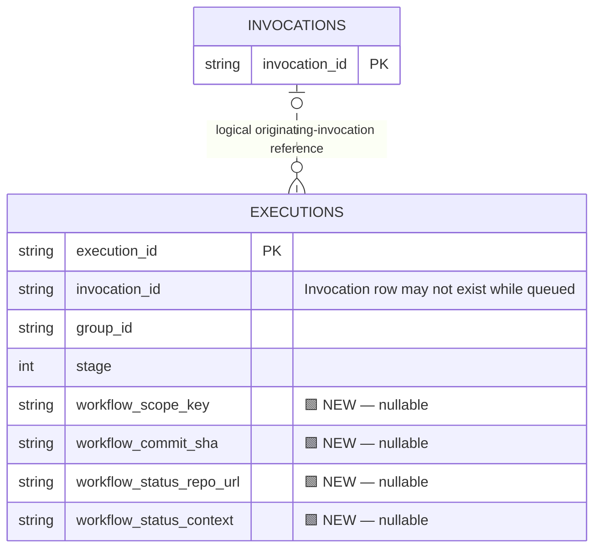
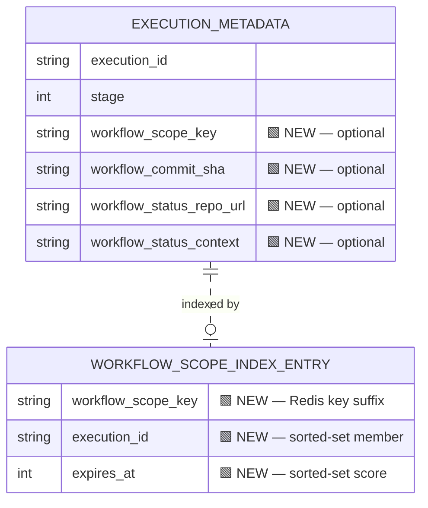

# Proposal: cancel superseded workflows before they start executing

When a newer workflow run supersedes an older run for the same repository, branch, and action, an older run that is still queued can escape cancellation and subsequently execute.

This is a design proposal for feedback before implementation.

## Problem and reproduction

We reproduced the behavior against `aa9fbfa3b8`:

1. Occupy an executor so workflow actions must wait in its local queue.
2. Queue a workflow for commit A.
3. Queue the same workflow action for a newer commit B on the same branch.
4. Release executor capacity.

The older scheduler task remained valid, and both commits executed.

The workflow service allocates an invocation ID before enqueueing. However, `cancelInProgressWorkflowsOnSameBranch` discovers cancellation candidates through `IN_PROGRESS` invocation records. Those records are created after the CI runner starts, so queued runs are absent from the search.

## Proposed design

Preserve the workflow cancellation scope and GitHub status-routing metadata when the execution is created, before scheduling it. Support both primary-database and Redis-backed execution metadata.

Add an optional `workflow_scope_key`, computed from a versioned, unambiguous encoding of:

- Group ID
- Repository URL, using the existing cancellation scope
- Pushed branch
- Workflow action name

A fixed-size hash provides a compact equality-lookup key. It does not include the commit SHA, because successive commits must match the same scope.

Also retain the information needed to report cancellation before the runner starts:

- `workflow_commit_sha`: the commit whose status was published.
- `workflow_status_repo_url`: the repository receiving the GitHub status, following existing fork/reporting rules.
- `workflow_status_context`: the context used for the original "Queued" status.

Ordinary, non-workflow executions leave these fields unset. Credentials continue to come from existing workflow authentication; no credentials are added to execution metadata.

When a replacement workflow is successfully scheduled, use the scope key to discover superseded unfinished executions and cancel them through the existing cancellation path. Preserve the configured concurrency exceptions, including the default-branch policy.

## SQL changes

Add the optional workflow fields to `Executions`, with an index on `(workflow_scope_key, stage)`.

In the diagrams, **🟩 marks additions**. No existing columns change. Only relevant existing fields are shown.

🟩 **New index:** `(workflow_scope_key, stage)`.

The invocation relationship is logical; this proposal does not add a foreign-key constraint. The existing action-merging link table is omitted from this simplified diagram.

## Redis changes

Add the same optional workflow fields to execution metadata and introduce a secondary index owned by `ExecutionCollector`, alongside its existing execution metadata and invocation links.

For each scope, use a Redis sorted set:

- **Key:** `workflowCancellationScope/<scope-key>`
- **Member:** execution ID
- **Score:** member expiry timestamp

`WORKFLOW_SCOPE_INDEX_ENTRY` represents a Redis sorted-set entry, not a SQL table.

Lookup would discard expired members, read the associated execution metadata, and exclude missing or completed executions. Completion and cancellation would remove index membership where their cleanup paths run. Per-member expiry provides a backstop for interrupted cleanup without retaining orphan entries indefinitely on frequently updated branches.

Expiry scores are for cleanup only; they do not establish commit or scheduling order.

## Cancellation compatibility

After successfully cancelling a queued execution, the cancellation path must tolerate the absence of its invocation row. Currently, it can delete the scheduler task and then return an error when attempting to mark the nonexistent invocation disconnected.

Execution and invocation records should retain their normal lifecycle. Deleting database rows is not the mechanism for cancelling scheduled work.

## GitHub status reporting

A workflow cancelled before startup cannot emit build events to replace its "Queued" status. The workflow service would therefore report the cancellation directly after confirming that the execution was cancelled.

For an older commit superseded by a different commit, publish:

- **Repository, SHA, and context:** those recorded for the cancelled run.
- **State:** `error`, consistent with BuildBuddy's existing cancellation reporting.
- **Description:** `Cancelled: superseded by a newer workflow run`.
- **Target URL:** the replacement workflow invocation.

BuildBuddy uses GitHub commit statuses, which do not have a separate `cancelled` state.

## Concurrency and rollout

The lookup must exclude the replacement run and respect the existing supersession policy. Concurrent scheduling and retries need explicit handling so a delayed older operation cannot cancel the intended replacement.

Existing executions without the new scope metadata would continue to rely on the existing cancellation lookup during rollout. The additional status-reporting behavior would apply where the required routing metadata is present.

## Validation

Regression coverage would verify:

- A superseded queued workflow loses its scheduler task and never executes after capacity becomes available.
- Its replacement remains runnable.
- Cancellation succeeds when no invocation row exists.
- Both SQL-backed and Redis-backed execution metadata support discovery.
- Different groups, repositories, branches, and actions remain isolated.
- Concurrency exceptions, concurrent scheduling, retries, and index cleanup behave correctly.
- A cancelled pre-start run receives a terminal status on the correct repository, SHA, and context.
- Failed or skipped cancellation does not produce a false terminal cancellation status.

A local regression already demonstrates the obsolete queued commit executing on the current code. Implementation validation would turn that regression green.

## Scope and feedback requested

This proposal addresses obsolete queued work escaping cancellation and the GitHub status of runs cancelled before startup.

It does not address immediate removal of stale executor-local reservations or an immediate reduction in displayed Queue Length. A cancelled task may remain locally queued until pruning or a failed lease attempt removes it, but it must not execute.

We would appreciate feedback on:

- Whether execution-owned workflow metadata and equivalent SQL/Redis indexes fit the existing storage architecture.
- The intended supersession ordering under concurrent scheduling.
- Whether the proposed GitHub status behavior matches the desired treatment of superseded runs.
