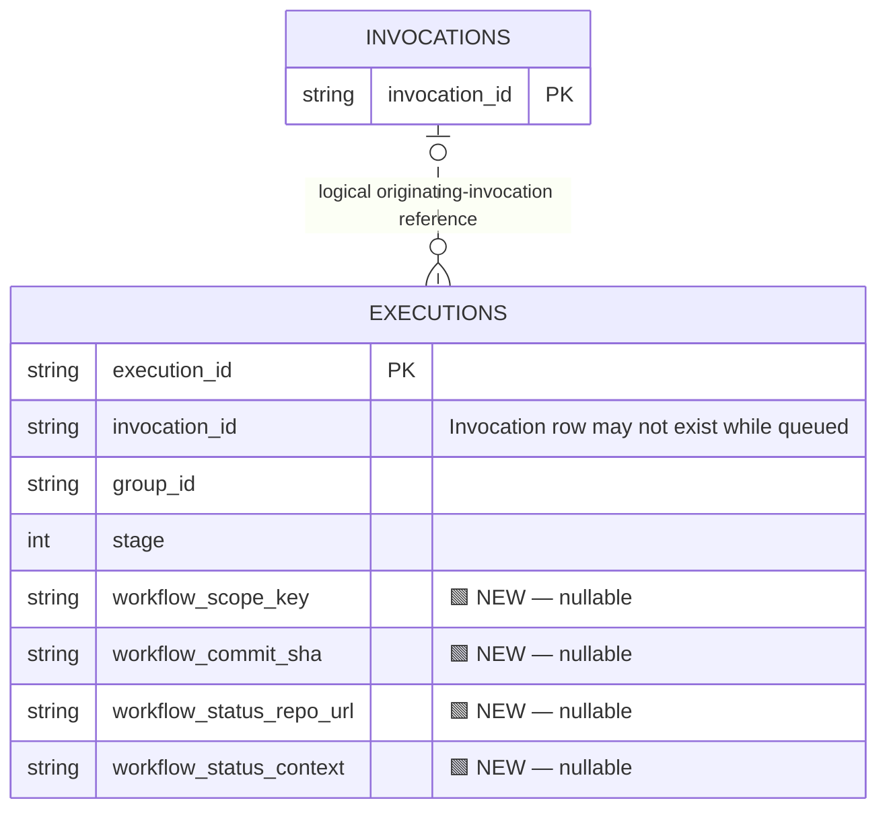
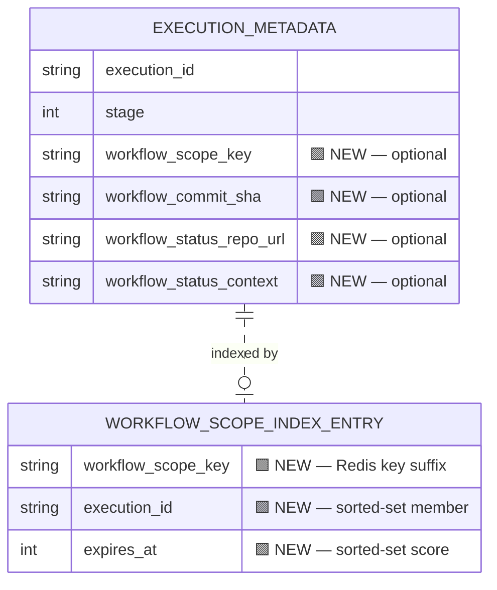

# Proposal: cancel superseded workflows before they start executing

**Proposal only — no implementation changes.** We want queued workflow runs to be cancelled when a newer run supersedes them, before they consume executor time.

## The problem

BuildBuddy finds superseded runs by searching `IN_PROGRESS` invocation records. A queued workflow already has an invocation ID, but its invocation row does not exist until the runner starts. The search therefore misses it.

We reproduced this against `aa9fbfa3b8`: keep an executor busy, queue commit A, then queue newer commit B for the same branch and action. After releasing capacity, **both commits executed**.

## Proposed fix

Make queued workflows discoverable through execution metadata, in both SQL-backed and Redis-backed configurations:

1. When creating a workflow execution, record a `workflow_scope_key`: a hash of **group + repository + pushed branch + action**.
2. When a replacement run is successfully scheduled, use that key to find superseded unfinished executions.
3. Cancel them through the existing cancellation path.

The key excludes the commit SHA so successive commits match. Existing concurrency settings, including the default-branch policy, still apply. The replacement itself must not be cancelled.

Also record the commit SHA, GitHub reporting repository, and status context so the workflow service can report cancellation if the runner never starts. All new fields are optional and unset for non-workflow executions.

## SQL changes

Add four fields to `Executions` and an index on **`(workflow_scope_key, stage)`**. **🟩 marks additions**; only relevant existing fields are shown.

The invocation relationship is logical, not a new foreign-key constraint.

## Redis changes

Add the same fields to execution metadata. In `ExecutionCollector`, add a sorted set per scope: `workflowCancellationScope/<scope-key>`. Members are execution IDs; scores are expiry timestamps.

The index entry above represents Redis data, not a SQL table. Lookup ignores expired, missing, or completed executions. Cleanup removes index entries, with per-member expiry covering interrupted cleanup. Expiry is not used to order runs.

## Handling cancellation before startup

Two small additions to the cancellation flow are needed:

- **Allow a missing invocation row.** Today, cancellation can delete the scheduler task and then return an error while trying to mark the nonexistent invocation disconnected.
- **Update GitHub directly.** After confirmed cancellation of an older commit, the workflow service reports `error` on that commit's recorded repository and status context, with the description `Cancelled: superseded by a newer workflow run` and a link to the replacement. This follows BuildBuddy's existing cancellation convention and avoids leaving the old status at "Queued".

## Validation and scope

The main regression should prove that queued commit A never executes after commit B supersedes it, while B remains runnable. Cover both storage configurations, missing invocation rows, GitHub status reporting, scope isolation, and concurrent scheduling/retries.

Existing runs without the new metadata retain the current cancellation lookup during rollout. Immediate cleanup of stale executor-local queue entries is outside this proposal.

**Feedback requested:** does extending execution metadata with these SQL and Redis indexes fit the existing architecture, and does the proposed cancellation reporting match the desired behavior?
