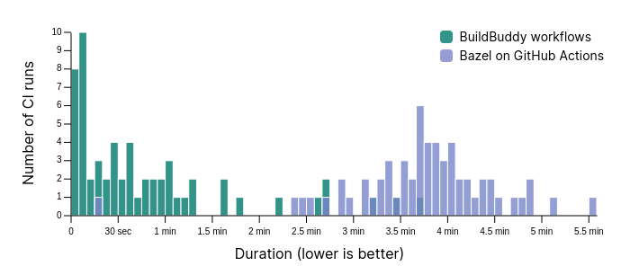

Traditional [CI systems](https://en.wikipedia.org/wiki/Continuous_integration), like Jenkins, Travis, CircleCI, and BuildKite, are built around the concept of a pipeline. Pipelines allow you to specify a list of build/test steps to run for each commit or pull request to your repo. Pipelines are great because you can run many in parallel across multiple machines. Unfortunately, there are often dependencies between these pipelines, for example a build step that must be completed before a test step can begin.

Some tools, like [GitLab Pipelines](https://docs.gitlab.com/ee/ci/pipelines/), attempt to solve this problem by allowing you to specify dependencies between pipelines. This approach is better, but forces you to manually maintain the relationships between pipelines in a pile of YAML configuration files. As the number of dependencies grow, any sufficiently complex CI system [starts to resemble a build system](https://gregoryszorc.com/blog/2021/04/07/modern-ci-is-too-complex-and-misdirected/).

None of these pipeline-based approaches are well suited for Bazel's approach to dependency management and remote build execution, which involves generating a [Directed Acyclic Graph](https://en.wikipedia.org/wiki/Directed_acyclic_graph) of all build and test actions. Bazel's approach allows for optimal parallelization and caching of these actions. It also enables rebuilding and retesting only affected targets, saving both engineering time and compute resources.

## Introducing a Bazel-focused CI Solution

BuildBuddy Workflows is a Continuous Integration (CI) solution for Bazel repositories hosted on GitHub (with support for other providers coming soon).

Like other CI solutions, Workflows give you the confidence that your code
builds successfully and passes all tests before you merge pull requests or
deploy a new release.

But because BuildBuddy Workflows were built for Bazel repos and tightly
integrated with BuildBuddy RBE and Remote Caching, they are **_really fast_**.

## How fast are BuildBuddy Workflows?

We've used BuildBuddy Workflows on our own repos for the past few
months, comparing them side-by-side with our existing CI solution built on GitHub Actions with BuildBuddy RBE and Remote Caching enabled.

By leveraging warm, hosted, Bazel processes, as well as BuildBuddy's
remote caching and execution, Workflows dramatically sped up our CI runs.
Compared to our previous solution (which used BuildBuddy RBE and Remote Caching on GitHub Runners), we reduced the median duration by nearly **8X** &mdash; with most CI runs completing in just a few seconds.

This overlapping histogram chart shows the complete picture. Note that
the majority of BuildBuddy workflow runs took 30 seconds or less, while
nearly all runs on GitHub Actions took at least 2 minutes and 15 seconds:

## How did we make BuildBuddy Workflows so fast?

In addition to convenience and security, one of our main goals for Workflows
was to maximize performance, even for very large source repositories.

We did this in two main ways:

1. Ensuring a **fast network connection between Bazel and BuildBuddy's RBE & caching servers**.
2. Running workflows against **hosted, warm, Bazel instances**.

### Fast connection to BuildBuddy RBE

In our experience, network latency is often the biggest bottleneck in many Bazel Remote Build Execution and Remote Caching setups.

The solution here was simple: run Workflows on executors in the same datacenters where BuildBuddy RBE and Cache nodes are deployed.

With GitHub actions or other CI solutions, the network connection might
be fast (particularly after the recent network optimizations we made in
[BuildBuddy v2](https://blog.buildbuddy.io/blog/introducing-buildbuddy-v2)) &mdash; but not nearly as fast
as having workflow runners on the same local network as BuildBuddy
itself.

### Hosted, Warm, Bazel instances

Once you have a sufficiently fast RBE and Remote Caching setup, and have removed network bottlenecks &mdash; the CI bottleneck often becomes Bazel's [analysis phase](https://docs.bazel.build/versions/main/glossary.html#analysis-phase).

By re-using warm Bazel processes when possible, we're able to re-use Bazel's analysis cache across CI runs of the same repo. This can save several minutes per build, depending on the size of your repository and the number of external dependencies being pulled in.

This is similar to how [Google's Build Dequeuing Service](https://dl.acm.org/doi/pdf/10.1145/3395363.3397371) performs workspace selection:

> A well-chosen workspace can increase the build speed by an
> order of magnitude by reusing the various cached results from the
> previous execution. [...] We have observed that builds that execute the same targets as a previous
> build are effectively no-ops using this technique

## How do I use BuildBuddy Workflows?

BuildBuddy Workflows are launching today, in Beta, for all GitHub users. You can get started with BuildBuddy Workflows by checking out our [setup guide](https://docs.buildbuddy.io/docs/workflows-setup/).
If you've already linked your GitHub account to BuildBuddy, it'll only take
about 30 seconds to enable Workflows for your repo &mdash; just select a repo
to link, and we'll take care of the rest!
