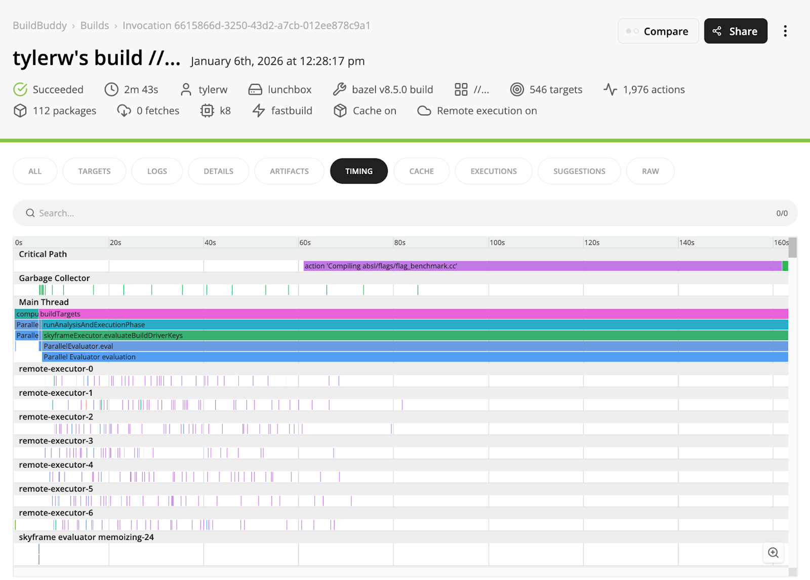

We're excited to announce that BuildBuddy's remote execution platform now supports the ARM64 (AArch64) architecture. This means you can run your builds and tests natively on ARM64 executors, unlocking faster builds for ARM64 targets and enabling teams to test on the same architecture they deploy to.

## Autoscaled Cloud ARM Support

For several years now, we’ve supported native ARM64 builds using Bring Your Own Runners (BYOR) or using our cloud mac build machines. As more customers transition to the ARM architecture for cost or performance reasons, we want to make it even easier for your builds to run natively on Linux + ARM64 as well. So we’re closing the loop and adding support for autoscaled cloud Linux ARM64 runners. This means that no matter how big your build, we’re able to handle it, and you’ll only pay for the resources you actually use.

We’ve made it easy to get started with ARM builds by adding support to the [`buildbuddy-toolchain`](https://github.com/buildbuddy-io/buildbuddy-toolchain) to automatically detect your architecture and set the platform appropriately. This makes maintaining a project that builds on both ARM64 and x86-64 ergonomic and easy, and removes the need for slow cross-compilation.

## Getting Started

Configuring your Bazel build to use BuildBuddy's arm64 executors is straightforward. Add the BuildBuddy toolchain to your WORKSPACE file:

`WORKSPACE`:

```python
bazel_dep(name = "toolchains_buildbuddy", version = "0.0.4")

# Use the extension to create toolchain and platform targets
buildbuddy = use_extension("@toolchains_buildbuddy//:extensions.bzl", "buildbuddy")
```



Then build your project with remote execution enabled, and your build will run on the new ARM64 executors.

[Example ARM build](https://app.buildbuddy.io/invocation/6615866d-3250-43d2-a7cb-012ee878c9a1) of [Abseil](https://github.com/abseil/abseil-cpp)

As always, please report any problems you find to us either on our [GitHub repo](https://github.com/buildbuddy-io/buildbuddy) or come chat with us on [Slack](https://community.buildbuddy.io/)!
