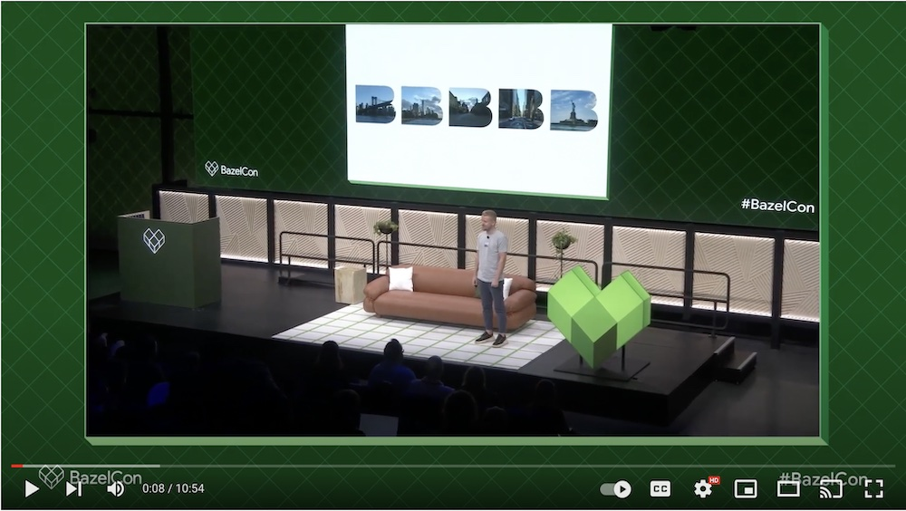
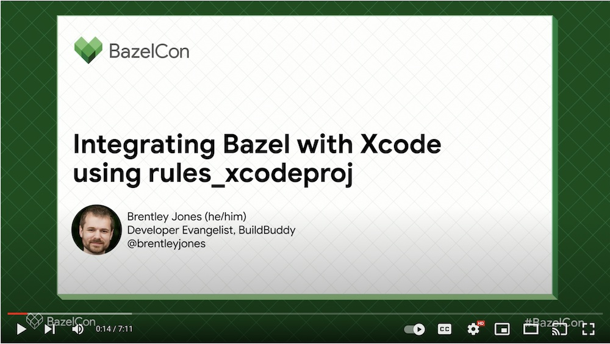
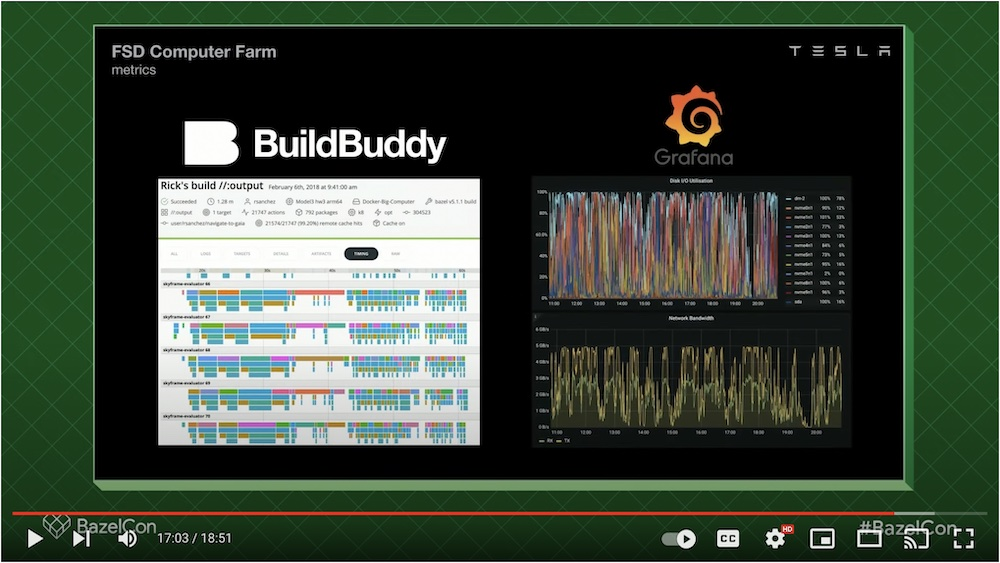
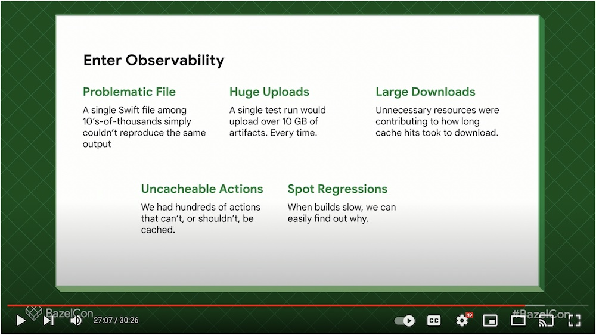

import { Tweet } from "react-twitter-widgets";

Earlier this month we wrapped up the 2022 Bazelcon conference in New York City. The conference featured talks by many prominent Bazel users including [Lyft](https://youtu.be/e2ID05dpJzo), [Spotify](https://youtu.be/k4H20WxhbsA), [Tesla](https://youtu.be/ol5hwjr48Q4), [Slack](https://youtu.be/wy3Q38VJ5uQ), [Stripe](https://youtu.be/kaKpp10z5ws), [Tinder](https://youtu.be/IoEMMLjKFtM), [Tecton](https://youtu.be/Bjaiu8tZZhs), [Coinbase](https://youtu.be/2BgRXmX1X-4), [Uber](https://youtu.be/a1jXzx3884g), more.

Here's are some of the highlights from the conference:

- We gave a [talk previewing](https://youtu.be/MIXy4zGtniE) the upcoming **BuildBuddy 3.0** release
- **Six companies** that are [BuildBuddy Enterprise](https://buildbuddy.io/) customers presented on the main stage
- We co-hosted a [Bazelcon happy hour](https://twitter.com/bazelbuild/status/1592624463975448576) with **Google Cloud** that had over **200 attendees**
- We [shared](https://youtu.be/B__SHnz3K3c) what we've been working on over the past year with [rules_xcodeproj](https://github.com/buildbuddy-io/rules_xcodeproj)
- We gave away **370 BuildBuddy shirts** and **1600 BuildBuddy stickers**
- We finally got to meet so many of incredible customers & open source contributors in person!

Tweets, talks, and pictures from the event below!

<!-- truncate -->

<Tweet tweetId="1593290390953955328" options={{ align: "center" }} />

<Tweet tweetId="1593052641310875648" options={{ align: "center" }} />

## Our talks

### BuildBuddy 3.0

By Siggi Simonarson

### Integrating Bazel with Xcode using rules_xcodeproj

By Brentley Jones

## BuildBuddy shout-outs

### Autopilot: Developing Software for Cars & Robots

By Gabe Gheorghian and Romi Phadte @ Tesla

### Insights from Two iOS Bazel Migrations

By Erik Kerber @ Slack

See you all next year!
