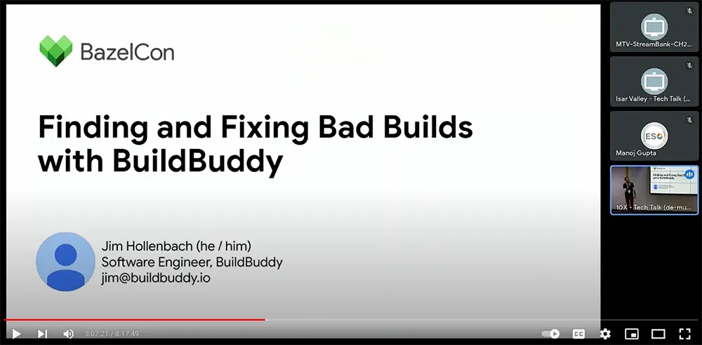
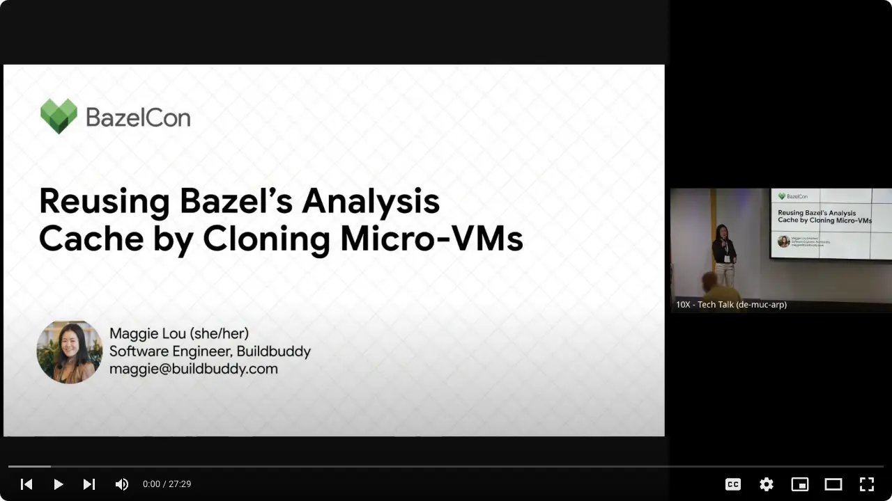
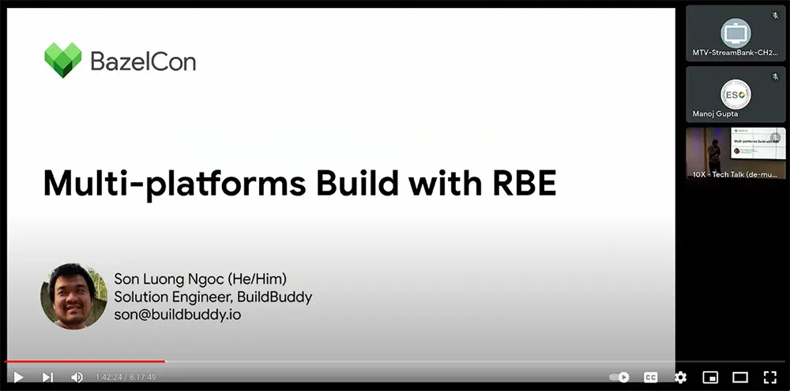
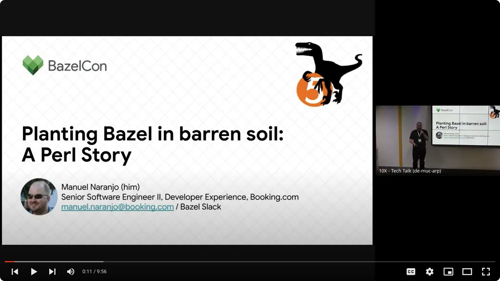
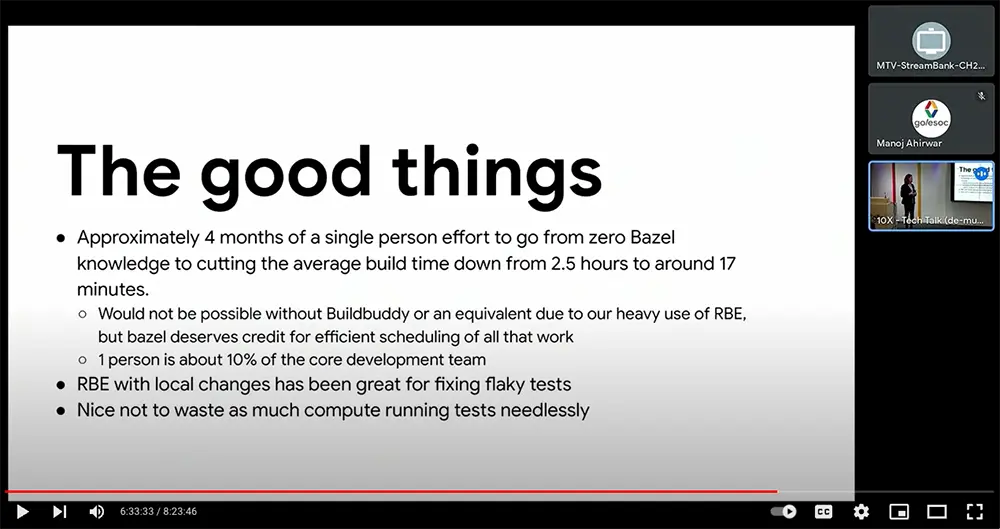

Another year, another Bazelcon! This year's edition was held in Munich, Germany, and featured two days of talks by Bazel maintainers, contributers, and users. Among the Bazel users represented as this year's conference were: [Booking.com](https://www.youtube.com/watch?v=FFtZAKAm0qA&list=PLxNYxgaZ8Rsefrwb_ySGRi_bvQejpO_Tj&index=20), [RabbitMQ](https://www.youtube.com/watch?v=kax1Su_WSu4&list=PLxNYxgaZ8Rsefrwb_ySGRi_bvQejpO_Tj&index=31&pp=iAQB), [Spotify](https://www.youtube.com/watch?v=QYAbmE_1fSo&list=PLxNYxgaZ8Rsefrwb_ySGRi_bvQejpO_Tj&index=33&pp=iAQB), [Stripe](https://www.youtube.com/watch?v=JjZ0A1YkKsU&list=PLxNYxgaZ8Rsefrwb_ySGRi_bvQejpO_Tj&index=10&pp=iAQB), [Uber](https://www.youtube.com/watch?v=QLbkMdUOI48&list=PLxNYxgaZ8Rsefrwb_ySGRi_bvQejpO_Tj&index=13&pp=iAQB), and more.

Here are some of the highlights:

- [Jim](https://www.linkedin.com/in/jim-hollenbach-5a49659) talked about improvements we've made to the trends page to help users [find and fix strange builds](https://www.youtube.com/watch?v=37C5zvQHnZI&list=PLxNYxgaZ8Rsefrwb_ySGRi_bvQejpO_Tj&index=8&pp=iAQB).
- [Maggie](https://www.linkedin.com/in/maggie-lou-4a3bb110a) explained how we're [using user fault file descriptors (UFFD) and FUSE to clone micro-VMs over the network](https://www.youtube.com/watch?v=YycEXBlv7ZA&list=PLxNYxgaZ8Rsefrwb_ySGRi_bvQejpO_Tj&index=9&pp=iAQB), keeping CI runner Bazel analysis caches hot, and speeding up workflows by up to 8x.
- [Son](https://www.linkedin.com/in/luongngocson) dove deep on [supporting multi-platform builds in a monorepo](https://www.youtube.com/watch?v=XimUovAh46k&list=PLxNYxgaZ8Rsefrwb_ySGRi_bvQejpO_Tj&index=4&pp=iAQB).
- [Brentley](https://www.linkedin.com/in/brentleyjones) co-lead a Birds of a Feather session with Lyft's Keith Smiley focused on Bazel-on-iOS.
- We co-hosted a well-attended happy hour together with Google Cloud open to all conference attendees.
- We had a great time meeting a bunch of our amazing customers, and other folks passionate about Bazel.

More details below!

<!-- truncate -->

## Our talks

### Finding and Fixing Strange Builds with BuildBuddy

By Jim Hollenbach

### Reusing Bazel's Analysis Cache by Cloning Micro-VMs

By Maggie Lou

### Multi-Platforms Build with Remote Build Execution

By Son Luong Ngoc

## BuildBuddy shout-outs

### Planting Bazel in Barren Soil: A Perl Story

By Manuel Naranjo

### RabbitMQ and the Story of rules_erlang

By Rin Kuryloski

Looking forward to seeing everyone again next year!
