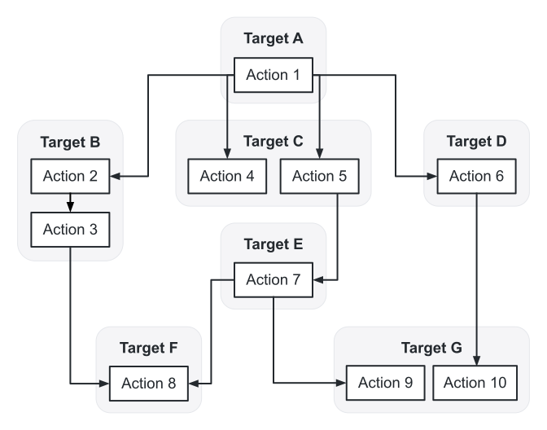

Bazel's famous remote caching and remote execution capabilities can be a game changer,
but if you're not familiar with how they work,
they can be a bit of a mystery.

Well, don't worry.
I'm here with to go over the fundamentals of remote caching and remote execution,
with a nuts and bolts
(or rather actions and spawns 😄)
overview of Bazel's remote capabilities.

<!-- truncate -->

## Actions

Each [rule target][rule] in the [build graph][build-graph] of a requested build produces zero or more [actions][action] during the [analysis phase][analysis-phase].
These actions form an [action graph][action-graph],
representing all the actions that need to be performed during the [execution phase][execution-phase].

During the execution phase the action graph is traversed.
For each action,
Bazel determines if it has to be executed,
either because the [action result][action-result] doesn't exist in the output base's [action cache][action-cache],
or because the output in the [output base][output-base] doesn't match the output listed in the action result.

## Spawns

If Bazel has to execute an action,
it creates a [spawn][spawn],
which encodes all the information needed to be able to execute the action,
including the spawn's ["strategy"][spawn-strategy][^1],
which,
among other things,
determines if/how the spawn should utilize remote caching or remote execution.

[^1]: Julio wrote a great [summary on spawn strategies](https://jmmv.dev/2019/12/bazel-strategies.html) that I highly recommend reading.

A spawn's strategy will dictate if Bazel has to do additional work
before,
after,
or instead of executing an action locally.
For example,
if a spawn with the `remote-cache` strategy is executed,
Bazel may check if the action result exists in the external cache's action cache,
and if it does,
it might download the listed outputs instead of executing the action.
I go over this in greater detail [later](#remote-caching).

After an action's outputs are available in the output base,
either because they were downloaded or created locally,
dependent actions in the action graph can spawn.

### Parallelism

The number of actions that can be executed locally at once is limited by the [`--local_cpu_resources`][local_cpu_resources] flag.
The number of spawns that can be executed at once is limited by the [`--jobs`][jobs] flag.
Since a spawn's execution can include more work,
or different work,
than an action's local execution,
it can be beneficial to have a `--jobs` value that is larger than `--local_cpu_resources`.
When that is the case,
and a spawn tries to execute an action locally,
it might block waiting for CPU resources to free up.
This is where [remote execution](#remote-execution) can be beneficial.

## Remote caching

To prevent confusion over Bazel's concept of a ["remote cache"][remote-caching],
which can mean either a disk cache which is local to the machine,
or a remote cache which uses networking protocols and is probably not local to the machine,
I'm going to instead refer to both of these cache types as an "external cache",
as it's external to the output base.

When using an external cache,
Bazel will augment it's output base with the action cache (AC) and content-addressable storage (CAS) of the external cache.
This means if an action result for an action that Bazel wants to execute isn't in the output base's action cache,
Bazel can check if the AC has it.
The same is true for the action's outputs;
if the output base doesn't have the expected output,
then Bazel can check if the CAS has it.

### `remote-cache`

Bazel achieves this behavior with the `remote-cache` spawn strategy,
which is used alongside a local strategy (e.g. `sandbox`, `worker`, `local`, etc.).

A `remote-cache` spawn has the following steps:

- If the action's action result isn't in the output base's action cache,
  try to retrieve it from the AC
  ([`ActionCache.GetActionResult`][reapi-getactionresult])[^2]
- If the action result was retrieved from either cache...
  - And the action's outputs are in the output base,
    the spawn is done
  - Otherwise,
    try to retrieve it from the CAS
    ([`ByteStream.Read`][bytestream-read])
- If the outputs were retrieved,
  the spawn is done
- Otherwise,
  the action is executed locally
- If the action completes successfully,
  the action's outputs are uploaded to the CAS
  ([`ByteStream.Write`][bytestream-write]),
  and its action result is uploaded to the AC
  ([`ActionCache.UpdateActionResult`][reapi-updateactionresult])[^3]
  - If [`--experimental_remote_cache_async`][experimental_remote_cache_async][^4] is used,
    then the spawn is done,
    and dependent actions are able to spawn
    while uploads continue in the background
  - Otherwise,
    uploads have to finish before dependent actions are able to spawn

[^2]:
    Except possibly if [`--noremote_accept_cached`][remote_accept_cached] is set.
    See the [flags section](#flags).

[^3]:
    Except if the action is tagged with `no-remote-cache-upload`,
    or possibly if [`--noremote_upload_local_results`][remote_upload_local_results] is set.
    See the [flags section](#flags).

[^4]: Available in [Bazel 5.0](https://github.com/bazelbuild/bazel/commit/7f08b7841fcf4c7d7d09b69f9ec1f24969aba8a1).

### Flags

Setting the [`--disk_cache`][disk_cache] flag causes Bazel to use that directory on the filesystem as an external cache.
Setting the [`--remote_cache`][remote_cache] flag causes Bazel to connect via HTTP(S), gRPC(S), or UNIX sockets to an external cache.
Setting both flags causes Bazel to use both the disk cache and the remote cache at the same time,
forming a "combined cache".

A combined cache reads from and writes to both the disk and remote caches,
and is treated like a remote cache overall,
unless the [`--incompatible_remote_results_ignore_disk`][incompatible_remote_results_ignore_disk] flag is used.
If that flag is used,
the disk cache instead continues to behave like a local cache,
allowing it to return results even if [`--noremote_accept_cached`][remote_accept_cached] is set,
store results even if [`--noremote_upload_local_results`][remote_upload_local_results] is set,
and return/store results for [`no-remote-cache`/`no-remote`][common-tags] actions.[^5]

Setting the [`--experimental_guard_against_concurrent_changes`][experimental_guard_against_concurrent_changes] flag helps protect the external cache from being poisoned by changes to input files that happen during a build.
I highly recommend setting this flag if developers have an external cache enabled,
even if it's only the disk cache.

Most remote cache implementations will separate the AC,
and some will separate the CAS,
based on the value of the [`--remote_instance_name`][remote_instance_name] flag.
This can used for numerous reasons,
such as project separation,
or a bandage for non-hermetic toolchains.

The [`--remote_cache_header`][remote_cache_header] flag causes Bazel to send extra headers in requests to the external cache.
Multiple headers can be passed by specifying the flag multiple times.
Multiple values for the same name will be converted to a comma-separated list.
The [`--remote_header`][remote_header] flag can be used instead of setting both `--remote_cache_header` and `--remote_exec_header` to the same value.

[^5]: Available in [Bazel 5.0](https://github.com/bazelbuild/bazel/commit/46c3f1711b90c648baf3d15d6df2890c8a12f67c).

## Remote execution

Bazel is able to execute actions on a remote executor,
instead of executing them locally,
using a concept called ["remote execution"][remote-execution].
Since these actions don't use local resources,
the number of actions that can be executed remotely in parallel is limited only by `--jobs` and the available remote resources,
not `--local_cpu_resources`.
If your builds are sufficiently parallel,
this can result in them completing faster.
The [parallelism section](#parallelism) goes into more detail.

### `remote`

Bazel achieves the behavior of executing actions remotely with the `remote` spawn strategy,
which includes most of the behavior of the [`remote-cache`](#remote-cache) strategy,
and is used instead of a local strategy (e.g. `sandbox`, `worker`, `local`, etc.).

A `remote` spawn has the following steps:

- If the action's action result isn't in the output base's action cache,
  try to retrieve it from the AC
  ([`ActionCache.GetActionResult`][reapi-getactionresult])[^6]
- If the action result was retrieved from either cache...
  - And the action's outputs are in the output base,
    the spawn is done
  - Otherwise,
    try to retrieve it from the CAS
    ([`ByteStream.Read`][bytestream-read])
- If the outputs were retrieved,
  the spawn is done
- Otherwise,
  determine if any inputs to the action need to be uploaded
  ([`ContentAddressableStorage.FindMissingBlobs`][reapi-findmissingblobs]),
  and upload them
  ([`ByteStream.Write`][bytestream-write])
- Then execute the action remotely ([`Execution.Execute`][reapi-execute])
- If the action completes successfully,
  download the action's outputs from the CAS
  ([`ByteStream.Read`][bytestream-read])

[^6]: Except if [`--noremote_accept_cached`][remote_accept_cached] is set.

### Disk cache

[Starting in Bazel 5.0](https://github.com/bazelbuild/bazel/commit/cf57d036c2e1b608ca902267fbbdfeb7ee5aa166),
the disk cache
(or more specifically,
the combined cache)
can be used with remote execution.
Prior to Bazel 5.0,
if you also wanted to cache things locally,
you would have to setup a remote cache proxy sidecar.

### Dynamic execution

Bazel supports a mode of remote execution called ["dynamic execution"][dynamic-execution],
in which local and remote execution of the same action are started in parallel,
using the output from the first branch that finishes,
and cancelling the other branch.

I wanted to mention it for completeness,
because when tuned properly it can result in faster builds than using either local execution or remote execution alone.
However,
it might not play well with [Remote Build without the Bytes](#remote-build-without-the-bytes),
as the local execution branches might need to download the outputs of previous remotely completed actions,
and if tuned improperly,
it can result in slower builds.

### Flags

Setting the [`--remote_executor`][remote_executor] flag causes Bazel to connect via gRPC(S) or UNIX sockets to a remote executor.
If `--remote_cache` isn't set,
it defaults to the value set for `--remote_executor`.
Most remote execution setups will have the remote cache and remote executor at the same endpoint.

In addition to how it [affects the remote cache](#flags),
the [`--remote_instance_name`][remote_instance_name] flag might determine which remote execution cluster a build runs on.
Some actions might need to target a specific subset of executors,
possibly because they need certain hardware or software,
and they can do that with [platform properties][platform-properties].

Platform properties can be set globally with the [`--remote_default_exec_properties`][remote_default_exec_properties] flag,
but only if they aren't set at the [platform][platform-exec_properties] or [target][target-exec_properties] level.
The action result that is stored in an action cache includes the platform properties.
This is important to note, as it can affect action cache hit rates.
If you conditionally use remote execution,
and you use set platform properties,
you might want to have them set non-conditionally,
in order to be able to reuse the cached action results.
Some remote execution implementations allow setting global platform properties with [`--remote_exec_header`](#remote_exec_header-flag) flags,
as a way to prevent these cache misses.

The [`--remote_timeout`][remote_timeout] flag controls how long Bazel will wait for a remote cache operation to complete.
While the timeout doesn't apply to the `Execution.Execute` call[^7],
using remote execution might involve uploading or downloading artifacts that a local build doesn't,
and the default value for this flag
(60 seconds)
might not be long enough.

The [`--remote_retries`][remote_retries] flag controls how many times Bazel will retry a remote operation on a transient error,
such as a timeout.
The flag defaults to `5`,
and depending on how you plan to use remote execution,
you might want to increase it to a much larger value.
Bazel uses an exponential backoff for retries,
but currently caps the delay at 5 seconds between calls.

The [`--remote_exec_header`][remote_exec_header] flag causes Bazel to send extra headers in requests to the remote executor.
Multiple headers can be passed by specifying the flag multiple times.
Multiple values for the same name will be converted to a comma-separated list.
The [`--remote_header`][remote_header] flag can be used instead of setting both `--remote_cache_header` and `--remote_exec_header` to the same value.

[^7]:
    If the [`--experimental_remote_execution_keepalive`][experimental_remote_execution_keepalive] flag is set,
    the `Execution.Execute` and `Execution.WaitExecute` calls take into account the values of `--remote_timeout` and `--remote_retries`,
    but in a [more complicated way](https://docs.google.com/document/d/1NgDPsCIwprDdqC1zj0qQrh5KGK2hQTSTux1DAvi4rSc).
    Even with that flag, the goal is for execution time to be unbounded,
    as it can vary greatly depending on the action being executed.

## Remote Build without the Bytes

For both remote caching and remote execution,
Bazel supports a feature called ["Remote Build without the Bytes"][remote-build-without-the-bytes] (BwtB).
If enabled,
Bazel will only download the direct outputs of the targets specified
([`--remote_download_toplevel`][remote_download_toplevel]),
or the minimum needed to complete the build
([`--remote_download_minimal`][remote_download_minimal]).
This can result in greatly reduced network traffic,
which can also result in faster builds.

The feature isn't without its flaws though.
Currently,
BwtB requires remote caches to [never evict outputs](https://github.com/bazelbuild/bazel/issues/8250),
can result in slower builds due to clumping of downloads,
doesn't allow specifying that other outputs should be downloaded,
etc.
Though,
similar to [dynamic scheduling](#dynamic-scheduling),
if used properly BwtB can result in faster builds.
Just don't apply it blindly.

## Bonus topic: Build Event Service

Bazel can stream build results,
specifically the [build event protocol][bep] (BEP),
to a [build event service][bes] (BES).
Depending on the capabilities of the service,
this can have numerous benefits.

Here is a list of some benefits that various BES products (including BuildBuddy!) offer:

- Easily share build logs
- See historical build data, including aggregations and trends
- See details not exposed via the terminal
  (e.g. all command-line flags used without having to use [`--announce_rc`][announce_rc],
  or all environment variables set)
- View action timing data (same as [`--experimental_generate_json_trace_profile`][experimental_generate_json_trace_profile])
- Visualize queries
- View error and test logs
- Download action outputs
- View remote cache stats
- View related remote execution data
  - List of actions executed
  - Individual action details
    (e.g. command-line arguments,
    environment variables,
    platform properties,
    timing data,
    and downloading inputs and outputs)

### Flags

Setting the [`--bes_backend`][bes_backend] flag causes Bazel to connect via gRPC(S) to a BES backend and stream build results to it.
Setting the [`--bes_results_url`][bes_results_url] flag causes Bazel to output to the terminal a URL to the BES UI for the build underway.

When using BES,
Bazel will upload all files referenced in the BEP,
unless [`--experimental_build_event_upload_strategy=local`][experimental_build_event_upload_strategy][^8] is set.
Alternatively,
if you set [`--incompatible_remote_build_event_upload_respect_no_cache`][incompatible_remote_build_event_upload_respect_no_cache][^9],
and have actions that are tagged with [`no-cache`/`no-remote-cache-upload`/`no-remote-cache`/`no-remote`][common-tags],
then the output of those actions will still be excluded from upload.

The [`--bes_timeout`][bes_timeout] flag controls how long Bazel will wait to finish uploading to BES after the build and tests have finished.
By default there is no timeout,
which might not be what you want.
If you leave the default,
you should consider changing the [`--bes_upload_mode`][bes_upload_mode] flag,
which controls if Bazel should block the build for BES uploads
(the default),
or if it should finish the uploads in the background.

The [`--bes_header`][bes_header][^10] flag causes Bazel to send extra headers in requests to the BES backend.
It behaves the same way as [`--remote_header`][remote_header].

[^8]:
    A warning though:
    setting `--experimental_build_event_upload_strategy=local` will prevent the uploading of some nice things,
    such as the timing profile,
    or test logs.

[^9]: Available in [Bazel 5.0](https://github.com/bazelbuild/bazel/commit/bfc24139d93f8643686d91596ba347df2e01966a).
[^10]: Available in [Bazel 5.0](https://github.com/bazelbuild/bazel/commit/ef42d1365d0f508d3d817997b5049639a72100ab).

## That's it, for now

Hopefully with this information at hand,
Bazel's remote caching and remote execution capabilities are less of a mystery.

[action]: https://docs.bazel.build/versions/5.0.0/glossary.html#action
[action-cache]: https://docs.bazel.build/versions/5.0.0/glossary.html#action-cache
[action-graph]: https://docs.bazel.build/versions/5.0.0/glossary.html#action-graph
[analysis-phase]: https://docs.bazel.build/versions/5.0.0/glossary.html#analysis-phase
[build-graph]: https://docs.bazel.build/versions/5.0.0/glossary.html#build-graph
[disk-cache]: https://docs.bazel.build/versions/5.0.0/glossary.html#disk-cache
[execution-phase]: https://docs.bazel.build/versions/5.0.0/glossary.html#execution-phase
[output-base]: https://docs.bazel.build/versions/5.0.0/glossary.html#output-base
[rule]: https://docs.bazel.build/versions/5.0.0/glossary.html#rule
[bep]: https://docs.bazel.build/versions/5.0.0/build-event-protocol.html
[bes]: https://docs.bazel.build/versions/5.0.0/build-event-protocol.html#build-event-service
[dynamic-execution]: https://docs.bazel.build/versions/5.0.0/dynamic-execution.html
[platform-properties]: https://docs.bazel.build/versions/5.0.0/platforms-intro.html#common-platform-properties
[remote-caching]: https://docs.bazel.build/versions/5.0.0/remote-caching.html
[remote-execution]: https://docs.bazel.build/versions/5.0.0/remote-execution.html
[common-tags]: https://docs.bazel.build/versions/5.0.0/be/common-definitions.html#common.tags
[platform-exec_properties]: https://docs.bazel.build/versions/5.0.0/be/platform.html#platform.exec_properties
[target-exec_properties]: https://docs.bazel.build/versions/5.0.0/be/common-definitions.html#common.exec_properties
[announce_rc]: https://docs.bazel.build/versions/5.0.0/command-line-reference.html#flag--announce_rc
[bes_backend]: https://docs.bazel.build/versions/5.0.0/command-line-reference.html#flag--bes_backend
[bes_header]: https://docs.bazel.build/versions/5.0.0/command-line-reference.html#flag--bes_header
[bes_results_url]: https://docs.bazel.build/versions/5.0.0/command-line-reference.html#flag--bes_results_url
[bes_timeout]: https://docs.bazel.build/versions/5.0.0/command-line-reference.html#flag--bes_timeout
[disk_cache]: https://docs.bazel.build/versions/5.0.0/command-line-reference.html#flag--disk_cache
[experimental_build_event_upload_strategy]: https://docs.bazel.build/versions/5.0.0/command-line-reference.html#flag--experimental_build_event_upload_strategy
[experimental_generate_json_trace_profile]: https://docs.bazel.build/versions/5.0.0/command-line-reference.html#flag--experimental_generate_json_trace_profile
[experimental_guard_against_concurrent_changes]: https://docs.bazel.build/versions/5.0.0/command-line-reference.html#flag--experimental_guard_against_concurrent_changes
[experimental_remote_cache_async]: https://docs.bazel.build/versions/5.0.0/command-line-reference.html#flag--experimental_remote_cache_async
[experimental_remote_execution_keepalive]: https://docs.bazel.build/versions/5.0.0/command-line-reference.html#flag--experimental_remote_execution_keepalive
[incompatible_remote_build_event_upload_respect_no_cache]: https://docs.bazel.build/versions/5.0.0/command-line-reference.html#flag--incompatible_remote_build_event_upload_respect_no_cache
[incompatible_remote_results_ignore_disk]: https://docs.bazel.build/versions/5.0.0/command-line-reference.html#flag--incompatible_remote_results_ignore_disk
[jobs]: https://docs.bazel.build/versions/5.0.0/command-line-reference.html#flag--jobs
[local_cpu_resources]: https://docs.bazel.build/versions/5.0.0/command-line-reference.html#flag--local_cpu_resources
[remote_accept_cached]: https://docs.bazel.build/versions/5.0.0/command-line-reference.html#flag--remote_accept_cached
[remote_cache]: https://docs.bazel.build/versions/5.0.0/command-line-reference.html#flag--remote_cache
[remote_cache_header]: https://docs.bazel.build/versions/5.0.0/command-line-reference.html#flag--remote_cache_header
[remote_default_exec_properties]: https://docs.bazel.build/versions/5.0.0/command-line-reference.html#flag--remote_default_exec_properties
[remote_download_minimal]: https://docs.bazel.build/versions/5.0.0/command-line-reference.html#flag--remote_download_minimal
[remote_download_toplevel]: https://docs.bazel.build/versions/5.0.0/command-line-reference.html#flag--remote_download_toplevel
[remote_executor]: https://docs.bazel.build/versions/5.0.0/command-line-reference.html#flag--remote_executor
[remote_exec_header]: https://docs.bazel.build/versions/5.0.0/command-line-reference.html#flag--remote_exec_header
[remote_header]: https://docs.bazel.build/versions/5.0.0/command-line-reference.html#flag--remote_header
[remote_instance_name]: https://docs.bazel.build/versions/5.0.0/command-line-reference.html#flag--remote_instance_name
[remote_retries]: https://docs.bazel.build/versions/5.0.0/command-line-reference.html#flag--remote_retries
[remote_timeout]: https://docs.bazel.build/versions/5.0.0/command-line-reference.html#flag--remote_timeout
[remote_upload_local_results]: https://docs.bazel.build/versions/5.0.0/command-line-reference.html#flag--remote_upload_local_results
[action-result]: https://github.com/bazelbuild/bazel/blob/5.0.0/src/main/java/com/google/devtools/build/lib/actions/ActionResult.java#L26-L28
[bes_upload_mode]: https://github.com/bazelbuild/bazel/blob/5.0.0/src/main/java/com/google/devtools/build/lib/buildeventservice/BuildEventServiceOptions.java#L145-L154
[spawn]: https://github.com/bazelbuild/bazel/blob/5.0.0/src/main/java/com/google/devtools/build/lib/actions/Spawn.java#L25-L30
[spawn-strategy]: https://github.com/bazelbuild/bazel/blob/5.0.0/src/main/java/com/google/devtools/build/lib/actions/SpawnStrategy.java#L18-L28
[bytestream-read]: https://github.com/googleapis/googleapis/blob/885183fcec1a9b3a812055c209fa61f391c9042c/google/bytestream/bytestream.proto#L50-L53
[bytestream-write]: https://github.com/googleapis/googleapis/blob/885183fcec1a9b3a812055c209fa61f391c9042c/google/bytestream/bytestream.proto#L55-L77
[reapi-execute]: https://github.com/bazelbuild/remote-apis/blob/3e816456ee28f01ab2e0abf72306c1f340c7b229/build/bazel/remote/execution/v2/remote_execution.proto#L45-L115
[reapi-findmissingblobs]: https://github.com/bazelbuild/remote-apis/blob/3e816456ee28f01ab2e0abf72306c1f340c7b229/build/bazel/remote/execution/v2/remote_execution.proto#L318-L329
[reapi-getactionresult]: https://github.com/bazelbuild/remote-apis/blob/3e816456ee28f01ab2e0abf72306c1f340c7b229/build/bazel/remote/execution/v2/remote_execution.proto#L145-L159
[reapi-updateactionresult]: https://github.com/bazelbuild/remote-apis/blob/3e816456ee28f01ab2e0abf72306c1f340c7b229/build/bazel/remote/execution/v2/remote_execution.proto#L161-L182
[remote-build-without-the-bytes]: https://github.com/bazelbuild/bazel/issues/6862
