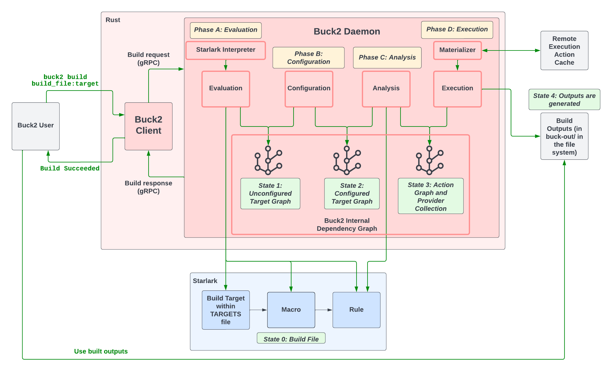

# Buck2 unboxing

Recently Meta announced the release of Buck2, their official build tool that was rewritten in Rust.
I got a chance to try it and integrate it with BuildBuddy's Remote Cache and Remote Build Execution offerings.


Here are the initial impressions I have after a week of using Buck2.

<!-- truncate -->

## Overview

Similar to Buck(1) and Bazel, Buck2 is an [artifact-based](https://bazel.build/basics/artifact-based-builds) build tool that operates on a large graph of dependencies.

Buck2 was rewritten from scratch in Rust while providing many backward compatibility features with Buck(1).
On the [official website of Buck2](https://buck2.build/docs/why/), Meta touted it to be:

1. Remote Execution first
2. Dynamic graph computation engine
3. A single build phase

So how true are these claims?
Is Buck2 going to replace Bazel?
Is this the right tool for your needs?

Let's dive in!

## The pros

#### Incredible CLI UX

Right out of the box, Buck2 feels incredibly responsive.
The command line is ridiculously fast compared to Bazel 6.2.0.
Here, we are using [Hyperfine](https://github.com/sharkdp/hyperfine) to benchmark the two build tools.

```bash
> hyperfine 'buck2 --version' --shell=none --warmup 3 --runs 20
Benchmark 1: buck2 --version
  Time (mean ± σ):       5.5 ms ±   0.6 ms    [User: 2.7 ms, System: 1.4 ms]
  Range (min … max):     5.0 ms …   7.1 ms    20 runs

> hyperfine 'bazel version' --shell=none --warmup 3 --runs 20
Benchmark 1: bazel version
  Time (mean ± σ):      31.2 ms ±   0.7 ms    [User: 9.7 ms, System: 11.8 ms]
  Range (min … max):    29.8 ms …  32.4 ms    20 runs
```

Moreover, the CLI was written in Rust's Clap library, which comes with a sane help menu
and (soon to come) auto-completion.

```bash
> buck2 -h
buck2 42652bf853883e0391382f6b8d038fe6 <local>
A build system

Documentation: https://buck2.build/docs/

USAGE:
    buck2 [OPTIONS] <SUBCOMMAND>

OPTIONS:
    -h, --help
            Print help information

        --isolation-dir <ISOLATION_DIR>
            Instances of Buck2 share a daemon if and only if their isolation directory is identical.
            The isolation directory also influences the output paths provided by Buck2, and as a
            result using a non-default isolation dir will cause cache misses (and slower builds)
            [env: BUCK_ISOLATION_DIR=] [default: v2]

    -v, --verbose <NUMBER>
            How verbose buck should be while logging. Values: 0 = Quiet, errors only; 1 = default; 2
            = more info about errors; 3 = more info about everything [default: 1]

    -V, --version
            Print version information

SUBCOMMANDS:
    aquery       Perform queries on the action graph (experimental)
    audit        Perform lower level queries
    build        Build the specified targets
    bxl          Run BXL scripts
    clean        Delete generated files and caches
    cquery       Perform queries on the configured target graph
    ctargets     Resolve target patterns to configured targets
    docs         Print documentation of specified symbols
    help         Print this message or the help of the given subcommand(s)
    init         Initialize a buck2 project
    install      Build and install an application
    kill         Kill the buck daemon
    killall      Kill all buck2 processes on the machine
    log          Commands for interacting with buck2 logs
    lsp          Start an LSP server for starlark files
    profile      Profiling mechanisms
    query        Alias for `uquery`
    rage         Record information about the previous failed buck2 command
    root         Find buck cell, project or package root
    run          Build and run the selected target
    server       Start, query, and control the http server
    starlark     Run Starlark operations
    status       Buckd status
    subscribe    Subscribe to updates from the Buck2 daemon
    targets      Show details about the specified targets
    test         Build and test the specified targets
    uquery       Perform queries on the unconfigured target graph
```

This means that even the subcommands flags are declared with the framework and
comes with amazing default documentation.

```bash
> buck2 rage -h
buck2-rage
Record information about the previous failed buck2 command

USAGE:
    buck2 rage [OPTIONS]

OPTIONS:
    -h, --help
            Print help information

        --invocation-id <INVOCATION_ID>
            Select invocation directly using the invocation's UUID

        --invocation-offset <INVOCATION_OFFSET>
            Use value 0 to select last invocation, 1 to select second to last and so on

        --no-invocation
            Collect rage report about buck2 in general, not about specific invocation

        --no-paste
            We may want to omit paste if this is not a user or is called in a machine with no pastry
            command

        --origin <ORIGIN>
            Where buck2 rage is being called from [default: unspecified] [possible values:
            hang-detector, unspecified]

        --timeout <TIMEOUT>
            Stop collecting information after `<timeout>` seconds [default: 60]

    -v, --verbose <NUMBER>
            How verbose buck should be while logging. Values: 0 = Quiet, errors only; 1 = default; 2
            = more info about errors; 3 = more info about everything [default: 1]
```

The build progress library was custom-made for Buck2 and can sort and color-code slower actions.
Here is a quick sped up demo:


#### First-class Remote Execution

Buck2 was not kidding about it being a "Remote Execution first" build tool.

Thanks to this assumption, Buck2 was able to cut corners by not providing any local-sandboxing implementations by default.
What seems to be an unwanted side-effect at scale, actually made the tool more friendly to new learners.
The lack of local sandboxing allows Buck2 to behave locally closer to other task-runner build tools such as Make or Just.

However, any mistakes that are made when authoring build definitions locally will very soon be revealed once moved to Remote Build Execution.
Buck2 follows the same industry standard [Remote Execution API](https://github.com/bazelbuild/remote-apis) that was adopted by the like of Bazel, Goma, Pants, Please, Recc...
This means that Buck2 is compatible with BuildBuddy Remote Cache and Remote Build Execution offering! 🎉

So let's test it out!

First, let's establish a setup to benchmark our test

```python
SIZE_RANGE = range(0, 1000)

XYZ_SHA256 = "72036ae48c55d632cc333cac04c78be336b0c76f39b225d023e218efe077ab1b"

# Add some execution time to each action to simulate a real build.
SLEEP_CMD = "sleep $$((RANDOM % 5));"

# Stage 1
[
    genrule(
        name = "x_{}".format(n),
        outs = ["x_{}.txt".format(n)],
        cmd = SLEEP_CMD + "echo x_{} > $@".format(n),
    )
    for n in SIZE_RANGE
]

[
    genrule(
        name = "y_{}".format(n),
        outs = ["y_{}.txt".format(n)],
        cmd = SLEEP_CMD + "echo y_{} > $@".format(n),
    )
    for n in SIZE_RANGE
]

# Stage 2
[
    genrule(
        name = "z_{}".format(n),
        outs = ["z_{}.txt".format(n)],
        cmd = SLEEP_CMD + "cat $(location :x_{n}) $(location :y_{n}) > $@".format(n = n),
        tools = [
            ":x_{}".format(n),
            ":y_{}".format(n),
        ],
    )
    for n in SIZE_RANGE
]

# Stage 3
genrule(
    name = "xyz",
    outs = ["xyz.txt"],
    # cat $(location :z_0) $(location :z_1) ... $(location :z_999) > $@,
    cmd = SLEEP_CMD + "cat " + " ".join([
        "$(location :z_{})".format(n)
        for n in SIZE_RANGE
    ]) + " > $@",
    tools = [
        ":z_{}".format(n)
        for n in SIZE_RANGE
    ],
)

# Stage 4
sh_test(
    name = "test",
    srcs = ["test.sh"],
    args = [
        "$(location :xyz)",
        XYZ_SHA256,
    ],
    data = [
        ":xyz",
    ],
)
```

Our setup is a build graph composed of 4 stages:

- Stage 1: Create 1000 "x" targets and 1000 "y" targets (2000 build targets)

- Stage 2: Create 1000 "z" targets by concat "x" and "y" from Stage 1 (1000 build targets)

- Stage 3: Concat all "z" targets (1 build target)

- Stage 4: Validate stage 3 output with a test (1 test target)

Before each action, we sleep a random duration between 0 and 4 seconds to make the simulation closer to real-world build.

We also inject this sleep value into our test to help validate testing features down the line:

```bash
> cat test.sh
#!/bin/bash

file=$1
expected=$2
got=$(sha256sum $file | awk '{print $1}')

sleep $((RANDOM % 5));
if [[ $expected == $got ]]; then
    exit 0
else
    exit 1
fi
```

With a total of 2002 user-defined targets and 4 stages, assuming perfect concurrency,
it should result in a worst-case 16 seconds, average 8 seconds, sleep overhead.

Let's use Bazel's latest release, 6.2.0, as our baseline and see how Buck2 compares.

1. Local Execution

   ```bash
   > cat .bazelrc
   build:local --strategy=local
   build:local --jobs=200
   build:local --local_cpu_resources=200
   build:local --local_ram_resources='HOST_RAM*2.0'
   ```

   It's worth noting that Bazel executes actions in a sandbox by default, so `--strategy=local` is used here to explicitly disable sandboxing.
   We also set Bazel's concurrency limit to 200 by specifying `--jobs=200` and override Bazel's system resource estimations by specifying
   `--local_cpu_resources` and `--local_ram_resources` to larger values.
   Because our actions are lightweight, with majority of the time being spent on `sleep(1)` call,
   these Bazel flags enable us to hit the "200 concurrent build actions" mark.

   ```bash
   > hyperfine --prepare 'bazel clean' --warmup 1 'bazel test --config=local //...'
   Benchmark 1: bazel test --config=local //...
     Time (mean ± σ):     65.631 s ±  0.460 s    [User: 0.051 s, System: 0.063 s]
     Range (min … max):   65.179 s … 66.310 s    10 runs
   ```

   To ensure fairness, we also set Buck2 execution concurrency to the same value as Bazel:

   ```bash
   > tail -2 .buckconfig
   [build]
   threads = 200
   ```

   Here, Buck's Starlark API differs slightly from Bazel's, so some small modifications were needed.
   For example:

   ```diff
   @@ -21,9 +21,9 @@
    [
        genrule(
            name = "z_{}".format(n),
   -        outs = ["z_{}.txt".format(n)],
   +        out = "z_{}.txt".format(n),
   -        cmd = "cat $(location :x_{n}) $(location :y_{n}) > $@".format(n = n),
   +        cmd = "cat $(location :x_{n}) $(location :y_{n}) >$OUT".format(n = n),
   -        tools = [
   +        srcs = [
                ":x_{}".format(n),
                ":y_{}".format(n),
            ],
   ```

   With all that set, let's see how Buck2 performs:

   ```bash
   > hyperfine  --prepare 'buck2 clean' --warmup 1 'buck2 test //...'
   Benchmark 1: buck2 test //...
     Time (mean ± σ):     41.175 s ±  2.183 s    [User: 0.371 s, System: 0.190 s]
     Range (min … max):   37.584 s … 43.803 s    10 runs
   ```

   And quite a performance indeed, Buck2 left Bazel in the dust!

2. Remote Execution

   Using BuildBuddy as the RBE backend should be as simple as copying the configurations from the website:

   ```
   build:remote --jobs=600

   build:remote --bes_results_url=https://app.buildbuddy.io/invocation/
   build:remote --bes_backend=grpcs://remote.buildbuddy.io
   build:remote --remote_cache=grpcs://remote.buildbuddy.io
   build:remote --remote_timeout=3600
   build:remote --remote_executor=grpcs://remote.buildbuddy.io
   build:remote --remote_header=x-buildbuddy-api-key=<redacted>
   ```

   With that set, let's check the result:

   ```bash
   # With remote cache
   > hyperfine --prepare 'bazel clean' \
               --warmup 1 \
               'bazel test --config=remote //...'
   Benchmark 1: bazel test --config=remote //...
     Time (mean ± σ):      9.798 s ±  0.515 s    [User: 0.028 s, System: 0.039 s]
     Range (min … max):    8.645 s … 10.434 s    10 runs

   # Without remote cache
   # Set remote_instance_name to a random string to reset remote_cache
   > hyperfine  --prepare 'bazel clean' \
                --warmup 1 \
                'bazel test --config=remote --remote_instance_name="$RANDOM" //...'
   Benchmark 1: bazel test --config=remote --remote_instance_name="$RANDOM" //...
     Time (mean ± σ):     106.062 s ±  3.106 s    [User: 0.090 s, System: 0.099 s]
     Range (min … max):   102.111 s … 111.645 s    10 runs
   ```

   17 seconds is amazing compared to the local execution time of 74 seconds.
   It's 73% faster!

   But what about Buck2?
   Well setting it up is as simple as copying the provided configurations in [Buck2's BuildBuddy Example](https://github.com/facebook/buck2/tree/main/examples/remote_execution/buildbuddy)

   ```bash
   [build]
   execution_platforms = root//platforms:platforms

   # [buck2_re_client]
   engine_address = remote.buildbuddy.io
   action_cache_address = remote.buildbuddy.io
   cas_address = remote.buildbuddy.io
   http_headers = x-buildbuddy-api-key:<redacted>
   ```

   Let's run it:

   ```bash
   # With remote cache
   > hyperfine --prepare 'buck2 clean' \
               --warmup 1 \
               'buck2 test --unstable-allow-all-tests-on-re //...'
     Time (mean ± σ):      7.937 s ±  0.487 s    [User: 0.296 s, System: 0.175 s]
     Range (min … max):    7.357 s …  8.945 s    10 runs

   # Without remote cache
   > hyperfine --prepare 'buck2 clean; echo "INSTANCE_NAME = \"$RANDOM\"" > instance.bzl' \
               'buck2 test --unstable-allow-all-tests-on-re //...'
   Benchmark 1: buck2 test --unstable-allow-all-tests-on-re //...
     Time (mean ± σ):     203.431 s ± 29.882 s    [User: 4.187 s, System: 1.566 s]
     Range (min … max):   163.044 s … 258.968 s    10 runs
   ```

   Buck2 does not have a good way to invalidate the remote cache to give a fair comparison,
   so I did apply a workaround by invalidating all the `x` and `y` actions with a random value instead.

   Regardless, the performance was very impressive.
   The Remote Build Execution client of Buck2 is not as configurable as Bazel, so it was harder to tune.
   I expect it will make builds perform much better in the future.

#### Easy to contribute

Seriously, Buck2 code base is a blast to work with.
Unlike Bazel, which was written in a mix of C++ and Java using Google's homegrown frameworks,
Buck2 was built with a single language: Rust!

Not only can the code base be built using Buck2, but it could also be built using Cargo, and
is completely compatible with Rust Analyzer (Rust's Language Server).
It has been a long time since I could open the code base of a build tool and have "Go to definitions"
and "Find references" work out of the box.

The Buck2 team in Meta has been quite engaging thus far.
It often takes them less than a week to respond to my GitHub Issues / Pull Requests.
And most of the time, I get a response within a day.

Diving into Buck2 and its Rust code base is... addictive. 😅

## The cons

> So is that it? Buck2 is faster, let's all move there?

Not so fast young padawan!
Buck2 does come with some downsides.

#### It's actually multiple phases!

In contrary to it's official introduction, [Buck2's architecture diagram](https://buck2.build/docs/developers/architecture/buck2/)
describes multiple phases and stages inside a typical build.



There seems to be 5 Phases acting as transitions between 5 states of Buck2 dynamic build graph, [DICE](https://github.com/facebook/buck2/tree/main/dice).

The good thing about Buck2 is that none of these phases are "blocking", and thus multiple targets could
transition through different states in great parallelization. Bazel is also trying to work toward this
setup with the recently announced [SkyMeld project](https://www.youtube.com/watch?v=IEJLHNNRP9U&list=PLxNYxgaZ8RsdH4GCIZ69dzxQCOPyuNlpF&index=10).

#### No Build Telemetry

First of all, because Buck2 does not implement Bazel's Build Event Stream protocol (not part of Remote Execution API),
we are not able to integrate with it to display your test results and provide you with sweet cache hit/miss analysis as we have with Bazel.

Buck2 does come with a proto-defined set of `BuckEvent` data.
Currently, these log-like data are stored locally under `buck-out/log` and could be interacted with using troubleshooting commands such as `buck2 what-failed`.

Internally in Meta, these log data are sent to their [message queue system Scribe](https://engineering.fb.com/2019/10/07/data-infrastructure/scribe/) using Thrift RPC, which is consumed by their Telemetry Data platform [Scuba](https://research.facebook.com/publications/scuba-diving-into-data-at-facebook/).
However, there is no open-source implementation equivalent and I created [buck2/issue/226](https://github.com/facebook/buck2/issues/226) to discuss the creation of one.

#### No Repository Phase

In Bazel, external dependencies to the build are prepared before build execution happens, in the "Repository Phase".

Buck2 is touted to be a single phases build tool, so how does it manage 3rd party dependencies then?
Currently, there are only a limited set of options:

1. Git submodules
   Buck2 comes with **Prelude**, an open-source git repository that is meant to help define most Buck2 build rules.
   However, for each new Buck2 project being created with `buck2 init`, you would need to set up Prelude as a git submodule in your git repo.
   Without prelude, you would not get access to even basic rules such as `genrule` or `sh_binary`.

2. Vendor
   Since the majority of Buck2 is written in Rust, the companion tool **Reindeer** helps you vendor all
   Cargo external packages into the repository and set up appropriate `BUCK` files for them.
   This is not a problem for Meta internally, with their custom monorepo and virtual file system [Sapling](https://sapling-scm.com/),
   but it should be a huge problem for Git repos and code review systems in the open-source world.

3. Anon target and dynamic outputs
   Although there is no repository phase, you could still define `http_archive` to have external downloads happen during Buck2 build execution.
   However, you will not be able to export build targets out of these newly downloaded archives easily.
   Instead of the Bazel approach which lets you run some commands to generate `BUILD` files,
   Buck2 provides the complicated anon target, sub-targets, and dynamic outputs APIs in Starlark for you to accomplish the same thing.
   However, there is very limited documentation and examples of how these APIs work.

#### Complicated testing abstraction

Unlike Bazel, which treats tests as another build action to be executed at the end of the graph,
Buck2 took this to a whole new level by introducing a new RPC to integrate Buck2 with their internal testing platform [TPX](https://buck2.build/docs/rule_authors/test_execution/).

Because TPX is in charge of coordinating test executions on various platforms and collecting related test outputs data,
the set of APIs that define integration between Buck2 and TPX is also quite featureful.
However, there is not a lot of documentation at this moment regarding how these work.

Because of this reason, there is no test caching in Buck2 by default as the test target selector is supposed to be handled. But there are ongoing conversation about this in [buck2/issue/183](https://github.com/facebook/buck2/issues/183).

#### Other foot guns

There are several pain points I experienced while testing out Buck2. They range from small annoyances to rendering the tool completely un-usable 😓:

- `http_archive` does not work from within anon target. Fixed in [buck2/commit/370cd4d](https://github.com/facebook/buck2-prelude/commit/370cd4d8b2cd002e0f794b91520febcab289b7d0).

- All Go rules are not usable without a standard library to compile/link against. Reported in [buck2/issue/240](https://github.com/facebook/buck2/issues/240).

- Lack of documentation for `.buckconfig` keys and default values. Reported in [buck2/issue/152](https://github.com/facebook/buck2/issues/152).

- No local cache for external downloads (leading to re-download happening on a Buck Daemon reset). Reported in [buck2/issue/246](https://github.com/facebook/buck2/issues/246).

- Terminal UI reported the wrong value for actions counts. Reported in [buck2/issue/251](https://github.com/facebook/buck2/issues/251).

- Remote Execution does not have symlinks support [buck2/issue/222](https://github.com/facebook/buck2/issues/222).

- Simply crash and not usable [buck2/issue/257](https://github.com/facebook/buck2/issues/257), but fixed with [buck2/commit/7947156](https://github.com/facebook/buck2/commit/79471567dd5e05f4035515c697e3fb9ef78622ac).

## The verdict

> So what does all this mean?
>
> Should I start using Buck2 today?

Buck2 is a fresh, new shiny build tool on the block.
With it comes a lot of good things:

- Great language, great performance

- Fresh UI

- Compatibility with existing RBE services

It has all the joy and excitement of a typical green field project that attracts the Rust (and potentially C++) community toward it.

> But is it a Bazel replacement?
>
> Should an enterprise consider adopting this for hundreds to thousands of users?

I would say _not yet_!

- There are still too many foot guns that come with the new tool (as documented above).

- There is not enough configurations and/or documentation to support large-scale enterprise users.

- Users are expected to be hands-on with the code base. If you don't know Rust... well you better learn it first.

- Lack of build rules and toolings for typical use cases: building a container image, a typescript project, a go binary... are not possible just yet.

My conclusion is that Buck2 is exciting!
However, today, it's still young and too early to replace typical enterprise use cases.
I hope the current excitement could grow a community and ecosystem around Buck2 sustainably to further drive the tool to maturity.

In the meantime, I have created a repository to collect [all Buck2-related resources here](https://github.com/sluongng/awesome-buck2).
If you are interested in Buck2, give it a look!
