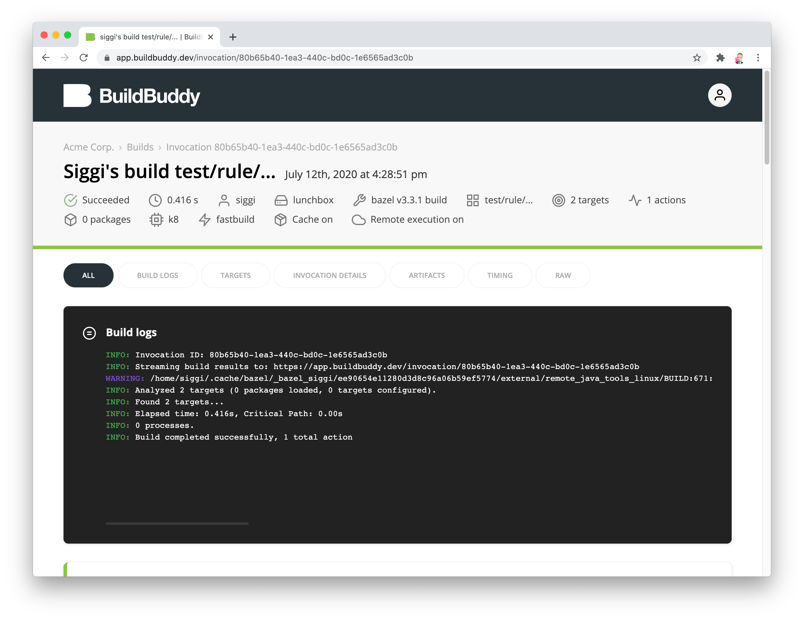
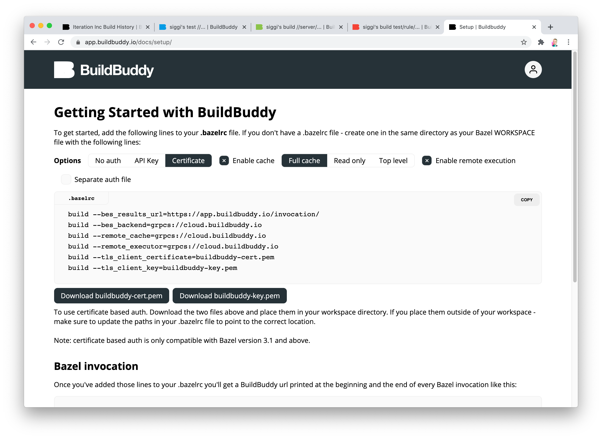
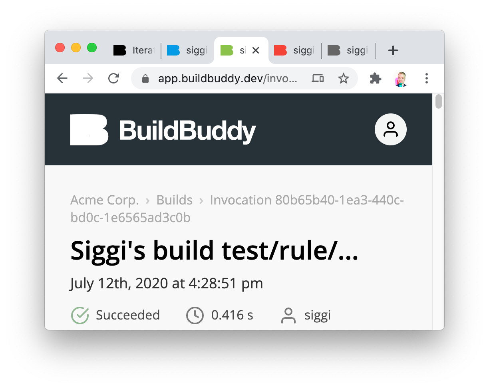
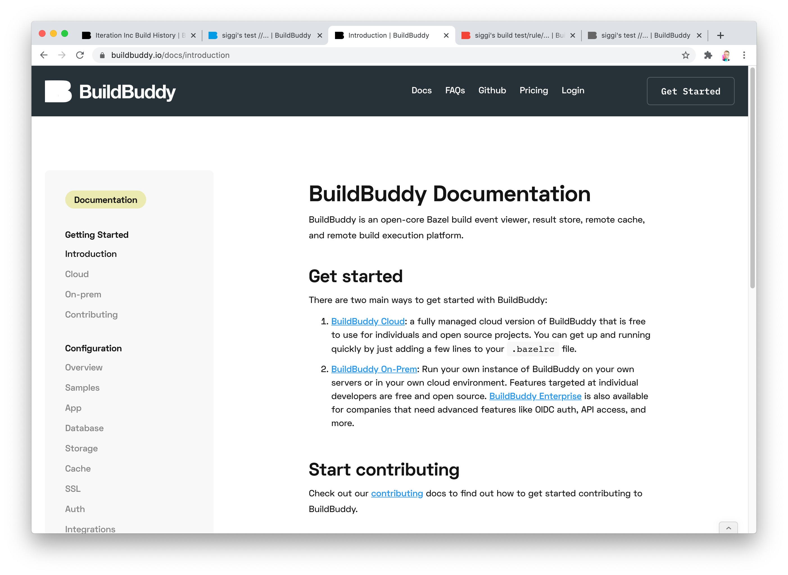
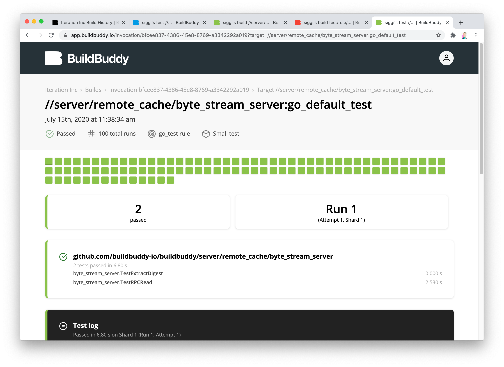
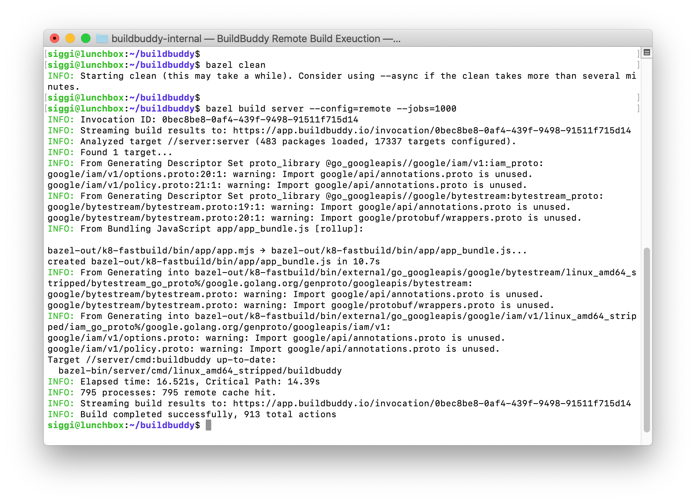
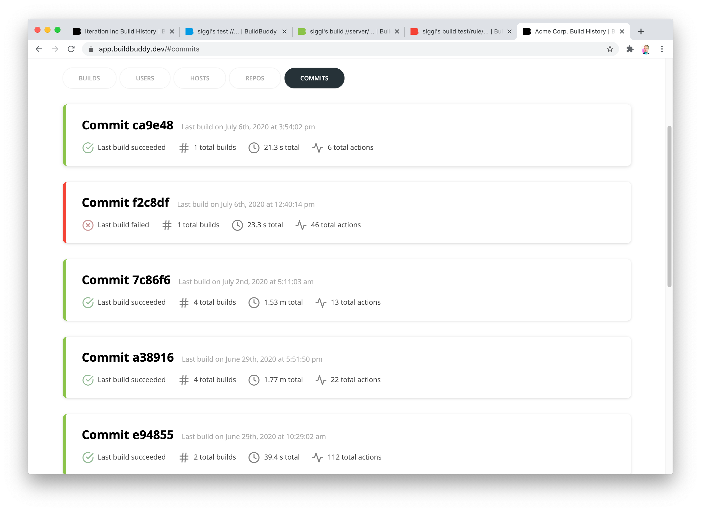

Excited to share that v1.1.0 of BuildBuddy is live on both [Cloud Hosted BuildBuddy](https://app.buildbuddy.io/) and open source via [Github](https://github.com/buildbuddy-io/buildbuddy) and [Docker](https://github.com/buildbuddy-io/buildbuddy/blob/master/SETUP.md#docker-image)!

Thanks to everyone that has tested open source and cloud-hosted BuildBuddy. We've made lots of improvements in this release based on your feedback.

A special thank you to our new contributors:

- [Sergio Rodriguez Orellana](https://github.com/SrodriguezO) who contributed support for making dense mode the default view mode.
- [Tim Glaser](https://twitter.com/timgl?lang=en) who made some major improvements to our documentation.

Our focus for this release was on our new Remote Build Execution platform. This release marks a huge step in fulfilling our mission of making developers more productive by supporting the Bazel ecosystem.

BuildBuddy's Remote Build Execution platform supports executing your Bazel build and tests in parallel across thousands of machines with automatic scaling, support for custom Docker images, and more. We've been iterating on and testing BuildBuddy RBE for months with companies of different sizes, and are excited to now make it available to everyone.

<!-- truncate -->

While BuildBuddy RBE is not yet fully open source, we're offering Cloud RBE for free to individuals and open source projects to show our appreciation to the open source community.

We'll be adding more documentation on getting started with BuildBuddy RBE in the coming weeks, but in the meantime feel free to email us at <rbe@buildbuddy.io> or ping us in the [BuildBuddy Slack](https://join.slack.com/t/buildbuddy/shared_invite/zt-e0cugoo1-GiHaFuzzOYBPQzl9rkUR_g) and we'll be happy to help you get started.

## **New to Open Source BuildBuddy**

- **Cache & remote execution badges - **BuildBuddy invocations pages now show badges that indicate whether or not caching and remote execution are enabled. Clicking on these badges takes you to instructions on how to configure these if they're enabled for your BuildBuddy instance.

- **Remote build execution configuration options** - the BuildBuddy configuration widget has now been updated to enable configuring of remote build execution if it's enabled for your BuildBuddy instance.

- **Better build status support** - BuildBuddy now better distinguishes between in-progress, failed, passed, and cancelled builds with new colorful status indicators, favicons, and more.

- **Improved documentation and new website** - we've completely revamped the BuildBuddy documentation, and it's now sync'd between GitHub and [buildbuddy.io/docs/](https://buildbuddy.io/docs/), so your docs will be fresh regardless of where you're reading them. We'll be adding new sections on configuring RBE in the coming weeks. We've also completely revamped the BuildBuddy website to make it easier to navigate and perform actions like requesting a quote, or subscribing to our [newsletter](#wf-form-Newsletter-Form).

- **Test run grid** - BuildBuddy will now automatically display test runs as a grid when a single test target is run more than 10 times. This supports the use case of finding and fixing flaky tests by running them with **--runs_per_test=100**.

- **Performance and reliability improvements** - we put a lot of work into improving performance and reliability in this release. This includes changes like better event flushing (no more getting stuck on 15 build events), better shutdown behavior, speed improvements and optimizations in build artifact uploading and downloading, and more.

## New to Cloud & Enterprise BuildBuddy

- **Remote Build Execution** - BuildBuddy Cloud and enterprise on-prem now support Remote Build Execution. Features include custom Docker image support, automatic scaling, multiple caching layers, and more. Additional features like Mac support, viewing of remote build actions in BuildBuddy, and more are coming soon.

- **Invocation grouping** - BuildBuddy invocations can now be grouped by commit and by repo. These can be populated in one of three ways:

1.  automatically by common CI environments like CircleCI and GitHub actions
2.  manually by using build flags **--build_metadata=REPO_URL=** and **--build_metadata=COMMIT_SHA=**‍
3.  by using a **--workspace_status_command** script like [this one](https://github.com/buildbuddy-io/buildbuddy/blob/master/workspace_status.sh)

- **New cloud endpoint** - BuildBuddy now exposes a L7 load balanced gRPCS cloud endpoint at **cloud.buildbuddy.io** which can be used for BES, cache, and remote execution (see our [.bazelrc](https://github.com/buildbuddy-io/buildbuddy/blob/master/.bazelrc#L25) for an example). We'll gradually be migrating users to this from the old events.buildbuddy.io, and cache.buildbuddy.io endpoints with port numbers.

- **Easier enterprise deployment** - deploying enterprise BuildBuddy is now just as easy as deploying open source BuildBuddy, with a one line install script that deploys to your Kubernetes cluster. It takes your [BuildBuddy configuration file](https://www.buildbuddy.io/docs/config) as a parameter so you can easily configure things to your needs.

That's it for this release. Stay tuned for more updates coming soon!

As always, we love your feedback - email us at <hello@buildbuddy.io> with any questions, comments, or thoughts.
