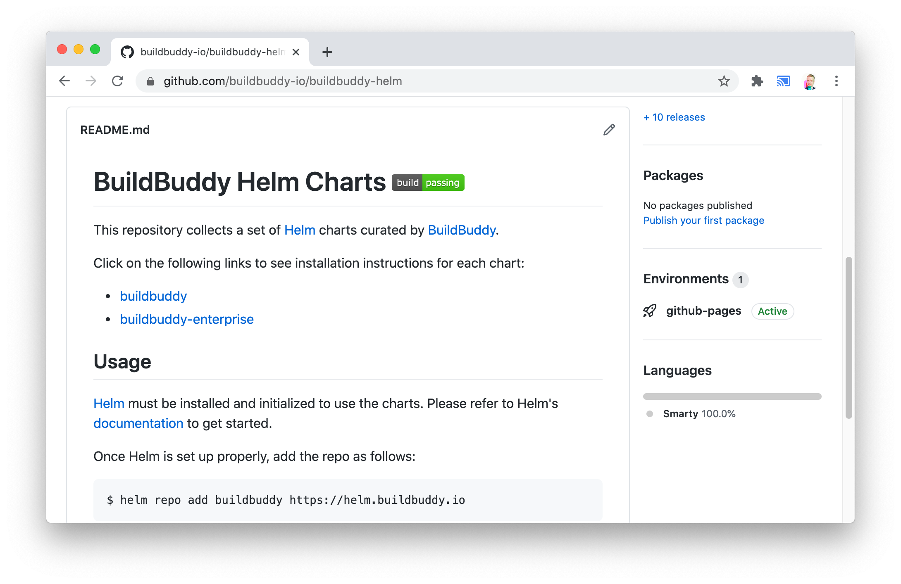
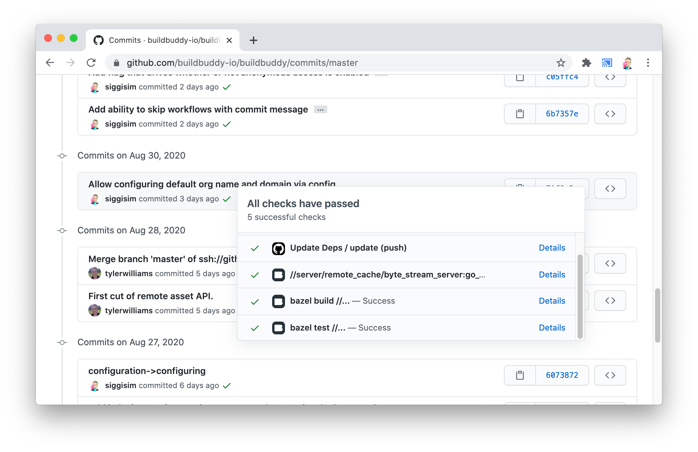
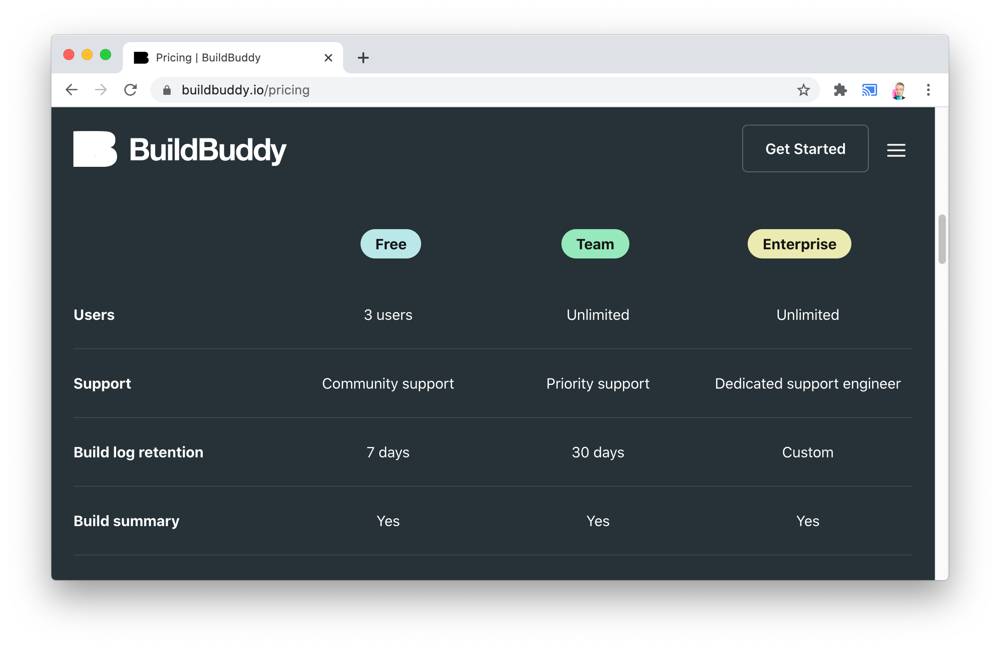

Excited to share that v1.2.1 of BuildBuddy is live on both [Cloud Hosted BuildBuddy](https://app.buildbuddy.io/) and open source via [Github](https://github.com/buildbuddy-io/buildbuddy) and [Docker](https://github.com/buildbuddy-io/buildbuddy/blob/master/docs/on-prem.md#docker-image)!

Thanks to everyone that has tested open source and cloud-hosted BuildBuddy. We've made lots of improvements in this release based on your feedback.

A special welcome to our newest contributor and **team member**:

- [Brandon Duffany](https://github.com/bduffany) - Brandon is an ex-Googler and Cornell alumn who's worked as a software engineer on Google Assistant and Google Ads. He'll start off focused on surfacing better profiling and timing information to help users track down and fix slow builds!

Our focus for this release was on expanding access to BuildBuddy as well as improving scalability and performance.

We're also excited to announce that we're expanding the BuildBuddy Cloud free tier. BuildBuddy Cloud is now **free for teams of up to 3 engineers** in addition to being free for individuals open source projects of any size.

<!-- truncate -->

## New to Open Source BuildBuddy

- **Official BuildBuddy Helm charts** - thanks to a [request](https://github.com/buildbuddy-io/buildbuddy/issues/35) from [Nathan Leung](https://github.com/nathanhleung) we've created official [BuildBuddy Helm Charts](https://github.com/buildbuddy-io/buildbuddy-helm) that are available for both [Open Source](https://github.com/buildbuddy-io/buildbuddy-helm/tree/master/charts/buildbuddy) and [Enterprise](https://github.com/buildbuddy-io/buildbuddy-helm/tree/master/charts/buildbuddy-enterprise) deployments. [Helm](https://helm.sh/) enables you to deploy BuildBuddy to a Kubernetes cluster with a single command, and makes configuration a breeze. The charts can optionally take care of provisioning a MySQL instance, an Nginx ingress, and even Memcached.

- **Build metadata** - a frequent request from users is the ability to associate a BuildBuddy invocation with a particular git commit and repo. To support this, we've added optional build metadata including repo URL, commit SHA, and CI role that can be passed up with your build. This metadata can be passed up using the `--build_metadata` flag, using a `--workspace_status_command` script, or using environment variables commonly set by CI providers like CircleCI, BuildKite, GitHub Actions, and others. More information on how to configure your metadata can be found in our [build metadata guide.](https://www.buildbuddy.io/docs/guide-metadata)

- **GitHub commit status publishing** - now that you can configure build metadata to associate invocations with a GitHub repo and commit, we've added the ability to publish commit statuses straight to GitHub when you've set your metadata role to **CI**. To enable this feature, simply click **Link GitHub Account** in your BuildBuddy profile dropdown (if you're using self hosted BuildBuddy, you'll need to [create a Github OAuth app](https://www.buildbuddy.io/docs/config-github) and add it to your config.yaml file).

BuildBuddy links directly on GitHub

- **Improved cache hit rate** - we've made improvement to our Action Cache validation logic that should result in higher cache hit rates.

- **New guides** - we've added new guides to our documentation, including our [Authentication Guide](https://www.buildbuddy.io/docs/guide-auth), [Build Metadata Guide](https://www.buildbuddy.io/docs/guide-metadata), [Remote Build Execution with Github Actions Guide](https://www.buildbuddy.io/docs/rbe-github-actions), with more coming soon. We've also started collecting troubleshooting documentation for common errors including [RBE Failures](https://www.buildbuddy.io/docs/troubleshooting-rbe), and [Slow Uploads](https://www.buildbuddy.io/docs/troubleshooting-slow-upload). Contributions [welcome](https://github.com/buildbuddy-io/buildbuddy/tree/master/docs)!

- **Target information in timing tab** - in Bazel 3.4.0, the experimental [flag](https://docs.bazel.build/versions/master/command-line-reference.html#flag--experimental_profile_include_target_label) `--experimental_profile_include_target_label` was introduced which adds target information to profiling events. When this flag is enabled, this target information is now displayed in the BuildBuddy Timing tab.

## New to Cloud & Enterprise BuildBuddy

- **BuildBuddy Cloud is now free for teams of up to 3** - we want to make BuildBuddy available to every team - regardless of size. BuildBuddy has always been free for individuals and open source projects and today we're expanding this to teams of up to 3 engineers. As your team continues to grow, we have reasonably priced plans that scale from startups to the largest enterprises.

- **Distributed scheduler** - the scheduler is a core component of any remote execution platform. In many cases, it is a single point of failure that turns an otherwise robust system into a fragile, stateful service that's hard to scale. In BuildBuddy 1.2.1, we rewrote our **distributed** Remote Build Execution scheduler from the ground up based on many learnings and best practices from state-of-the-art systems like Apache Spark. This enables BuildBuddy to scale to handle the largest workloads with no single point of failure, single digit millisecond queue wait times, and fault tolerance that enables execution on preemptible nodes. This allows for more cost effective high availability configurations, and allows you to deploy new BuildBuddy releases without a blip in ongoing executions.

- **Remote asset API** - in Bazel 3.0.0 the Remote Asset API was introduced along with the `--experimental_remote_downloader` [flag](https://docs.bazel.build/versions/master/command-line-reference.html#flag--experimental_remote_downloader). In this release, we've added basic support for this experimental API.

- **Organization configuration** - we've added configuration options for on-prem installs that allow you to configure an organization's name and limit signups to emails from a specific domain. More information in the [org config documentation](https://www.buildbuddy.io/docs/config-org).

- **Configurable anonymous access** - we've added a configuration option that allows organizations with authentication configured to choose whether or not anonymous access should be enabled. Anonymous access is off by default when auth is configured. More information in the [auth config documentation](https://www.buildbuddy.io/docs/config-auth).

- **S3 cache support** - BuildBuddy [previously](https://github.com/buildbuddy-io/buildbuddy/pull/12) had support for using Amazon S3 as a backing store for build events. In this release, we've added Amazon S3 support for as a backing store for caching as well, with support for streaming, ContainsMulti, and more.

That's it for this release. Stay tuned for more updates coming soon!

As always, we love your feedback - join our [Slack channel](https://slack.buildbuddy.io) or email us at <hello@buildbuddy.io> with any questions, comments, or thoughts.
