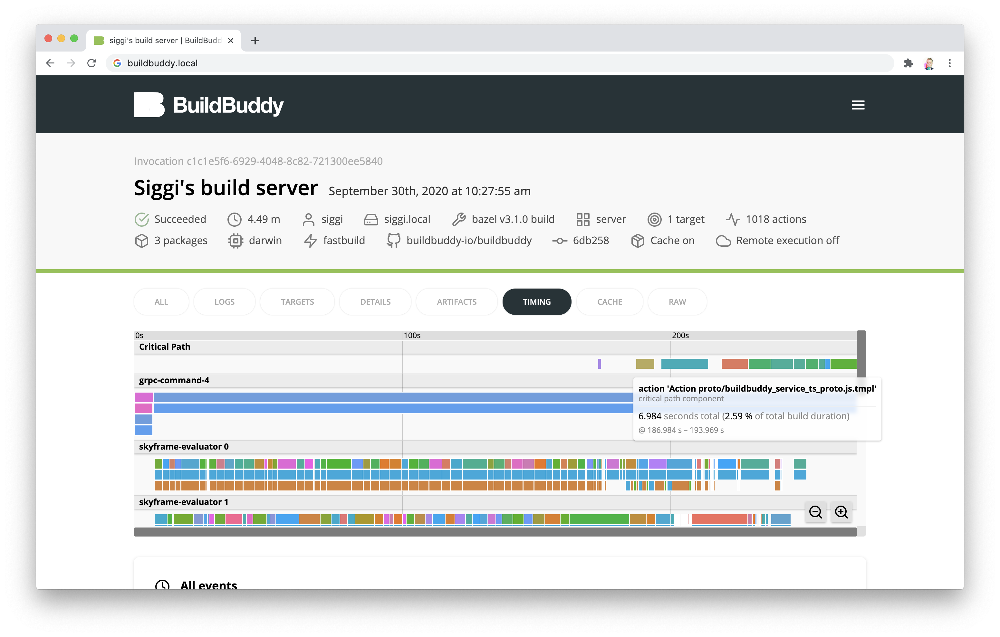
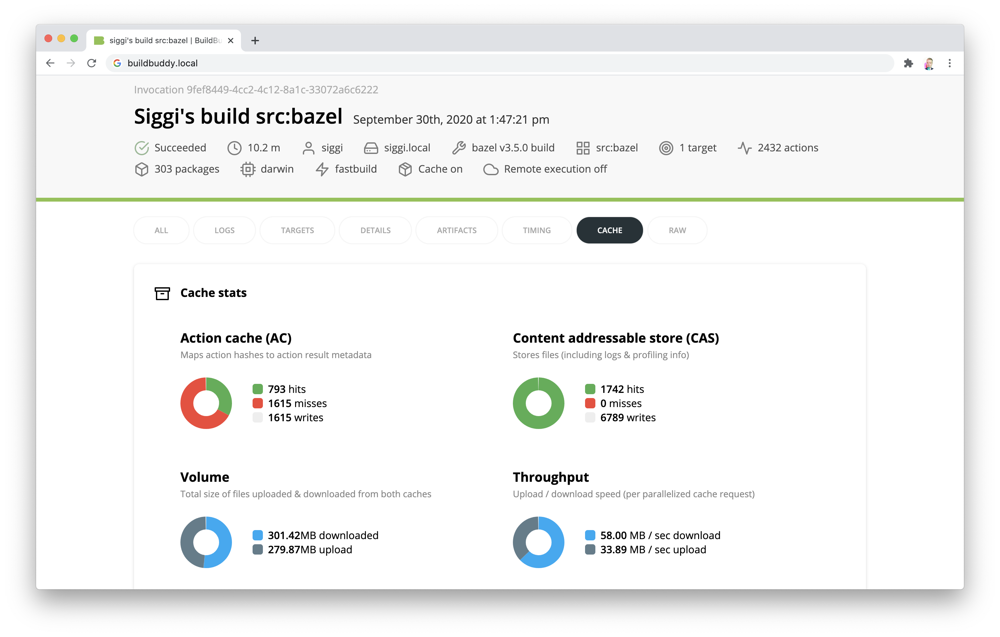
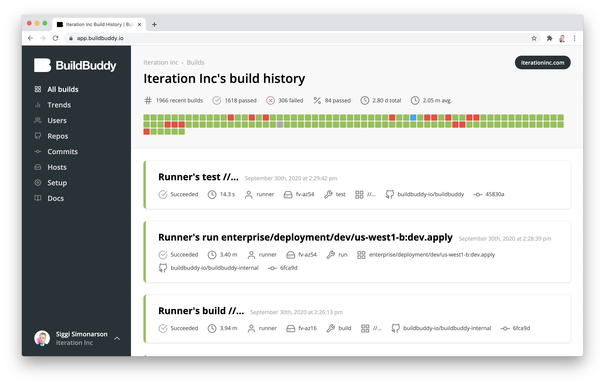
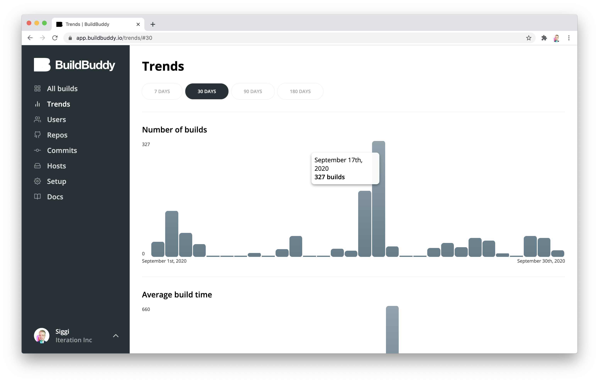

We're excited to share that v1.3.0 of BuildBuddy is live on both[ Cloud Hosted BuildBuddy](https://app.buildbuddy.io/) and open-source via[ Github](https://github.com/buildbuddy-io/buildbuddy) and[ Docker](https://github.com/buildbuddy-io/buildbuddy/blob/master/docs/on-prem.md#docker-image)!

Thanks to everyone using open source and cloud-hosted BuildBuddy. We’ve made lots of improvements in this release based on your feedback.

Our focus for this release was on giving users new tools to improve build performance, debug cache hits, and a completely redesigned Cloud & Enterprise experience.

<!-- truncate -->

## New to Open Source BuildBuddy

- **Timing profile explorer **- Bazel's timing profile is the best way to get detailed insights into where to spend your time optimizing your build. Unfortunately, extracting useful information out of the thousands of events can be challenging without using something like Chrome's profiling tools. Now we've built these tools right into the BuildBuddy timing tab so you can explore this info for any build. See which actions dominate your build's critical path or find out how much time is spent downloading outputs - now with a single click.

Dive into the timing for every action, critical path information, and more.

- **Cache stats **- one of the feature requests we get most frequently is for more information on cache hits and misses. This data can be tricky to get a hold of because it's not made easily available by Bazel's build event protocol. That's why we've introduced BuildBuddy's new cache tab. It gives you a view into cache hits, misses, and writes for every invocation that uses BuildBuddy's gRPC cache. It breaks these numbers down by action cache (AC) and content addressable store (CAS). BuildBuddy also tracks the volume and throughput of cache requests so you can see how much data is moving in and out of the cache - and at what speed.

Get a view into cache performance for every invocation.

- **Environment variable redaction controls** - when debugging cache hits, it can be useful to get a full picture of the inputs that are affecting a particular build - like the PATH environment variable. By default, BuildBuddy redacts nearly all environment variables passed into Bazel. We've added controls per invocation that allow you to optionally allow environment variables of your choice to skip redaction. Information on configuring this can be found in our[ build metadata docs](https://www.buildbuddy.io/docs/guide-metadata#environment-variable-redacting).

## New to Cloud & Enterprise BuildBuddy

- **Redesigned navigation **- as BuildBuddy has grown from a debugging tool to a fully-featured platform to debug, analyze, monitor, and share builds across your organization, we've outgrown the minimal navigation setup that has gotten us this far. In Cloud and Enterprise BuildBuddy, we've replaced the top menu bar with a more fully-featured left-nav. This gives us room to add new features like Trends and provides easier access to critical pages like Setup & Docs.

The new navigation makes room for new features.

- **Trends **- BuildBuddy has lots of information about every invocation that it collects. Now with Trends, you can follow how your builds are changing over time. Have all of the cache improvements you've been working on decreased average build time over the last month? Has the addition of a new external dependency significantly increased the length of your slowest builds? Answering these questions is easy with BuildBuddy Trends.

- **Redis Pub/Sub support **- we've added support for Redis Pub/Sub to significantly improve remote build execution performance. It's completely optional for on-prem deployments, but in our testing it's improved performance for builds with lots of small actions by a factor of 2x. No change is required for Cloud users - just enjoy the faster builds!

That’s it for this release. Stay tuned for more updates coming soon!

As always, we love your feedback - join our[ Slack channel](https://slack.buildbuddy.io) or email us at <hello@buildbuddy.io> with any questions, comments, or thoughts.
