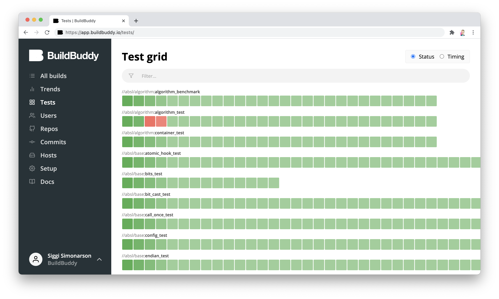
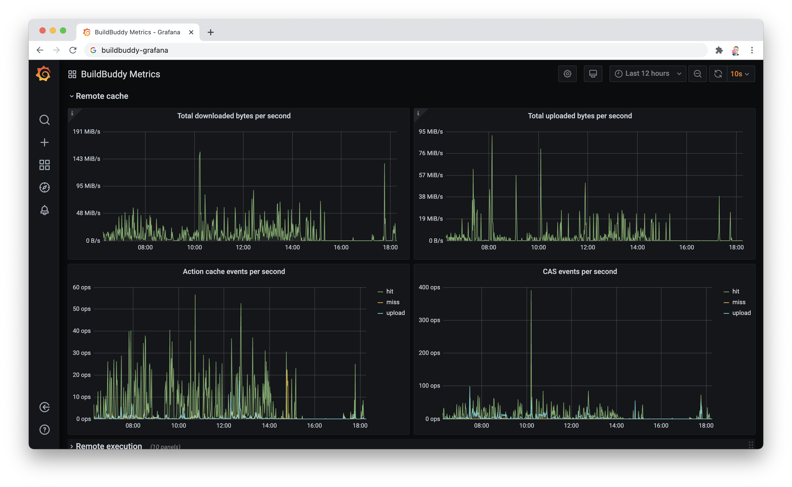
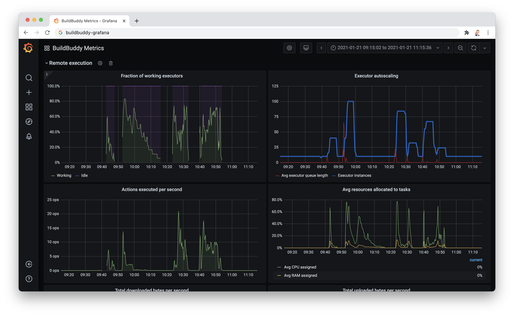

We're excited to share that v1.5.0 of BuildBuddy is live on both [Cloud Hosted BuildBuddy](https://app.buildbuddy.io/) and open-source via [Github](https://github.com/buildbuddy-io/buildbuddy), [Docker](https://github.com/buildbuddy-io/buildbuddy/blob/master/docs/on-prem.md#docker-image), and [our Helm Charts](https://github.com/buildbuddy-io/buildbuddy-helm)!

Thanks to everyone using open source, cloud-hosted, and enterprise BuildBuddy. We've made lots of improvements in this release based on your feedback.

A special thank you to our new open-source contributor:

- [**Corbin McNeely-Smith**](https://github.com/restingbull) who contributed to making our auth flow more resilient to error cases, and made our health-check handlers more flexible to support different load-balancers.

Our focus for this release was on giving users more visibility into test flakiness, monitoring & scaling improvements, and security hardening.

<!-- truncate -->

## New in v1.5.0

- **Test flakiness dashboard** - one of the feature requests we get most frequently from BuildBuddy users is the ability to collect target-level data and analyze it across invocations. Today we're taking the first step in the direction with our new test dashboard. The test dashboard allows you to monitor per-target test statuses by commit - so you can quickly identify and fix flaky test targets that slow down developer velocity. It also has a timing view that gives you a heat-map to quickly identify slow targets. This is just the first step we're taking in exposing more target-level data and are excited to build additional features based on your feedback!

- **Prometheus metrics** - we've added a ton of new Prometheus metrics to BuildBuddy that allow open-source and Enterprise users to monitor not only BuildBuddy's performance, but the overall health of their developer productivity efforts. This allows you to hook into existing monitoring and alerting tools like Grafana to analyze and get notified when your developers are experiencing issues. Metrics include build duration, cache hit & miss rates, remote execution queue length, and more. For a full list of the new metrics we now expose, see our [Prometheus metric documentation](https://www.buildbuddy.io/docs/prometheus-metrics). Interested in some metrics that aren't on this list? Let us know!

- **Auto-scaling** - with the addition of our new Prometheus metrics, we've also made improvements to the autoscaling capabilities of BuildBuddy executors. Now in addition to scaling off of raw compute metrics like CPU and RAM, BuildBuddy executors can also be configured to scale based on executor queue length and other custom metrics. This allows you to achieve better performance under heavy load while also managing your compute resources more efficiently and cost-effectively.

- **Security hardening** - as part of our SOC 2 compliance controls, BuildBuddy undergoes regularly scheduled penetration tests by paid security professionals. This release contains fixes for all three non-critical findings from our January 2021 pen-test.

- **Memory leak fixes** - we found and fixed 2 memory leaks in our BuildBuddy app (using our new Prometheus metrics!) that would occasionally cause BuildBuddy app servers to restart due to memory pressure.

- **Mac executor bug fix** - we fixed a tricky bug caused by quirks in the way macOS handles hard-linking that significantly improves the reliability of our Mac RBE executors.

- **More bug fixes** - there are lots of other bug fixes in this release including improved deadline and timeout handling, executor task scheduling improvements, and more!

That's it for this release. Stay tuned for more updates coming soon!

As always, we love your feedback - join our [Slack channel](https://slack.buildbuddy.io) or email us at <hello@buildbuddy.io> with any questions, comments, or thoughts.
