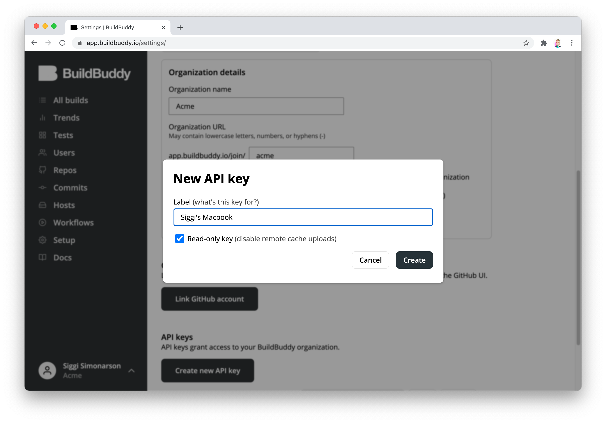
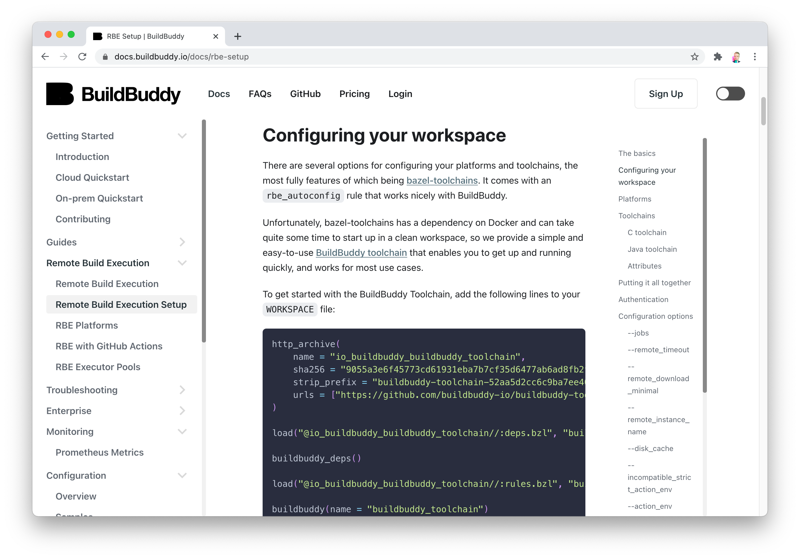
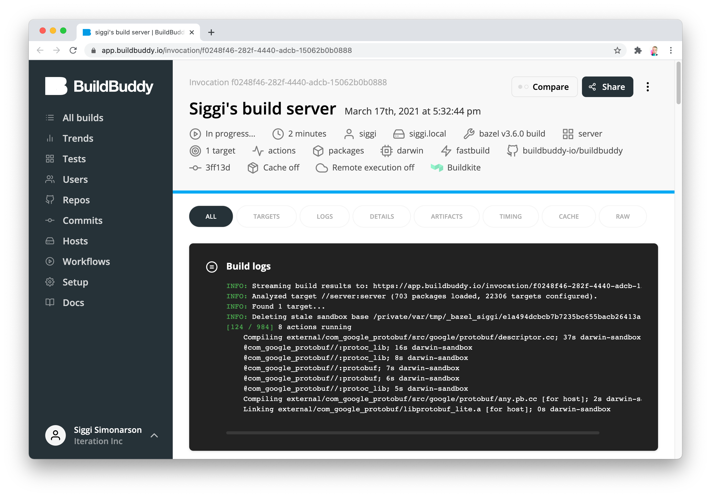
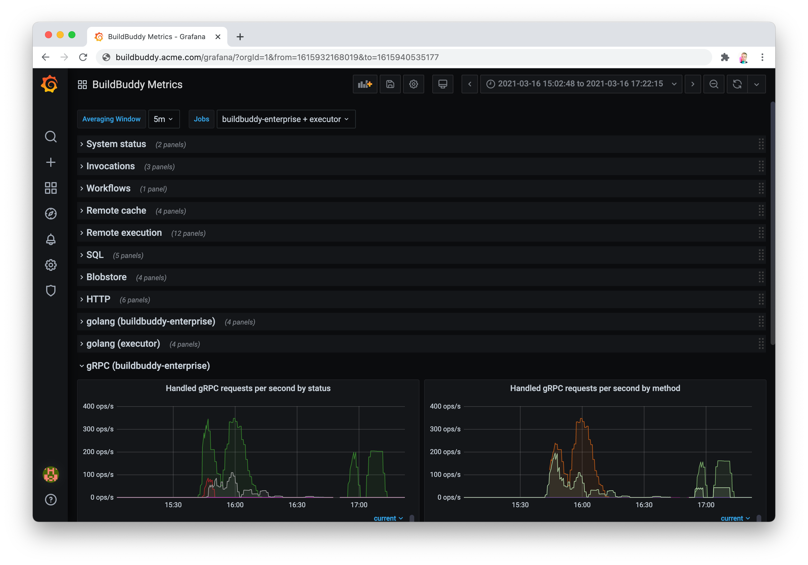

We're excited to share that v1.8.0 of BuildBuddy is live on [Cloud Hosted BuildBuddy](https://app.buildbuddy.io/), Enterprise, and Open Source via [GitHub](https://github.com/buildbuddy-io/buildbuddy), [Docker](https://github.com/buildbuddy-io/buildbuddy/blob/master/docs/on-prem.md#docker-image), and [our Helm Charts](https://github.com/buildbuddy-io/buildbuddy-helm)!

Thanks to everyone using open source, cloud-hosted, and enterprise BuildBuddy. We've made lots of improvements in this release based on your feedback.

**A special thank you to our new open-source contributor:**

- [**Ashley Davies**](https://github.com/ashleydavies) who contributed several pull requests to our [Helm charts](https://github.com/buildbuddy-io/buildbuddy-helm/) in order to make them easier to use in clusters that already have an Nginx controller deployed.

**And a warm welcome to our three new team members!**

- [**Pari Parajuli**](https://www.linkedin.com/in/pari-parajuli/) who joins our engineering team as an intern who's currently studying at University of California, Berkeley.
- [**Vadim Berezniker**](https://www.linkedin.com/in/vadimberezniker/) who joins our engineering team after 7 years at Google on the Google Cloud team.
- [**Zoey Greer**](https://www.linkedin.com/in/zoey-greer/) who joins us as a software engineer from the Google Search team.

We're excited to continue growing BuildBuddy and fulfill our mission of making developers more productive!

Our focus for this release was on reliability, performance, improved documentation, and making BuildBuddy easier to release and monitor.

<!-- truncate -->

## New in v1.8.0

- **Read-only API keys** - when using Bazel remote caching, teams often need to configure which machines have write access to the cache. While Bazel has some flags to control cache writes, using these can be error prone and insecure. BuildBuddy now makes this easy by introducing the ability to create both read-only and read+write api keys on your organization settings page. You can create as many API keys (and certificates) as you'd like and distribute them to your CI machines, workstations, and other endpoints.

- **Improved docs** - we've completely revamped [our documentation](https://docs.buildbuddy.io/) and added support for tables of contents, syntax highlighting, better navigation, dark mode (!!), interactive widgets, and an "Edit this page" button that links directly to the correct file in our [GitHub docs directory](https://github.com/buildbuddy-io/buildbuddy/tree/master/docs) for submitting pull requests. With these great new features, we'll be ramping up documentation on both new and existing BuildBuddy features to make the lives of BuildBuddy users easier.

- **Testing improvements** - we've invested heavily in our testing infrastructure, adding new integration tests and test fixtures that make testing BuildBuddy's interactions with Bazel easier. This will lead to more stable releases and faster iteration cycles going forward.

- **Remote execution improvements** - we've made more speed and reliability improvements to our remote build execution platform, including faster cache hit checking, faster auth checks, and better support for iOS builds.

- **Buildkite integration -** invocations that are kicked off from Buildkite now link back to the Buildkite job that triggered them.

- **Grafana** - our [Helm charts](https://github.com/buildbuddy-io/buildbuddy-helm) make deploying BuildBuddy to Kubernetess cluster a breeze. One thing that's been tricky for many users has been accessing the Prometheus data that BuildBuddy exports in an easily digestible format. To fix this, we made it easy to [deploy Grafana and Prometheus](https://github.com/buildbuddy-io/buildbuddy-helm/tree/master/charts/buildbuddy-enterprise#example-with-prometheus--grafana) via our Helm charts with just a couple lines of configuration. It comes out of the box with a default dashboard that shows popular BuildBuddy metrics and can be easily extended to add more graphs.

- **More to come** - we've been laying the groundwork for two major projects that will go live in the coming weeks to make building and testing your Bazel projects even faster.

That's it for this release. Stay tuned for more updates coming soon!

As always, we love your feedback - join our [Slack channel](https://slack.buildbuddy.io) or email us at <hello@buildbuddy.io> with any questions, comments, or thoughts.
