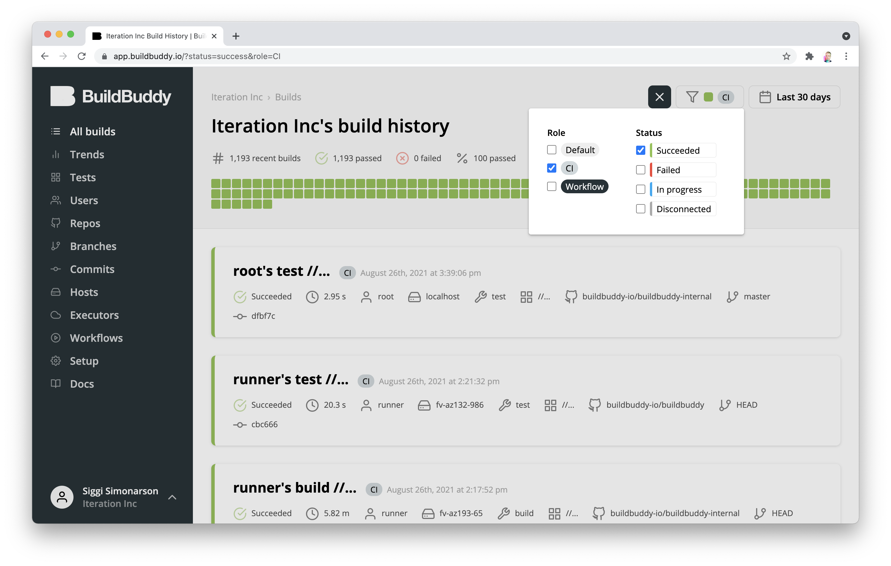
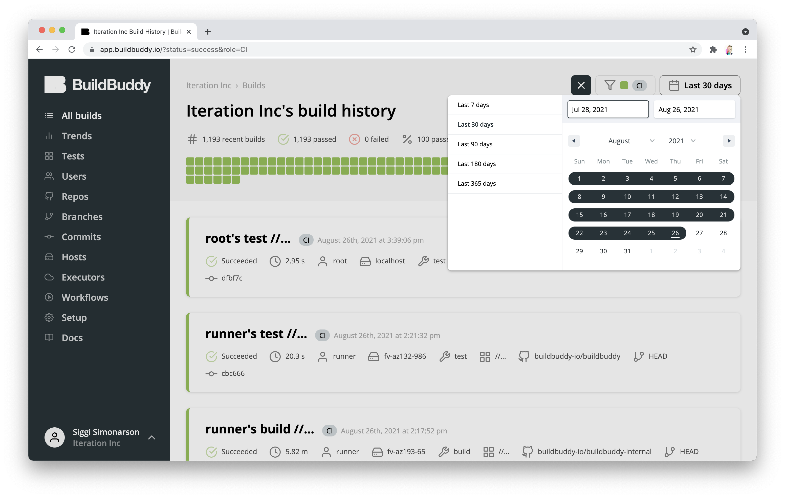
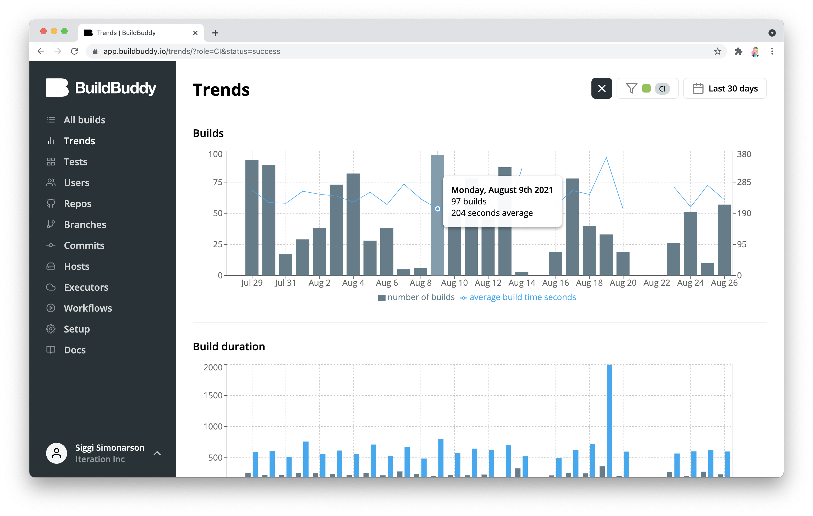
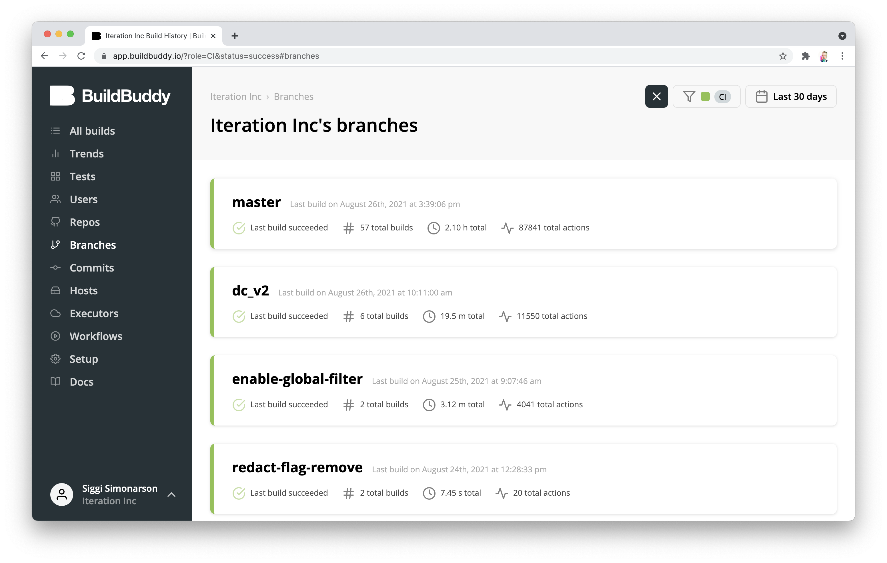
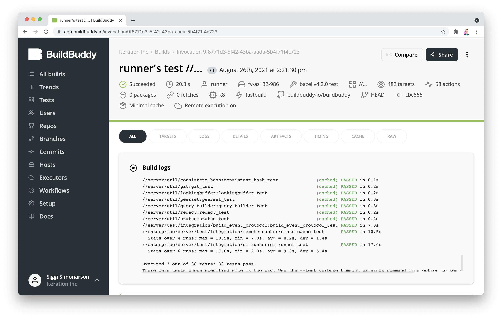
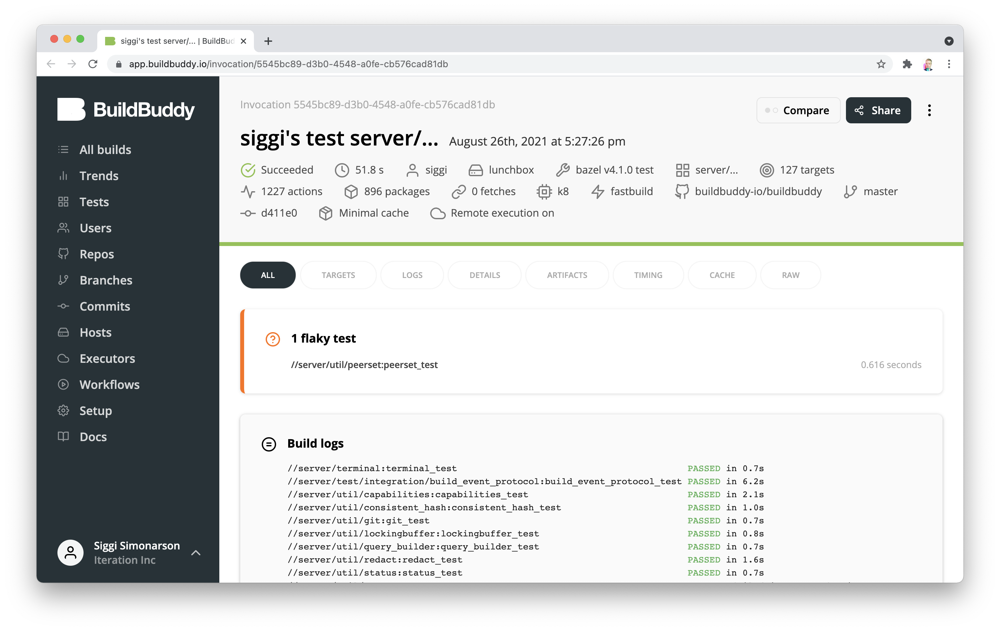
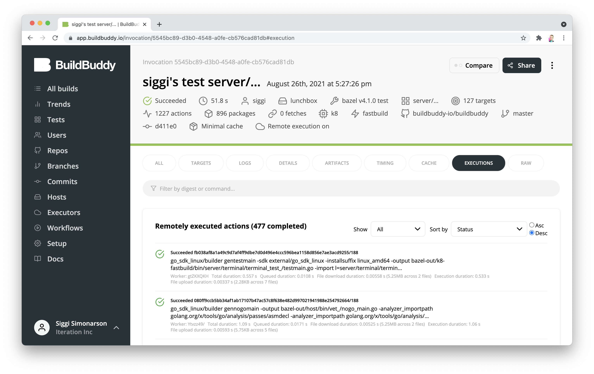
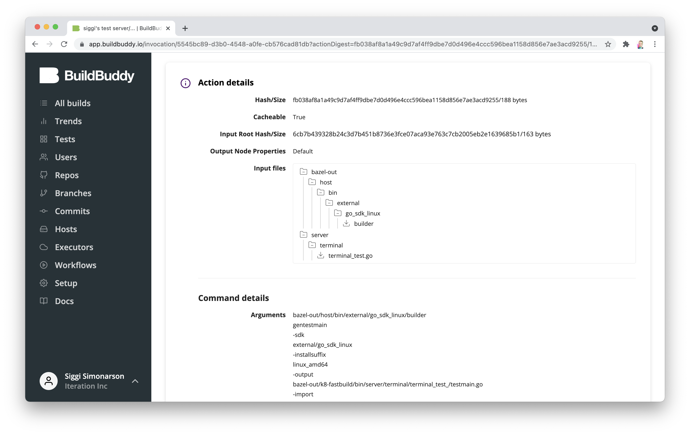
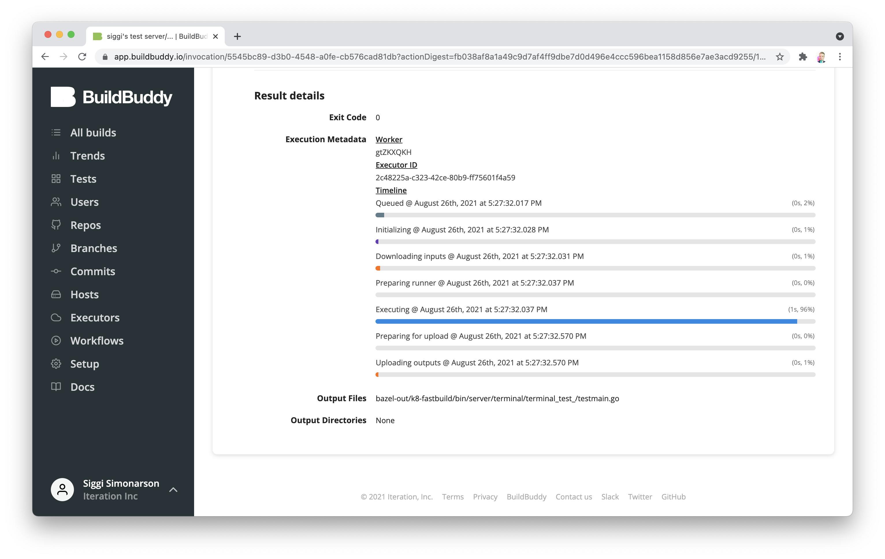
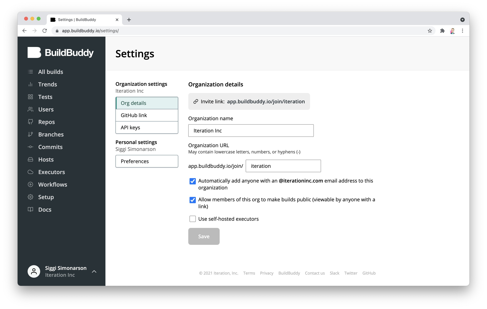

We're excited to share that v2.5.0 of BuildBuddy is live on both [Cloud Hosted BuildBuddy](https://app.buildbuddy.io/) and open-source via [Github](https://github.com/buildbuddy-io/buildbuddy), [Docker](https://github.com/buildbuddy-io/buildbuddy/blob/master/docs/on-prem.md#docker-image), and [our Helm Charts](https://github.com/buildbuddy-io/buildbuddy-helm)!

Thanks to everyone using open source, cloud-hosted, and enterprise BuildBuddy. We've made lots of improvements in this release based on your feedback.

<!-- truncate -->

## New in v2.5.0

- **The new global filter** - BuildBuddy collects lots of build information across CI and local builds. In order to make navigating these builds easier, we've introduced a new global filter. The global filter allows you to filter by status and role on any page - with more options including user, repo, and branch coming soon.

- **Date picker** - To complement the new global filter, we've also added a date picker. The date picker allows you to select a time range and see builds, trends, etc. for exactly the time period you're interested in.

- **Clickable trends** - Now that you can filter any view by date, we've added a feature to the Trends page that allows you to click on a data point and be taken to a filtered view of builds from just that time period. As part of this change, the trends page now also respects your local time zone.

- **Branch information** - BuildBuddy now collects information about a build's git branch in addition to the repo and commit info already collected. This makes it even easier to navigate your builds.

- **Light terminal theme** - For those of you who suffer from eye strain when reading light text on dark backgrounds: we've heard your feedback. We've added a new light terminal theme that can be enabled in your personal settings.

- **Improved flaky test support** - Flaky tests can destroy developer productivity. To make them easier to deal with, we've added a new feature that calls out flaky tests & timeouts more explicitly. We've also improved the behavior of our RBE to reduce flakes due to timeouts when caused by external factors like Docker image pulls.

- **Remote executions tab** - We've had a hidden feature for a while that allowed you to click on the `Remote execution on` label to see an overview of remotely executed actions for RBE builds. We've now promoted this feature to its own `Executions` tab. With this change come new features like search and filtering.

- **Action input & output files** - When clicking on an individual remotely executed actions, we now have a new file viewer that allows you to navigate the input files of the action. You can click on any of these files (as well as any output files the action has) to download them from the remote cache.

- **Action timing** - The timing tab gives you a breakdown of execution timing from Bazel's point of view, but there's another story to tell from the remote executor's point of view. Action pages now show a visual breakdown of time spent in queue, downloading inputs, executing, and uploading outputs for each remotely executed action.

- **Revamped settings page** - We've revamped the settings page to make it easier to manage your BuildBuddy account.

- **And much much more** - Every release comes packed with so many new features, performance improvements and bug fixes that we can't get to them all. Here are some more highlights:
  - Support for serving static files from a CDN
  - Support for MinIO as a storage backend
  - Buildkite links now link to the specific Buildkite job that spawned the invocation
  - Support for distributed tracing backends like Jaeger, Google Cloud Trace, and others

That's it for this release. Stay tuned for more updates coming soon!

As always, we love your feedback - join our [Slack channel](https://slack.buildbuddy.io) or email us at <hello@buildbuddy.io> with any questions, comments, or thoughts.
