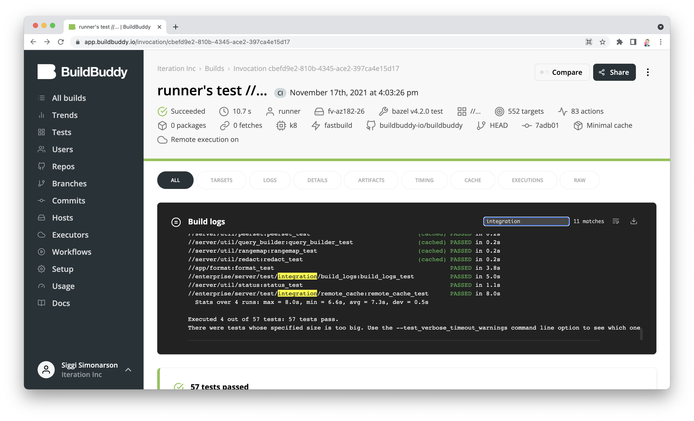
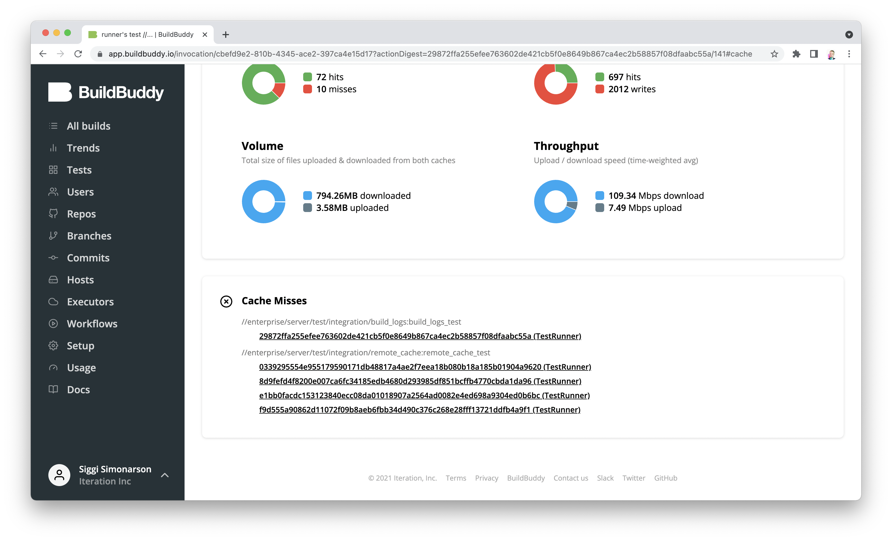
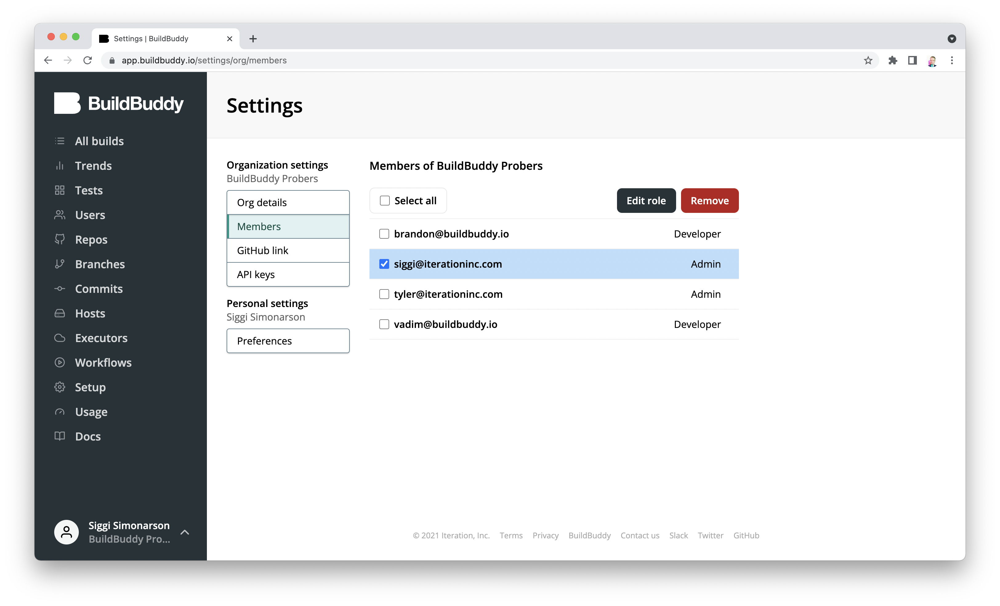
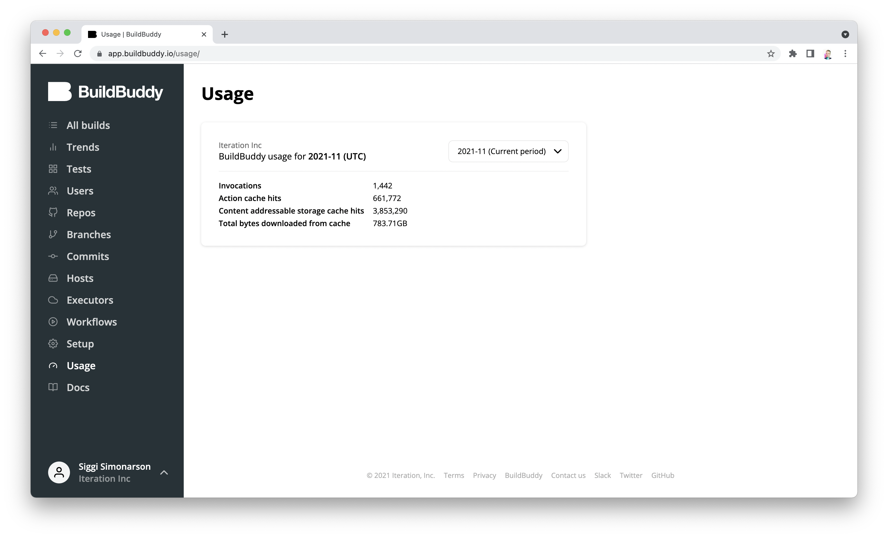

To celebrate Bazelcon 2021 (and [our Bazelcon talk](https://opensourcelive.withgoogle.com/events/bazelcon2021?talk=bazel-in-the-cloud)), we've got a lot in store for you in this release! We're excited to share that **v2.7.0** of BuildBuddy is live on both [Cloud Hosted BuildBuddy](https://app.buildbuddy.io/) and open-source via [Github](https://github.com/buildbuddy-io/buildbuddy), [Docker](https://github.com/buildbuddy-io/buildbuddy/blob/master/docs/on-prem.md#docker-image), and [our Helm Charts](https://github.com/buildbuddy-io/buildbuddy-helm)!

We've also updated [the list of open source repositories that use BuildBuddy](https://www.buildbuddy.io/open-source-repos). If you have an open source repo that's using BuildBuddy, and would like to be included on the list - please fill out the quick form at the bottom of that page!

Thanks to everyone using open source, cloud-hosted, and enterprise BuildBuddy. We've made lots of improvements in this release based on your feedback.

<!-- truncate -->

## New in v2.7.0

- **M1 Mac support** - we now [publish](https://github.com/buildbuddy-io/buildbuddy/releases/tag/v2.7.0) BuildBuddy executor binaries built for M1 Macs. These can be used with BuildBuddy Cloud's **Bring Your Own Executors** feature, BuildBuddy managed Mac executors, or in a self-hosted RBE cluster.

- **Build log improvements** - the build log viewer is core to the BuildBuddy experience. We've made a ton of improvements in this release to make this log viewing experience even better. Build logs are now **live** and update much more frequently. You can also now **search** build logs with a built-in search bar, **download** the raw build log text, and even **wrap** long lines.

- **Cache miss debugging UI** - one of the requests we get most frequently is for help debugging remote cache misses. There's a [guide](https://docs.bazel.build/versions/main/remote-execution-caching-debug.html) in the Bazel documentation, but it can be cumbersome to follow. We've made this process easier by surfacing individual action cache misses directly on the BuildBuddy cache tab. This allows you to quickly dive into which targets and actions missed cache and compare them against previous builds. You can click on any of these action hashes to explore the action's input files, environment variables, and command arguments. This is just the first step in making cache misses easier to debug - we're working on making this process even easier.

- **Member management & roles** - we've heard from many of the large organizations that we work with that they'd like to be able to limit which members of their organization are able to access certain BuildBuddy functionality - like editing organization settings. In order to support this, we've added a new member management UI on the BuildBuddy organization settings page. Here you can assign either `Admin` or `Developer` roles to members of your BuildBuddy organization.

- **Usage page** - while our Trends page gives users great insight into how their build metrics are trending over time, it's less useful for getting a sense of your total BuildBuddy usage for the current month (and previous months). We've introduced a new Usage page that allows you to get a quick glance of the metrics that are important for billing.
  

- **And much much more** - Every release comes packed with so many new features, performance improvements and bug fixes that we can't get to them all. Here are some more highlights:
  - Mac support for remote persistent workers
  - API improvements, including a build log download endpoint and target filtering by tag
  - Fixes for issues that can cause unnecessary BEP disconnects
  - Improvements to autoscaling scale-downs
  - Reduced memory footprint
  - New BEP live data export functionality
  - Flag overrides for platform properties for switching between pools without invalidating the cache
  - SAML quality of life improvements
  - Configurable executor docker image warm up
  - Support for Azure Storage as a storage backend
  - AWS WebIdentity authentication support
  - Private container registry support
  - A built-in Xcode locator in executors for discovering available Xcode versions

## Coming soon!

In addition to all of these great new features, we've also been laying the groundwork for some big new features that we're working on:

- A new caching infrastructure that will enable far more flexibility in where and how cache artifacts are stored.
- Mac support for [BuildBuddy Workflows](https://blog.buildbuddy.io/blog/meet-buildbuddy-workflows/).
- A managed cloud Bazel service that uses [Firecracker microVMs](https://firecracker-microvm.github.io/) to give you warm, incremental Bazel instances in the cloud (right next to your RBE cluster) that spin up in milliseconds.
- A web-based code editor built on top of VSCode (similar to [vscode.dev](https://vscode.dev/)) built entirely for Bazel that can kick off fully incremental RBE-enabled cloud Bazel builds & tests. If you're an ex-Googler who misses Cider &mdash; get excited!

If you're interested in any of these upcoming features and would like to try them out &mdash; [sign up here for early access](https://buildbuddy.typeform.com/to/BZikT3Eu)!

That's it for this release. Stay tuned for more updates!

As always, we love your feedback - join our [Slack channel](https://slack.buildbuddy.io) or email us at <hello@buildbuddy.io> with any questions, comments, or thoughts.
