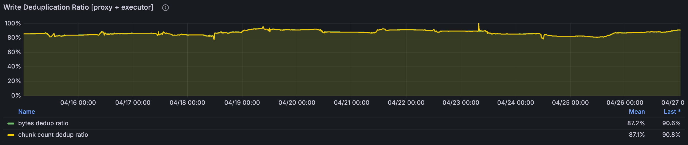
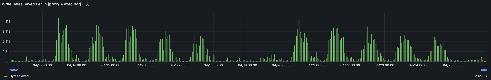
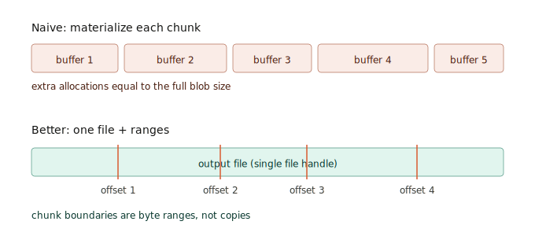

_The goal: move the changed bytes, not the whole output._

Remote Cache CDC uses Content-Defined Chunking (CDC) to make large build outputs behave more incrementally. When a binary, bundle, package, or archive is mostly unchanged, BuildBuddy can reuse chunks it has already seen instead of re-uploading or re-downloading the entire file.

In the [Bazel implementation PR](https://github.com/bazelbuild/bazel/pull/28437), a benchmark of the BuildBuddy repo showed about 40% less uploaded data and a 40% smaller disk cache. To enable client-side CDC with BuildBuddy, use Bazel 8.7+ or 9.1+ and pass <code className="flag">--experimental_remote_cache_chunking</code>.

<!-- truncate -->

## Setting the Scene

The next frontier for build caching is not just skipping actions. It is skipping bytes.

Build caching has come a long way. Instead of rebuilding the world after every edit, Bazel and remote caching let teams reuse action outputs across machines and CI jobs. In practice, builds have moved from something closer to O(size of repo) toward O(size of change).

But "size of change" can be misleading. What really matters is the size of the transitive actions affected by the edit. A small source change can still ripple into many binaries, packages, bundles, and other large outputs, even when only a small part of each output actually changes.

## Transitive Actions

Linking, bundling, packaging, and archiving are the usual offenders. They combine many transitive inputs into one output.

That makes them different from actions that operate on a small, direct set of files. A typical compile action might compile one source file using a smaller set of direct inputs. A transitive action, on the other hand, often consumes the accumulated outputs of many dependencies and produces one final binary, bundle, package, or archive.

In Bazel rules, this often shows up as a rule collecting files through a transitive `depset` and passing that accumulated set into a single action. For example, a simplified compile action might look like this:

```python
ctx.actions.run(
    inputs = [src] + direct_headers,
    outputs = [obj],
    executable = compiler,
    arguments = ["-c", src.path, "-o", obj.path],
)
```

A bundling or packaging action often looks more like this:

```python
transitive_inputs = depset(
    direct = direct_files,
    transitive = [dep[MyInfo].files for dep in ctx.attr.deps],
)

ctx.actions.run(
    inputs = transitive_inputs,
    outputs = [bundle],
    executable = bundler,
    arguments = ["--output", bundle.path],
)
```

That second shape is where small source changes can fan out into large output changes. The source edit might only change a small sequence of bytes in the final output, but the output digest is still new.

Without CDC, the cache treats that as a completely new blob, even when most of the binary, bundle, package, or archive is byte-for-byte identical to the previous version. If many final outputs depend on that changed input, they can all get new digests.

For remote caching, this creates two problems:

- Each cache miss is expensive because the outputs are large.
- Misses happen more often because any transitive input change can produce a new output digest.

One workaround is to disable remote caching for these actions. That avoids uploading huge outputs when the expected cache hit is not worth the write cost, but it creates a different problem: the action now has to run every time. It can also make the action harder to move to remote execution, because RBE depends on moving action inputs and outputs efficiently.

So the build avoids one expensive cache write, but gives up reuse entirely.



_A small source change can invalidate the final transitive action._

## Treating This as an Output Problem

One option would be to make the actions themselves incremental: incremental linking, runtime linking, smarter bundling, smarter packaging, and so on. But this is usually very difficult, and requires extensive changes to the linkers and tools themselves.

And even if we solved that for one tool, we would still need separate solutions for GoLink, C++ linkers, JavaScript bundlers, app packagers, generated archives, and every other action that can produce a large output. That does not scale.

Instead, we can treat this as a generic output problem: these actions create large files, where only a small amount of content is changing. With Content-Defined Chunking (CDC), we can leave the actions themselves untouched, while still getting many of the wins of making those actions incremental.

## Content-Defined Chunking

CDC is a repeatable process for splitting a file into chunks based on its contents rather than fixed byte offsets.

The TL;DR is: run a rolling hash over a small window of bytes, and split when the hash matches a rare pattern. The hash behaves randomly enough that this happens only occasionally, but the process is still deterministic: the same content produces the same chunk boundaries.

If you want chunks around 512 KiB on average, choose a pattern that has about a 1 in 512 KiB chance of matching at each byte. If the pattern does not match, shift the window and try again. Over time, this gives you the average chunk size you wanted while keeping the boundaries content-defined.[^cdc-cut]

Smaller chunks improve deduplication but increase metadata overhead and RPC cost, so CDC implementations balance chunk size against efficiency.

For a toy example, imagine the rolling window is 4 bytes wide and we split whenever the hash of that 4-byte window ends in `00`. Suppose the windows `bbbb` and `cccc` both happen to match that pattern (the exact hash values do not matter):

```text
original:  aaaabbbbccccdddd
windows:       bbbb
                   cccc
cuts:      aaaa|bbbb|cccc|dddd
```

If we insert a few bytes inside `bbbb`, the nearby windows change, so that chunk changes:

```text
updated:   aaaabbXXbbccccdddd
```

But once the rolling window moves past the inserted bytes and reaches `cccc` again, it sees the same 4-byte sequence as before. That sequence produces the same hash, so the algorithm finds the same cut point again. The later chunks can keep the same boundaries and hashes.

Real CDC uses a larger rolling window and a much rarer split pattern, but the idea is the same.

This means that a large file with a few bytes added or removed somewhere in the file usually only changes the nearby chunk(s). Once the rolling window moves past the changed bytes and reaches unchanged content again, it starts seeing the same byte sequences as before, so it finds the same future cut points.

One common CDC algorithm is [FastCDC](https://doi.org/10.1109/TPDS.2020.2984632). The [FastCDC presentation slides](https://www.usenix.org/sites/default/files/conference/protected-files/atc16_slides_xia.pdf) are also a helpful visual overview.



_Only the changed chunk needs to be uploaded again._

## How does this benefit remote caching?

If an action creates a large output, like GoLink or CppLink, a small input change may still produce a new output that is mostly identical to the previous one.

With CDC, the cache can split that output into chunks and discover that many of them already exist. Instead of uploading the whole output again, it uploads only the missing chunks.

This works especially well for CI and developer builds, where nearby commits often produce outputs that are mostly similar. Once a chunk has been uploaded, future builds can reuse it across related outputs.



_Most of the output can still map to chunks that already exist in the cache._



_In this recent window, CDC deduplicated about 85% of eligible written bytes across proxy + executor writes. In other words, most large-output writes were already present as reusable chunks, so only the remaining changed chunks needed to be uploaded._



_Over this two-week window, CDC skipped uploading ~300 TiB of duplicate chunk data on the write path, with peaks over 4 TiB per hour. This comes from write-side chunk deduplication across cache proxies and executor output uploads. Total network savings should be higher, since this does not include read-side savings when chunks are served from disk caches, proxy caches, or executor file caches._

BuildBuddy currently applies chunking to blobs larger than 2 MiB. In one test, only about 4.2% of objects were above that threshold, so most blobs are not chunked.

Within that eligible subset, CDC deduplicated about 85% of written bytes. Across all cache traffic, overall savings are typically in the 20 to 40% range.

## Introducing Split and Splice APIs

To make CDC useful for remote caching, clients and servers need a way to talk about chunks instead of only whole blobs. This is especially useful when the network is the bottleneck: users on slow networks, VPNs, or with high latency to the cache should not need to upload or download a whole large output when most of its chunks already exist somewhere.

Instead, the client can discover how a blob maps to chunks, check which chunks are already available locally, and transfer only the missing pieces.

This is where [SplitBlob](https://github.com/bazelbuild/remote-apis/blob/becdd8f9ff811df88a22d3eadd6341753d51d167/build/bazel/remote/execution/v2/remote_execution.proto#L443-L500) and [SpliceBlob](https://github.com/bazelbuild/remote-apis/blob/becdd8f9ff811df88a22d3eadd6341753d51d167/build/bazel/remote/execution/v2/remote_execution.proto#L503-L558) come in.

`SplitBlob` is the read-side API. Given the digest of a large blob, the client asks the cache if it already knows the chunk layout for that blob. If it does, the client can download only the chunks it does not already have.

`SpliceBlob` is the write-side API. After an action creates a large output, Bazel or the executor uploads any missing chunks and tells the cache how to reconstruct the full blob from those chunks. The cache stores that reconstruction metadata so future `SplitBlob` calls for the same blob digest can return the chunk layout.

The read path becomes:

1. Call `SplitBlob` to get the chunk layout for a large blob.
2. Check which chunks are already present in the local cache.
3. Download the missing chunks with `Read` or `BatchReadBlobs`.

The write path is the reverse:

1. After producing a large output, the client or executor runs it through the CDC algorithm to compute chunk boundaries and chunk digests.
2. It calls `FindMissingBlobs` to check which chunks the cache is missing.
3. It uploads only the missing chunks with `Write` or `BatchUpdateBlobs`.
4. It calls `SpliceBlob` to store the reconstruction metadata.

With this model, chunks are stored as normal CAS blobs under their own digests. The reconstruction metadata is keyed by the original large blob digest, so future `SplitBlob` calls can start from the digest they already know and discover the chunk layout.

This also helps distribute storage more evenly. Instead of treating one very large object as an indivisible cache entry, the cache can store and serve smaller chunks across the CAS like any other blob.



_SplitBlob is the read-side API; SpliceBlob is the write-side API._

## Bazel Combined Cache

Bazel implements CDC in the combined cache, which coordinates remote cache and disk cache reads and writes.

When the remote cache advertises chunking support, Bazel creates chunked upload and download paths. Large blobs above the server-provided threshold use the chunked path; smaller blobs keep using the normal cache path.

One important implementation detail is that Bazel does not need to keep a second copy of every chunk in memory. The output already exists on disk, so the uploader can use the original file as the source for chunk data and stream the needed byte ranges during upload.



_The client can keep byte ranges in the original file instead of a second copy of every chunk._

## BuildBuddy Implementation

BuildBuddy implements CDC in three places: the cache service, executors, and cache proxies.

### Cache Service

The cache service implements `SplitBlob` and `SpliceBlob`. Chunks are stored as normal CAS entries keyed by their chunk digest, while the reconstruction metadata is stored separately under a key derived from the original blob digest. When `SpliceBlob` is called, BuildBuddy verifies that the chunks exist and that concatenating them produces the original blob digest.

### Executors

Executors can upload large action outputs as chunks directly. The executor walks outputs normally, uses the negotiated chunking parameters to compute chunk digests for large files, calls `FindMissingBlobs`, and uploads only the missing chunks. The uploader can read the needed byte ranges from the original file and upload chunks concurrently, instead of keeping a second full copy in memory.

### Cache Proxies

BuildBuddy cache proxies can also apply CDC transparently for clients and executors that only use the normal ByteStream cache APIs. On writes, the proxy chunks the incoming stream, writes chunks to the local proxy cache, batches `FindMissingBlobs` and `BatchUpdateBlobs` calls to the remote cache, skips repeated chunks, and then calls `SpliceBlob`. On reads, the proxy calls `SplitBlob`, reads chunks from the local proxy cache when possible, fetches missing chunks from remote in parallel, and writes fetched chunks back locally to warm the proxy cache.

This gives BuildBuddy two ways to apply CDC: native chunked transfers when the client or executor supports Split/Splice, and transparent chunking when traffic flows through a BuildBuddy proxy. Existing unchunked cache paths continue to work.

## Availability

Bazel support for CDC was introduced in [bazelbuild/bazel#28437](https://github.com/bazelbuild/bazel/pull/28437), and remote cache CDC is available in Bazel 8.7+ and 9.1+.

Bazel clients using BuildBuddy can opt in to local client-side upload/download savings with:

```sh
bazel build //... --experimental_remote_cache_chunking
```

BuildBuddy servers currently have CDC enabled for executor outputs and large files flowing through cache proxies.

## Results

In production, CDC has already skipped hundreds of TiB of duplicate chunk uploads. Because BuildBuddy stores less duplicate data, effective cache retention has also improved.

The [Bazel implementation PR](https://github.com/bazelbuild/bazel/pull/28437) benchmarked 50 commits of the BuildBuddy repo and saw about 40% less data uploaded, about 40% smaller disk cache, in that benchmark.

## Closing

CDC makes remote caching better at what developers actually do all day: make small changes to large codebases that sometimes produce large outputs. Instead of uploading and downloading the same bytes again and again, BuildBuddy and Bazel can reuse the chunks that did not change, significantly cutting down on cache transfer.

Try it today with Bazel 8.7+ or 9.1+ by setting <code className="flag">--experimental_remote_cache_chunking</code> on your BuildBuddy cache-enabled Bazel builds.

## Further Reading and References

Bazel and BuildBuddy:

- [Bazel implementation PR](https://github.com/bazelbuild/bazel/pull/28437)
- [Recommended Bazel performance flags](/blog/debugging-slow-bazel-builds/#1-am-i-using-the-right-set-of-flags)
- [BuildBuddy remote build execution](/docs/remote-build-execution/)
- [Bazel remote caching](https://bazel.build/remote/caching)

Remote APIs:

- [Remote Execution API: SplitBlob and SpliceBlob](https://github.com/bazelbuild/remote-apis/blob/becdd8f9ff811df88a22d3eadd6341753d51d167/build/bazel/remote/execution/v2/remote_execution.proto#L443-L561)
- [Remote APIs PR updating SplitBlob and SpliceBlob](https://github.com/bazelbuild/remote-apis/pull/353)
- [Remote APIs PR adding cache chunking settings](https://github.com/bazelbuild/remote-apis/pull/357)

Content-defined chunking:

- [FastCDC, USENIX ATC 2016](https://www.usenix.org/conference/atc16/technical-sessions/presentation/xia)
- [FastCDC 2020, IEEE TPDS](https://doi.org/10.1109/TPDS.2020.2984632)
- [Rabin fingerprint](https://en.wikipedia.org/wiki/Rabin_fingerprint)
- [Google cdc-file-transfer](https://github.com/google/cdc-file-transfer)

[^cdc-cut]: One drawback of simple forward-scanning CDC algorithms is that if no cut is found before the maximum chunk size, the algorithm has to force a cut at the maximum size. MaxCDC improves this by scanning ahead and choosing the offset with the maximum rolling hash value, avoiding some undesirable forced cuts. RepMaxCDC applies MaxCDC repeatedly until chunks are within the desired size range. See [buildbarn/go-cdc](https://github.com/buildbarn/go-cdc) and [RepMaxCDC: repeated application of MaxCDC](https://github.com/buildbarn/go-cdc#repmaxcdc-repeated-application-of-maxcdc).
