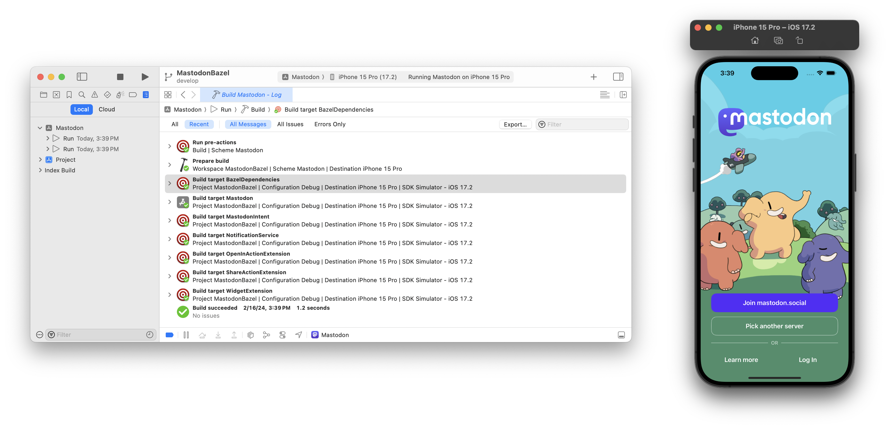
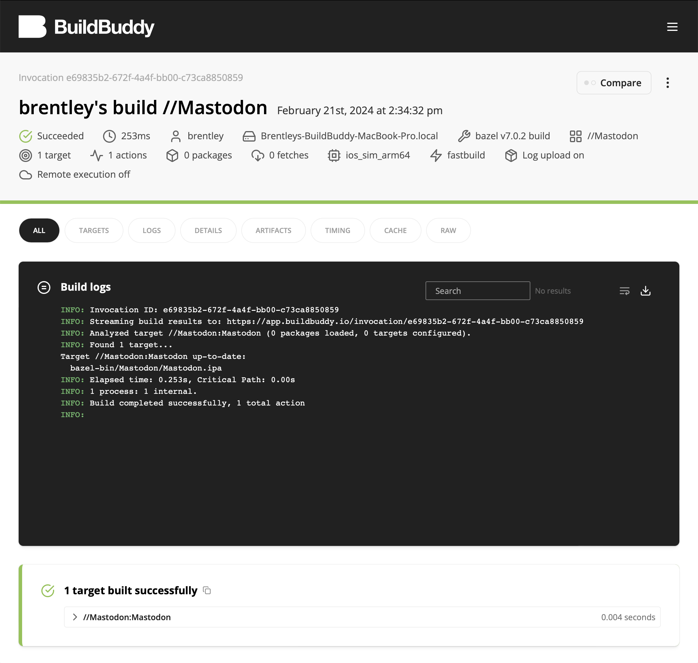

Do you have an iOS app,
or really any Apple-based project,
that you want to migrate to Bazel?
With this guide I'll show you how to migrate your project,
using the [Mastodon iOS][mastodon-ios] project as an example.

We will use iOS based rules in the example migration,
but similar rules exist in [**rules_apple**][rules_apple] for the other Apple platforms,
including
macOS,
watchOS,
tvOS,
and visionOS.

The completed migration is available in [my fork of mastodon-ios][fork-branch].
You can follow along with the changes made in the following sections by checking out [this commit][commit-start] first.
At the end of some sections there will be a link to a new commit that includes the changes mentioned up to that point.

[commit-start]: https://github.com/brentleyjones/mastodon-ios/commit/c15c418cfc94f0ac2ccab9a10e7a4f08a2f402c4
[fork-branch]: https://github.com/brentleyjones/mastodon-ios/tree/bj/migrate-to-bazel
[mastodon-ios]: https://github.com/mastodon/mastodon-ios
[rules_apple]: https://github.com/bazelbuild/rules_apple

<!-- truncate -->

If Bazel is completely new to you,
I recommend reading the official [quick start guide][bazel-quick-start].
That will explain some foundational things that I don't cover in this guide.

[bazel-quick-start]: https://bazel.build/run/build

## Table of contents

<nav className="toc">

- [Bootstrapping Bazel](#bootstrapping-bazel)
- [Defining targets](#defining-targets)
  - [Rules](#rules)
  - [Translating the Xcode project](#translating-the-xcode-project)
- [Integrating with Xcode](#integrating-with-xcode)
- [Leveraging remote caching and remote execution](#leveraging-remote-caching-and-remote-execution)
  - [Disk cache](#disk-cache)
  - [Remote cache](#remote-cache)
  - [Debugging cache hits](#debugging-cache-hits)
  - [**rules_xcodeproj** cache warming](#rules_xcodeproj-cache-warming)
  - [Build event service](#build-event-service)
  - [Remote execution](#remote-execution)
- [Optimizing](#optimizing)
  - [Optimal Bazel settings](#optimal-bazel-settings)
  - [Modularization](#modularization)
- [Next steps](#next-steps)

</nav>

## Bootstrapping Bazel

Before we can start to define the structure of our project,
we need to get some foundational Bazel setup out of the way.

### Bazelisk

There are two main ways to run Bazel: directly or via [Bazelisk][bazelisk].

For this migration I'm going to use Bazelisk.
I recommend using Bazelisk for multiple reasons:

- One installed binary supports multiple Bazel versions
- The project's supported Bazel version can be managed with a `.bazelversion` file
- The `tools/bazel` wrapper script is automatically run if it exists
- The Bazel community has largely settled on [using Bazelisk as a best practice][bazelisk-best-practice]

If you don't already have Bazelisk installed,
I recommend installing it with Homebrew:

```shellsession
$ brew install bazelisk
```

This will install Bazelisk as `bazel`.
Because of this,
when you see `bazel` in future examples,
it's actually running Bazelisk
(which then runs Bazel).

By the way,
because we are going to be using newer features of Bazel,
make sure your installed version of Bazelisk is at least v1.19.0.

[bazelisk]: https://github.com/bazelbuild/bazelisk
[bazelisk-best-practice]: https://bazel.build/install/bazelisk

### `.bazelversion`

Now that we have Bazelisk installed,
we need to tell it which version of Bazel we want it to download and run for us.
We can do that by creating a `.bazelversion` file at the root of the project:

```shellsession
$ echo '7.0.2' > .bazelversion
```

### `MODULE.bazel`

Since Bazel can be run in subdirectories of a project,
it uses the existence of a [repository boundary marker file][repository] to designate the root of the project
(which Bazel calls a [workspace][workspace]).
We're going to use a `MODULE.bazel` file for this,
since we will eventually have [Bazel module dependencies][bazel-external-overview-bzlmod] to declare.
We can start with an empty file to begin with:

```shellsession
$ touch MODULE.bazel
```

[bazel-external-overview-bzlmod]: https://bazel.build/external/overview#bzlmod
[repository]: https://bazel.build/external/overview#repository
[workspace]: https://bazel.build/external/overview#workspace

### Verifying

At this point we can verify that we have Bazel and Bazelisk configured properly by running `bazel info release`:

```shellsession
$ bazel info release
release 7.0.2
```

At [this commit][commit-bootstrap] we have Bazel bootstrapped for the Mastodon iOS project.

[commit-bootstrap]: https://github.com/brentleyjones/mastodon-ios/commit/7b55ceeaa71b7b2b4159c525b29dc4166c661896

## Defining targets

Now that we have the Bazel project bootstrapped,
we can start adding [targets][targets] to it.

Bazel targets are defined by instances of [rules][rules] in [packages][packages].
Packages are defined by [`BUILD`][build-files] files.
First I'll go over the rules we will use,
and then I'll show how we use them to define our targets.

[build-files]: https://bazel.build/concepts/build-files
[packages]: https://bazel.build/concepts/build-ref#packages
[rules]: https://bazel.build/extending/rules
[targets]: https://bazel.build/concepts/build-ref#targets

### Rules

I'm not going to cover every rule that you could use in an Apple-based project,
but I will cover some of the more popular/interesting ones,
even if they won't all be used in this migration.

#### `swift_library`

A [`swift_library`][swift_library] target defines a single Swift static library.

When built directly
(ideally though an [`ios_build_test`][ios_build_test] to ensure it's in the correct configuration),
`swift_library` produces `.swiftmodule` and `.swiftdoc` files.
If the [`swift.enable_library_evolution`][swift-enable_library_evolution-feature] and [`swift.emit_swiftinterface`][swift-emit_swiftinterface-feature] features are enabled,
it also produces a `.swiftinterface` file.
When depended on by an executable producing target,
such as [`ios_application`](#ios_application),
it also produces a `.a` file.

[ios_build_test]: https://github.com/bazelbuild/rules_apple/blob/3.3.0/doc/rules-ios.md#ios_build_test
[swift-enable_library_evolution-feature]: https://github.com/bazelbuild/rules_swift/blob/1.16.0/swift/internal/feature_names.bzl#L244-L246
[swift-emit_swiftinterface-feature]: https://github.com/bazelbuild/rules_swift/blob/1.16.0/swift/internal/feature_names.bzl#L252-L254
[swift_library]: https://github.com/bazelbuild/rules_swift/blob/1.16.0/doc/rules.md#swift_library

#### `objc_library`

An [`objc_library`][objc_library] target defines a single Objective-C static library.
Use it instead of [`cc_library`](#cc_library) when compiling Objective-C or Objective-C++ code.

When depended on by an executable producing target,
such as an [`ios_application`](#ios_application) target,
`objc_library` produces a `.a` file.

:::note

If `srcs` is empty,
an `objc_library` target acts as a collection of
headers,
defines,
include paths,
or linkopts,
which are propagated to dependent targets.

:::

[objc_library]: https://bazel.build/reference/be/objective-c#objc_library

#### `cc_library`

A [`cc_library`][cc_library] target defines a single C or C++ static library.
Use it when compiling C or C++ code.
While you can use `objc_library` to compile C or C++ code,
using `cc_library` is more efficient,
and is more clear in your intent.

When depended on by an executable producing target,
such as an [`ios_application`](#ios_application) target,
`cc_library` produces a `.a` file.

:::note

If `srcs` is empty,
a `cc_library` target acts as a collection of
headers,
defines,
include paths,
or linkopts,
which are propagated to dependent targets.

:::

[cc_library]: https://bazel.build/reference/be/c-cpp#cc_library

#### `experimental_mixed_language_library`

An [`experimental_mixed_language_library`][experimental_mixed_language_library] target defines an Objective-C and Swift mixed-language static library.
Use it for compiling mixed-language modules.

`experimental_mixed_language_library` is actually a [macro][macro] that creates
a [`swift_library`](#swift_library),
an [`objc_library`](#objc_library),
and some [modulemaps][modulemaps] to tie them together.

:::note

Due to poor build performance,
it is not recommended to have mixed-language modules.
It's recommended to only use this macro as a migration stopgap until you are able to demix them.

:::

[experimental_mixed_language_library]: https://github.com/bazelbuild/rules_apple/blob/3.3.0/doc/rules-apple.md#experimental_mixed_language_library
[macro]: https://bazel.build/versions/7.0.0/extending/macros
[modulemaps]: https://clang.llvm.org/docs/Modules.html#module-maps

#### `apple_intent_library`

An [`apple_intent_library`][apple_intent_library] target generates source files for an `.intentdefinition` file.
Use it if you have `.intentdefinition` resources.

:::note

The [`swift_intent_library`][swift_intent_library] and [`objc_intent_library`][objc_intent_library] macros wrap `apple_intent_library` with [`swift_library`](#swift_library) and [`objc_library`](#objc_library) targets respectively.
Use them instead of `apple_intent_library` directly if possible.

[objc_intent_library]: https://github.com/bazelbuild/rules_apple/blob/3.3.0/doc/rules-resources.md#objc_intent_library
[swift_intent_library]: https://github.com/bazelbuild/rules_apple/blob/3.3.0/doc/rules-resources.md#swift_intent_library

:::

[apple_intent_library]: https://github.com/bazelbuild/rules_apple/blob/3.3.0/doc/rules-resources.md#apple_intent_library

#### `apple_resource_bundle`

An [`apple_resource_bundle`][apple_resource_bundle] target generates a resource bundle.
Use it if you require certain resources to be placed in a named `.bundle`,
instead of directly placed in your top level bundle
(e.g. an `.app`, `.framework` , or `.xctest`).

:::note

`apple_resource_bundle` targets need to be listed in `data` attributes,
not `deps` attributes.

:::

[apple_resource_bundle]: https://github.com/bazelbuild/rules_apple/blob/3.3.0/doc/rules-resources.md#apple_resource_bundle

#### `ios_application`

An [`ios_application`][ios_application] target generates an application bundle.

Unlike Xcode,
Bazel separates compilation and bundling targets.
This means that an `ios_application` target
(which is a bundling target)
doesn't list its source files,
and instead requires that its primary module be a single static library dependency,
such as a [swift_library](#swift_library) or an [objc_library](#objc_library)
(which is a compilation target).

[ios_application]: https://github.com/bazelbuild/rules_apple/blob/3.3.0/doc/rules-ios.md#ios_application

#### `ios_app_clip`

An [`ios_app_clip`][ios_app_clip] target generates an app clip bundle.

`ios_app_clip` is used nearly identically to [`ios_application`](#ios_application)
(since app clips are on-demand applications),
except that it also needs to be listed in a parent `ios_application`'s `app_clips` attribute.

[ios_app_clip]: https://github.com/bazelbuild/rules_apple/blob/3.3.0/doc/rules-ios.md#ios_app_clip

#### `ios_extension`

An [`ios_extension`][ios_extension] target generates an application extension bundle.

Similar to [`ios_application`](#ios_application),
`ios_extension` defines a bundling target,
which means that it doesn't list its source files,
and instead requires that its primary module be a single static library dependency,
such as a [swift_library](#swift_library) or an [objc_library](#objc_library)
(which is a compilation target).

:::note

Extensions are listed in the [`extensions`][extensions-attr] attribute of the containing application instead of the `deps` attribute.

[extensions-attr]: https://github.com/bazelbuild/rules_apple/blob/3.3.0/doc/rules-ios.md#ios_application-extensions

:::

[ios_extension]: https://github.com/bazelbuild/rules_apple/blob/3.3.0/doc/rules-ios.md#ios_extension

#### `ios_framework`

An [`ios_framework`][ios_framework] target causes the [static library](#swift_library) targets it depends on to be linked and bundled into a dynamic framework bundle,
instead of the top-level bundle target they would have ultimately been linked into
(e.g. an `.app`, `.framework` , or `.xctest`).
These libraries still need to be depended on by your top-level bundle target.
See the [frameworks][frameworks] **rules_apple** documentation for more information on how to use this rule.

Since library dependencies have to be listed in `deps` attributes,
regardless if you use dynamic frameworks or not,
conditionally setting `frameworks` on your top-level bundle targets can be an easy way to switch between dynamic and static linking.
This can enable workflows such as using dynamic frameworks for dev builds,
which has faster incremental linking,
and using static linking for release builds,
which has faster startup time.[^mergable_libraries]

[^mergable_libraries]: When **rules_apple** gains support for [mergable_libraries] this type of workflow will be a lot easier to support.

:::note

`ios_framework` is not intended to be used for distribution
(i.e. consumed by Xcode).
Use [`ios_dynamic_framework`][ios_dynamic_framework] for that.

[ios_dynamic_framework]: https://github.com/bazelbuild/rules_apple/blob/3.3.0/doc/rules-ios.md#ios_dynamic_framework

:::

[frameworks]: https://github.com/bazelbuild/rules_apple/blob/3.3.0/doc/frameworks.md
[ios_framework]: https://github.com/bazelbuild/rules_apple/blob/3.3.0/doc/rules-ios.md#ios_framework
[mergable_libraries]: https://github.com/bazelbuild/rules_apple/issues/1988

#### `ios_unit_test`

An [`ios_unit_test`][ios_unit_test] target generates a unit testing bundle.

Similar to [`ios_application`](#ios_application),
`ios_unit_test` defines a bundling target,
which means that it doesn't list its source files,
and instead requires that its primary module be a single static library dependency,
such as a [swift_library](#swift_library) or an [objc_library](#objc_library)
(which is a compilation target).

[ios_unit_test]: https://github.com/bazelbuild/rules_apple/blob/3.3.0/doc/rules-ios.md#ios_unit_test

#### `ios_ui_test`

An [`ios_ui_test`][ios_ui_test] target generates a UI testing bundle.

Similar to [`ios_application`](#ios_application),
`ios_ui_test` defines a bundling target,
which means that it doesn't list its source files,
and instead requires that its primary module be a single static library dependency,
such as a [swift_library](#swift_library) or an [objc_library](#objc_library)
(which is a compilation target).

[ios_ui_test]: https://github.com/bazelbuild/rules_apple/blob/3.3.0/doc/rules-ios.md#ios_ui_test

#### `local_provisioning_profile`

A [`local_provisioning_profile`][local_provisioning_profile] target defines a reference to a provisioning file that exists on the user's machine.
Use it when your provisioning profile is not checked into the workspace,
such as per-user and/or managed by Xcode profiles.

[local_provisioning_profile]: https://github.com/bazelbuild/rules_apple/blob/3.3.0/doc/rules-apple.md#local_provisioning_profile

### Translating the Xcode project

When migrating a project that uses Xcode to build,
which the Mastodon iOS project does,
we have a blueprint in the form of the Xcode project that we can use to guide us on which Bazel targets we need to create.
Each Xcode target will map to one or more Bazel targets,
mostly formulaically.
And since we now know which rules we can use for those Bazel targets,
let's get to translating.

#### Dependencies

Before talking about how any given target is translated,
I wanted to mention how dependencies between targets are handled.

For each target dependency that an Xcode target has,
the corresponding Bazel target will have the same dependency listed in one of its dependency attributes.
For example,
if the Xcode target `A` depends on targets `B` and `C`,
then the Bazel target `//some:A` will have `//a/package:B` and `//another/pkg:C` included in its dependency attributes.

If a dependency is on a target that translates to multiple Bazel targets,
e.g. an `ios_extension` and `swift_library`,
then only the top-most target
(`ios_extension` in this example)
should be included in one of the Bazel target's dependency attributes.

If a dependency is on a product defined in a Swift package,
then a label of the form `@swiftpkg_foo//:A`,
where `A` is a product in the `Foo` Swift package,
should be included in one of the Bazel target's dependency attributes.
I'll give more details on how Swift packages are handled with Bazel in a [later section](#swift-packages-swiftpm).

#### **apple_support**, **rules_swift**, **rules_apple**, and **bazel_skylib**

Before using rules from some of the core rulesets we need to add dependencies on
**apple_support**,
**rules_swift**,
**rules_apple**,
and **bazel_skylib**.
We do that by adding `bazel_dep`s to our `MODULE.bazel` file:

```python title="MODULE.bazel"
bazel_dep(name = "apple_support", version = "1.14.0")
bazel_dep(name = "rules_swift", version = "1.16.0", repo_name = "build_bazel_rules_swift")
bazel_dep(name = "rules_apple", version = "3.3.0", repo_name = "build_bazel_rules_apple")
bazel_dep(name = "bazel_skylib", version = "1.5.0")
```

#### Static libraries

While the Mastodon iOS project doesn't define any static library targets in its Xcode project
(though it implicitly does through its use of Swift packages,
which are discussed later),
I wanted to mention that they are translated 1:1 with [static library](#swift_library) rules.

#### Provisioning profiles

If you have your provisioning profile stored in your workspace,
you can reference it directly with the [`provisioning_profile`][provisioning_profile-attr] attribute.
If your provisioning profile is instead stored in the default Xcode location
(i.e. `~/Library/MobileDevice/Provisioning Profiles`),
you'll want to use the [`local_provisioning_profile`](#local_provisioning_profile) rule to reference it.
Finally,
if you use Xcode's "Automatic Code Signing" feature,
you'll want to use the [`xcode_provisioning_profile`][xcode_provisioning_profile] rule as well.

[provisioning_profile-attr]: https://github.com/bazelbuild/rules_apple/blob/3.3.0/doc/rules-ios.md#ios_application-provisioning_profile
[xcode_provisioning_profile]: https://github.com/MobileNativeFoundation/rules_xcodeproj/blob/1.17.0/docs/bazel.md#xcode_provisioning_profile

#### Swift packages (SwiftPM)

An Xcode project can declare dependencies on Swift packages,
both remote and local.
The easy way to handle those dependencies with Bazel is by using [**rules_swift_package_manager**][rules_swift_package_manager].

**rules_swift_package_manager** requires all Swift package dependencies to be declared in a `Package.swift` file.
So any dependencies declared in an Xcode project need to be added to a new `Package.swift` file.
I say "new" since there might already exist `Package.swift` files that declare local packages,
and if you don't want to migrate those packages to Bazel
(which we aren't going to for this migration),
you'll need to declare those packages as local dependencies in a new `Package.swift` file.[^local-rspm]

[^local-rspm]:
    This is an area that I think can be improved upon in **rules_swift_package_manager**.
    For example,
    if you are only using a `Package.swift` file,
    without an Xcode project,
    I think it would be nice to be able to use **rules_swift_package_manager** to build the declared products in it,
    without having to migrate those to Bazel manually.

Here is the new `Package.swift` file that includes the dependencies that were referenced in the Xcode project:

```swift title="Package.swift"
// swift-tools-version:5.7

import PackageDescription

let package = Package(
    name: "Mastodon-iOS",
    defaultLocalization: "en",
    platforms: [
        .iOS(.v16),
    ],
    dependencies: [
        .package(name: "ArkanaKeys", path: "Dependencies/ArkanaKeys"),
        .package(name: "MastodonSDK", path: "MastodonSDK"),
        .package(
            url: "https://github.com/Bearologics/LightChart.git",
            branch: "master"
        ),
        .package(
            url: "https://github.com/jdg/MBProgressHUD.git",
            from: "1.2.0"
        ),
        .package(
            url: "https://github.com/tid-kijyun/Kanna.git",
            from: "5.2.7"
        ),
    ]
)
```

Currently **rules_swift_package_manager** requires you to use [Gazelle][gazelle] in order to create a `swift_deps_index.json` file.[^rspm-no-gazelle]
So we need to add a `bazel_dep` on **gazelle** in addition to **rules_swift_package_manager** in our `MODULE.bazel` file.
We also need to add a [`use_repo`][use_repo] stanza for the Swift packages we directly depend on
(though if you run the `//:swift_update_pkgs` Gazelle target,
which we will define shortly,
it will add the required stanza for you):

[^rspm-no-gazelle]:
    There is [a plan][remove-swift_deps_index] that before **rules_swift_package_manager** reaches 1.0.0 it will remove the need for the `swift_deps_index.json` file,
    and the need to use Gazelle with it.

```python title="MODULE.bazel"
bazel_dep(name = "rules_swift_package_manager", version = "0.28.0")
bazel_dep(name = "gazelle", version = "0.35.0")

# swift_deps START
swift_deps = use_extension(
    "@rules_swift_package_manager//:extensions.bzl",
    "swift_deps",
)
swift_deps.from_file(
    deps_index = "//:swift_deps_index.json",
)
use_repo(
    swift_deps,
    "swiftpkg_arkanakeys",
    "swiftpkg_arkanakeysinterfaces",
    "swiftpkg_kanna",
    "swiftpkg_lightchart",
    "swiftpkg_mastodonsdk",
    "swiftpkg_mbprogresshud",
)
# swift_deps END
```

And now we can define our Gazelle targets in a root `BUILD` file:

```python title="BUILD"
load("@gazelle//:def.bzl", "gazelle", "gazelle_binary")
load(
  "@rules_swift_package_manager//swiftpkg:defs.bzl",
  "swift_update_packages",
)

# - Gazelle

# Ignore the `.build` folder that is created by running Swift package manager
# commands. The Swift Gazelle plugin executes some Swift package manager
# commands to resolve external dependencies. This results in a `.build` file
# being created.
# NOTE: Swift package manager is not used to build any of the external packages.
# The `.build` directory should be ignored. Be sure to configure your source
# control to ignore it (i.e., add it to your `.gitignore`).
# gazelle:exclude .build

# This declaration builds a Gazelle binary that incorporates all of the Gazelle
# plugins for the languages that you use in your workspace. In this example, we
# are only listing the Gazelle plugin for Swift from
# rules_swift_package_manager.
gazelle_binary(
    name = "gazelle_bin",
    languages = [
        "@rules_swift_package_manager//gazelle",
    ],
)

# This macro defines two targets: `swift_update_pkgs` and
# `swift_update_pkgs_to_latest`.
#
# The `swift_update_pkgs` target should be run whenever the list of external
# dependencies is updated in the `Package.swift`. Running this target will
# populate the `swift_deps.bzl` with `swift_package` declarations for all of the
# direct and transitive Swift packages that your project uses.
#
# The `swift_update_pkgs_to_latest` target should be run when you want to
# update your Swift dependencies to their latest eligible version.
swift_update_packages(
    name = "swift_update_pkgs",
    gazelle = ":gazelle_bin",
    generate_swift_deps_for_workspace = False,
    patches_yaml = "patches/swiftpkgs.yaml",
    update_bzlmod_stanzas = True,
)

# This target updates the Bazel build files for your project. Run this target
# whenever you add or remove source files from your project.
gazelle(
    name = "update_build_files",
    gazelle = ":gazelle_bin",
)
```

:::note

Because of how **rules_apple** handles app icon assets
(though possibly because of a bug),
we need to [patch][rspm-patch] the **Tabman** package to not include test assets.
Our patches are defined in the `patches/swiftpkgs.yaml` file.

Also,
in our `.bazelrc` file we added something to work around a [current issue][rspm-sandboxing] with **rules_swift_package_manager** and sandboxing.

[rspm-patch]: https://github.com/cgrindel/rules_swift_package_manager/blob/v0.28.0/docs/patch_swift_package.md
[rspm-sandboxing]: https://github.com/cgrindel/rules_swift_package_manager/blob/v0.28.0/docs/faq.md#my-project-builds-successfully-with-bazel-build--but-it-does-not-build-when-using-rules_xcodeproj-how-can-i-fix-this

:::

To generate the `swift_deps_index.json` file,
and/or update the `MODULE.bazel` `use_repo` stanza,
run the `//:swift_update_pkgs` target:

```shellsession
$ bazel run //:swift_update_pkgs
INFO: Invocation ID: f2427bde-865b-43b3-bd3c-6a8489387f00
INFO: Analyzed target //:swift_update_pkgs (148 packages loaded, 11707 targets configured).
INFO: Found 1 target...
Target //:swift_update_pkgs up-to-date:
  bazel-bin/swift_update_pkgs-runner.bash
  bazel-bin/swift_update_pkgs
INFO: Elapsed time: 1.724s, Critical Path: 0.07s
INFO: 1 process: 1 internal.
INFO: Build completed successfully, 1 total action
INFO: Running command line: bazel-bin/swift_update_pkgs
```

At [this commit][commit-rspm] Swift packages have been integrated for the Mastodon iOS project.

[commit-rspm]: https://github.com/brentleyjones/mastodon-ios/commit/9616360e2e7148ee5d6ceb63616d14b3363c2b51
[gazelle]: https://github.com/bazelbuild/bazel-gazelle
[remove-swift_deps_index]: https://github.com/cgrindel/rules_swift_package_manager/discussions/936
[rules_swift_package_manager]: https://github.com/cgrindel/rules_swift_package_manager
[use_repo]: https://bazel.build/versions/7.0.0/rules/lib/globals/module#use_repo

#### App extensions

App extensions,
such as the
`MastodonIntent`,
`NotificationService`,
`ShareActionExtension`,
`OpenInActionExtension`,
and `WidgetExtension`
targets,
are represented by a combination of an [`*_extension`](#ios_extension) and [static library](#swift_library) rule.
And the static library target will need to have the `-application-extension` (for Swift) or `-fapplication-extension` (for Objective-C) copt set.

You will need to set the `infoplists` and `entitlements` attributes to your `Info.plist` and `.entitlements` files,
the `bundle_id` attribute to the value of the `PRODUCT_BUNDLE_IDENTIFIER` build setting,
and the `minimum_os_version` attribute to the value of `IPHONEOS_DEPLOYMENT_TARGET` build setting.

:::note

**rules_apple** processes `Info.plist` and `.entitlements` files in a slightly different manner than Xcode.
In Xcode,
you have build settings such as
`PRODUCT_BUNDLE_IDENTIFIER`,
`CURRENT_PROJECT_VERSION`,
and `PRODUCT_MODULE_NAME`.
And when it processes an `Info.plist`,
it substitutes references to those build settings with their resolved value.
**rules_apple** doesn't use build settings,
so it's not able to do the same substitutions.

There are some attributes on bundling rules that **rules_apple** [will substitute][rules_apple-variable-subsitution] in place of a build setting,
such as `bundle_id` for `PRODUCT_BUNDLE_IDENTIFIER`,
but for the most part when using Bazel you'll need to remove these build setting references from `Info.plist` and `.entitlements` files,
or use a custom rule to expand those values for you.
I decided to use the **bazel_skylib** [`expand_template`][expand_template] rule to allow the build setting references to stay in the `Info.plist` files.

[expand_template]: https://github.com/bazelbuild/bazel-skylib/blob/1.5.0/docs/expand_template_doc.md
[rules_apple-variable-subsitution]: https://github.com/bazelbuild/rules_apple/blob/3.3.0/doc/common_info.md#variable-substitution

:::

Since the Mastodon iOS project doesn't use resource bundles,
resources will be referenced directly with the `data` attribute of the static library target for the primary module.

With that in mind I added `BUILD` files for the app extension targets:

```python title="WidgetExtension/BUILD"
load("@bazel_skylib//rules:expand_template.bzl", "expand_template")
load("@build_bazel_rules_apple//apple:ios.bzl", "ios_extension")
load("@build_bazel_rules_apple//apple:resources.bzl", "apple_intent_library")
load("@build_bazel_rules_swift//swift:swift.bzl", "swift_library")

ios_extension(
    name = "WidgetExtension",
    bundle_id = "org.joinmastodon.app.WidgetExtension",
    entitlements = "WidgetExtension.entitlements",
    families = [
        "ipad",
        "iphone",
    ],
    infoplists = [":InfoPlist"],
    minimum_os_version = "16.0",
    resources = glob(
        [
            "**/*.lproj/**",
            "**/*.js",
            "**/*.xcassets/**",
        ],
        exclude = [".*"],
    ),
    visibility = ["//visibility:public"],
    deps = [":WidgetExtension.library"],
)

swift_library(
    name = "WidgetExtension.library",
    srcs = glob(["**/*.swift"]) + [":WidgetExtension.intent"],
    module_name = "WidgetExtension",
    deps = [
        "@swiftpkg_lightchart//:LightChart",
        "@swiftpkg_mastodonsdk//:MastodonSDKDynamic",
    ],
)

apple_intent_library(
    name = "WidgetExtension.intent",
    src = "Base.lproj/WidgetExtension.intentdefinition",
    language = "Swift",
    visibility = ["//visibility:public"],
)

expand_template(
    name = "InfoPlist",
    out = "Bazel.Info.plist",
    substitutions = {
        "$(CURRENT_PROJECT_VERSION)": "1",
        "$(MARKETING_VERSION)": "2024.3",
    },
    template = "Info.plist",
)
```

:::note

We are using [`glob`][glob] to collect our source files.
This requires that none of the source files in the workspace are dead/unused,
which can sometimes happen when using an Xcode project since it doesn't have to reference all files in a directory.
It also requires that all source files for a module live under that module's directory.
Best practice is to share code via modules instead of having multiple modules reference the same source file.

We also created and used an [`apple_intent_library`](#apple_intent_library) target for the `WidgetExtension.intentdefinition` file.
It has increased [visibility][visibility] since it's also used by the `Mastodon` application target.

[glob]: https://bazel.build/versions/7.0.0/reference/be/functions#glob
[visibility]: https://bazel.build/concepts/visibility

:::

At [this commit][commit-app-extensions] app extensions have been translated for the Mastodon iOS project.

[commit-app-extensions]: https://github.com/brentleyjones/mastodon-ios/commit/4e615641e1028ee6cd7c7f9eb2a0148fa9cb68fb
[exports_files]: https://bazel.build/versions/7.0.0/reference/be/functions#exports_files

#### Applications

Applications,
such as the `Mastodon` target,
are represented by a combination of an [`*_application`](#ios_application) and [static library](#swift_library) rule.
Since applications are bundle targets,
they are handled very similar to app extension targets,
which means we need to apply the same translations in regards to `Info.plist` files and build settings.

With that in mind I added a `BUILD` file for the `Mastodon` target:

```python title="Mastodon/BUILD"
load("@bazel_skylib//rules:expand_template.bzl", "expand_template")
load("@build_bazel_rules_apple//apple:ios.bzl", "ios_application")
load("@build_bazel_rules_swift//swift:swift.bzl", "swift_library")

ios_application(
    name = "Mastodon",
    bundle_id = "org.joinmastodon.app",
    entitlements = "Mastodon.entitlements",
    extensions = [
        "//MastodonIntent",
        "//NotificationService",
        "//OpenInActionExtension",
        "//ShareActionExtension",
        "//WidgetExtension",
    ],
    families = [
        "ipad",
        "iphone",
    ],
    infoplists = [":InfoPlist"],
    minimum_os_version = "16.0",
    resources = glob(
        [
            "Resources/**",
            "Supporting Files/**",
        ],
        exclude = [
            ".*",
            "Resources/Preview Assets.xcassets",
        ],
    ),
    visibility = ["//visibility:public"],
    deps = [":Mastodon.library"],
)

swift_library(
    name = "Mastodon.library",
    srcs = glob(["**/*.swift"]) + [
        "//MastodonIntent:Intents.intent",
        "//WidgetExtension:WidgetExtension.intent",
    ],
    module_name = "Mastodon",
    visibility = ["//MastodonTests:__pkg__"],
    deps = [
        "@swiftpkg_kanna//:Kanna",
        "@swiftpkg_mastodonsdk//:MastodonSDKDynamic",
        "@swiftpkg_mbprogresshud//:MBProgressHUD",
    ],
)

expand_template(
    name = "InfoPlist",
    out = "Bazel.Info.plist",
    substitutions = {
        "$(CURRENT_PROJECT_VERSION)": "1",
        "$(MARKETING_VERSION)": "2024.3",
    },
    template = "Info.plist",
)
```

:::note

The [visibility][visibility] of the `Mastodon` target was increased to allow it to be a test host for tests.

[visibility]: https://bazel.build/concepts/visibility

:::

At [this commit][commit-app] the iOS app has been translated for the Mastodon iOS project.

[commit-app]: https://github.com/brentleyjones/mastodon-ios/commit/dcf1dcd12f92b6d27719eea79c8fc7e2cf63df14

#### Tests

Tests,
such as the `MastodonTests` and `MastodonUITests` targets,
are represented by a combination of a [`*_unit_test`](#ios_unit_test)/[`*_ui_test`](#ios_ui_test) and [static library](#swift_library) rule.
Since tests are bundle targets,
they are handled very similar to application targets,
which means we need to apply the same translations in regards to `Info.plist` files and build settings.

If a unit test has a host application,
or a UI test has a target application,
the [`test_host`][test_host-attr] attribute needs to be set to the corresponding `*_application` Bazel target.
In the case of unit tests,
if the `Allow testing Host Application APIs` checkbox is unchecked,
[`test_host_is_bundle_loader`][test_host_is_bundle_loader-attr] needs to be set to `False`.

With that in mind I added `BUILD` files for the `MastodonTests` and `MastodonUITests` targets:

```python title="MastodonTests/BUILD"
load("@build_bazel_rules_apple//apple:ios.bzl", "ios_unit_test")
load("@build_bazel_rules_swift//swift:swift.bzl", "swift_library")

ios_unit_test(
    name = "MastodonTests",
    bundle_id = "org.joinmastodon.MastodonTests",
    minimum_os_version = "16.0",
    test_host = "//Mastodon:Mastodon",
    deps = [":MastodonTests.library"],
)

swift_library(
    name = "MastodonTests.library",
    srcs = glob(["**/*.swift"]),
    module_name = "MastodonTests",
    testonly = True,
    deps = [
        "@swiftpkg_mastodonsdk//:MastodonSDKDynamic",
        "//Mastodon:Mastodon.library",
    ],
)
```

```python title="MastodonUITests/BUILD"
load("@build_bazel_rules_apple//apple:ios.bzl", "ios_ui_test")
load("@build_bazel_rules_swift//swift:swift.bzl", "swift_library")

ios_ui_test(
    name = "MastodonUITests",
    bundle_id = "org.joinmastodon.MastodonUITests",
    minimum_os_version = "16.0",
    test_host = "//Mastodon:Mastodon",
    deps = [":MastodonUITests.library"],
)

swift_library(
    name = "MastodonUITests.library",
    srcs = glob(["**/*.swift"]),
    module_name = "MastodonUITests",
    testonly = True,
)
```

At [this commit][commit-tests] the tests have been translated for the Mastodon iOS project.

[commit-tests]: https://github.com/brentleyjones/mastodon-ios/commit/f622f72b704b470650b3101aa7f0e2a5e8b2fdaf
[test_host-attr]: https://github.com/bazelbuild/rules_apple/blob/3.3.0/doc/rules-ios.md#ios_unit_test-test_host
[test_host_is_bundle_loader-attr]: https://github.com/bazelbuild/rules_apple/blob/3.3.0/doc/rules-ios.md#ios_unit_test-test_host_is_bundle_loader

#### Frameworks

Since we are using **rules_swift_package_manager** for the `MastodonSDK` target,
we don't have any framework targets to define.
If we did though,
we would use the [`ios_framework`](#ios_framework) rule to define a bundle similar to our application or app extensions,
and reference the framework with the [`frameworks`][frameworks-attr] attribute.
This is in addition to listing dependencies in the `deps` attribute for any [static library](#swift_library) targets that happen to be bundled in the framework.

[frameworks-attr]: https://github.com/bazelbuild/rules_apple/blob/3.3.0/doc/rules-ios.md#ios_application-provisioning_profile

#### Codegen

Bazel actions can't modify source files in the workspace.
So in order to use code generation with Bazel you need to use a [`genrule`][genrule] or a custom rule to generate files,
which you then depend on in your `srcs` attributes.

The Mastodon iOS project uses [Sourcery][sourcery] and [SwiftGen][swiftgen] to modify source files in-place,
which it then checks into source control.
In order to allow building the project with either xcodebuild or Bazel,
we will leave code generation as an external process.

[genrule]: https://bazel.build/versions/7.0.0/reference/be/general#genrule
[sourcery]: https://github.com/krzysztofzablocki/Sourcery
[swiftgen]: https://github.com/SwiftGen/SwiftGen

## Integrating with Xcode

If we were performing this migration more than a year ago this section would be a lot larger,
and could probably be its own post.
Thankfully since the start of last year we have a
fast,
stable,
and
mature
community backed solution in the form of [**rules_xcodeproj**][rules_xcodeproj].

### `xcodeproj`

To use **rules_xcodeproj**,
we add a `bazel_dep` for it to our `MODULE.bazel` file,
and define an `xcodeproj` target for the project in the root `BUILD` file:

```python title="MODULE.bazel"
bazel_dep(name = "rules_xcodeproj", version = "1.16.0")
```

```python title="BUILD"
load("@rules_xcodeproj//xcodeproj:defs.bzl", "top_level_target", "xcodeproj")

xcodeproj(
    name = "xcodeproj",
    generation_mode = "incremental",
    project_name = "MastodonBazel",
    top_level_targets = [
        top_level_target(
            "//Mastodon:Mastodon",
            target_environments = ["simulator", "device"],
        ),
        "//MastodonTests:MastodonTests",
        "//MastodonUITests:MastodonUITests",
    ],
)
```

:::note

Any targets listed in `xcodeproj.top_level_targets` will need to grant visibility to **rules_xcodeproj**.
They can do so by having `"@rules_xcodeproj//xcodeproj:generated"` in their [`visibility`][visibility] attribute.

[visibility]: https://bazel.build/concepts/visibility

:::

At [this commit][commit-xcodeproj] **rules_xcodeproj** has been integrated into the Mastodon iOS project.

[commit-xcodeproj]: https://github.com/brentleyjones/mastodon-ios/commit/c0139c3cce3784832a00e42405c690a3db9c8d49
[rules_xcodeproj]: https://github.com/MobileNativeFoundation/rules_xcodeproj

### Generating the Xcode project

We can now generate a Bazel integrated Xcode project by running a single command:

```shellsession
$ bazel run //:xcodeproj
INFO: Analyzed target //:xcodeproj (1 packages loaded, 1 target configured).
INFO: Found 1 target...
Target //:xcodeproj up-to-date:
  bazel-bin/xcodeproj-runner.sh
INFO: Elapsed time: 0.089s, Critical Path: 0.00s
INFO: 3 processes: 3 internal.
INFO: Build completed successfully, 3 total actions
INFO: Running command line: bazel-bin/xcodeproj-runner.sh

Generating "MastodonBazel.xcodeproj"
INFO: Analyzed target @@rules_xcodeproj~1.16.0~internal~rules_xcodeproj_generated//generator/xcodeproj:xcodeproj (1 packages loaded, 1 target configured).
INFO: Found 1 target...
INFO: Elapsed time: 0.308s, Critical Path: 0.07s
INFO: 4 processes: 2 internal, 2 local.
INFO: Build completed successfully, 4 total actions
INFO: Running command line: /private/var/tmp/_bazel_brentley/b406c5544781724b8a84c3c6fa8dad13/rules_xcodeproj.noindex/build_output_base/execroot/_main/bazel-out/darwin_arm64-dbg/bin/external/rules_xcodeproj~1.16.0~internal~rules_xcodeproj_generated/generator/xcodeproj/xcodeproj-installer.sh --xcodeproj_bazelrc /private/var/tmp/_bazel_brentley/b406c5544781724b8a84c3c6fa8dad13/execroot/_main/bazel-out/darwin_arm64-fastbuild/bin/xcodeproj-runner.sh.runfiles/_main/xcodeproj.bazelrc --extra_flags_bazelrc /private/var/tmp/_bazel_brentley/b406c5544781724b8a84c3c6fa8dad13/execroot/_main/bazel-out/darwin_arm64-fastbuild/bin/xcodeproj-runner.sh.runfiles/_main/xcodeproj-extra-flags.bazelrc --bazel_path /Users/brentley/Library/Caches/bazelisk/downloads/sha256/93772ce53afbe2282d0d727137a19c835eaa6f328964d02024bf3c234993bf7b/bin/bazel --execution_root /private/var/tmp/_bazel_brentley/b406c5544781724b8a84c3c6fa8dad13/execroot/_main
Updated project at "MastodonBazel.xcodeproj"
```

If you open the generated project
(i.e. `xed MastodonBazel.xcodeproj`)
and run the `Mastodon` scheme,
it should
build,
install to the simulator,
and launch successfully:

<figure>

<figcaption>The <strong>rules_xcodeproj</strong> generated project open in Xcode and running in the Simulator</figcaption>
</figure>

### Ensuring Bazel sees the correct Xcode version

Currently there are additional steps that need to be taken in order for Bazel to correctly detect when Xcode versions change.
I recommend reading the ["Xcode Version Selection and Invalidation"][rules_apple-xcode-management] section of the **rules_apple** docs for details on what and why.
If you only build your project inside of Xcode,
or with the [**rules_xcodeproj** command-line API][rules_xcodeproj-command-line-api],
there is nothing else you need to do to manage your Xcode version with Bazel,
because it [applies these steps for you][rules_xcodeproj-xcode-management].

[rules_apple-xcode-management]: https://github.com/bazelbuild/rules_apple/blob/3.2.1/doc/common_info.md#xcode-version-selection-and-invalidation
[rules_xcodeproj-command-line-api]: https://github.com/MobileNativeFoundation/rules_xcodeproj/blob/1.17.0/docs/usage.md#command-line-api
[rules_xcodeproj-xcode-management]: https://github.com/MobileNativeFoundation/rules_xcodeproj/blob/1.17.0/xcodeproj/internal/templates/runner.sh#L148-L171

### Generating release archives

Currently the Archive action in Xcode doesn't work when using **rules_xcodeproj**.
This means that you'll need to generate release archives on the command line directly with Bazel,
and then upload them to the App Store.

For example, you can generate the `.ipa` archive for the Mastodon app by running the following command:

```shellsession
$ bazel build //Mastodon --ios_multi_cpus=arm64
```

And then you can [manually upload the archive][upload-ipa].
Or you can use the [`xcarchive`][xcarchive] rule from **rules_apple** to generate an `.xcarchive` bundle,
and then use Xcode to upload the archive.

[upload-ipa]: https://developer.apple.com/help/app-store-connect/manage-builds/upload-builds/
[xcarchive]: https://github.com/bazelbuild/rules_apple/blob/3.2.1/doc/rules-xcarchive.md#xcarchive

## Leveraging remote caching and remote execution

One of the main reasons to use Bazel,
instead of another build system such as xcodebuild,
is to leverage its remote caching and execution capabilities.
For a detailed overview on both of those capabilities,
I recommend reading my [post on the subject][rbc-explained].

For this post I'll detail the steps I would take for any Bazel migration,
starting from no caching and ending with both caching and remote execution.

[rbc-explained]: bazels-remote-caching-and-remote-execution-explained.md

### Disk cache

Bazel supports a form of "remote cache" that uses the local filesystem instead of a remote server.
It's called the "disk cache" and is enabled with the [`--disk_cache`][disk_cache-flag] flag.

There are pros and cons to using the disk cache:

- **Pros**
  - Lower latency than a remote cache
  - Includes blobs[^blob] that have been built locally,
    which is useful for developers that can't upload to the remote cache
- **Cons**
  - Only includes blobs that have been built or downloaded for local builds
  - Some redundancy with blobs already stored in the output base
  - No automatic cleanup[^disk-cache-max-size]
  - A history of being buggy

[^blob]: A "blob" is an [REAPI][reapi] term for artifacts that are stored in a cache.
[^disk-cache-max-size]: [Bazel issue #5139](https://github.com/bazelbuild/bazel/issues/5139).

With those in mind,
we are going to start out by enabling the disk cache for all use cases in the [`.bazelrc`][bazelrc] file:

```shell title=".bazelrc"
# Cache

common --disk_cache=~/bazel_disk_cache
```

[bazelrc]: https://bazel.build/run/bazelrc
[disk_cache-flag]: https://bazel.build/versions/7.0.0/reference/command-line-reference#flag--disk_cache
[reapi]: https://github.com/bazelbuild/remote-apis

### Remote cache

Using a remote cache allows for multiple machines to benefit from the work performed by a single machine.
It can be enabled with the [`--remote_cache`][remote_cache-flag] flag.

The disk cache can be used concurrently with a remote cache,
but I only recommend that setup for local development.
That's because normally the remote cache will only accept writes from CI,
so the disk cache can still provide a benefit to developers,
but CI will rarely see benefits,
and usually degradation,
by also using the disk cache.

We can adjust the `.bazelrc` file to
enable a remote cache,
disable uploads for local development,
and disable the disk cache on CI
(by using a dedicated [config][bazelrc-config]):

```shell title=".bazelrc"
common --remote_cache=grpcs://remote.buildbuddy.io
common --noremote_upload_local_results
common:upload --disk_cache=
common:upload --remote_upload_local_results

# CI

common:ci --config=upload
```

We used [BuildBuddy's Remote Cache][bb-remote-cache] because it's free for personal or open source projects.
We also used the [`--[no]remote_upload_local_results`][remote_upload_local_results-flag] flag to control uploading to the remote cache,
but in your project you probably want to use some sort of authentication and authorization method to limit this instead
(e.g. [BuildBuddy API keys][bb-auth]).

At [this commit][commit-rbc] a remote cache has been integrated into the Mastodon iOS project.

[bazelrc-config]: https://bazel.build/run/bazelrc#config
[bb-auth]: https://www.buildbuddy.io/docs/guide-auth
[bb-remote-cache]: https://www.buildbuddy.io/remote-cache
[commit-rbc]: https://github.com/brentleyjones/mastodon-ios/commit/aeac0c76d4d94e227a8862e4d5f92953fd0bf173
[remote_cache-flag]: https://bazel.build/versions/7.0.0/reference/command-line-reference#flag--remote_cache
[remote_upload_local_results-flag]: https://bazel.build/versions/7.0.0/reference/command-line-reference#flag--remote_upload_local_results

### Debugging cache hits

There might be times when you get fewer cache hits than you are expecting.
If that's the case,
I recommend reading ["Debugging Remote Cache Hits"][debug-remote-cache-hits] in the Bazel docs,
which has information that will aid you in finding the problem.

[debug-remote-cache-hits]: https://bazel.build/remote/cache-remote

### **rules_xcodeproj** cache warming

**rules_xcodeproj** most likely builds your targets with a slightly different configuration than when you build them on the command line.
Because of this,
**rules_xcodeproj** offers a [command-line API][rules_xcodeproj-command-line-api] that allows you to build targets under the same configuration that it uses.
This allows us to build targets on CI in a way that will populate the remote cache with blobs that developers will then get cache hits on.

We can add a new config to the `.bazelrc` file to ensure that we don't get CI specific modifications:

```shell title=".bazelrc"
# Cache warming

common:warming --config=upload
common:warming --remote_download_minimal
```

Here is the cache warming command we would run on CI:

```shellsession
$ bazel run //:xcodeproj -- --generator_output_groups=all_targets 'build --config=warming'
INFO: Analyzed target //:xcodeproj (0 packages loaded, 0 targets configured).
INFO: Found 1 target...
Target //:xcodeproj up-to-date:
  bazel-bin/xcodeproj-runner.sh
INFO: Elapsed time: 0.145s, Critical Path: 0.00s
INFO: 1 process: 1 internal.
INFO: Build completed successfully, 1 total action
INFO: Running command line: bazel-bin/xcodeproj-runner.sh '--generator_output_groups=all_targets' 'build --config=warming'

INFO: Analyzed target @@rules_xcodeproj~override~internal~rules_xcodeproj_generated//generator/xcodeproj:xcodeproj (3 packages loaded, 515 targets configured).
INFO: Found 1 target...
INFO: Elapsed time: 4.002s, Critical Path: 3.48s
INFO: 13 processes: 5 internal, 7 local, 1 worker.
INFO: Build completed successfully, 13 total actions
```

:::note

`--generator_output_groups=all_targets` will build every target,
in every `target_environment`,
that could be built by the project generated by `//:xcodeproj`.

If you don't want to build _every_ target
(e.g. you don't want to cache tests or device builds),
you can adjust the
`top_level_targets`,
`focused_targets`,
and/or `unfocused_targets` attributes to reflect the subset of targets that you want to build.
You can do this by defining additional `xcodeproj` targets,
or by adjusting the existing `//:xcodeproj` target before running the cache warming command
(and then throwing away the modifications after).

:::

### Build event service

Now that we have a remote cache enabled,
we should also enable uploading events to a Build Event Service (BES).
Using BES gives you greater insight into your builds,
asynchronously to when the build actually happened
(which can be immensely useful for CI builds).

Here are some benefits of using BES:

- Easily share build logs
- See historical build data, including aggregations and trends
- See details not exposed via the terminal
  (e.g. all command-line flags used without having to use [`--announce_rc`][announce_rc-flag],
  or all environment variables set)
- View action timing data (same as [`--generate_json_trace_profile`][generate_json_trace_profile-flag])
- Visualize queries
- View error and test logs
- Download action outputs
- View remote cache stats
- View related remote execution data
  - List of actions executed
  - Individual action details
    (e.g. command-line arguments,
    environment variables,
    platform properties,
    timing data,
    and downloading inputs and outputs)

We can adjust the `.bazelrc` file to upload to a BES endpoint:

```shell title=".bazelrc"
common --bes_backend=grpcs://remote.buildbuddy.io
common --bes_results_url=https://app.buildbuddy.io/invocation/
common --bes_upload_mode=nowait_for_upload_complete
```

We used [BuildBuddy's Build and Test UI][bb-bes] because it's free for personal or open source projects.

Now when we perform a build there will be a [link to the build results UI](https://app.buildbuddy.io/invocation/e69835b2-672f-4a4f-bb00-c73ca8850859),
which when opened shows detailed information about the build performed:

```shellsession
$ bazel build //Mastodon
INFO: Invocation ID: e69835b2-672f-4a4f-bb00-c73ca8850859
INFO: Streaming build results to: https://app.buildbuddy.io/invocation/e69835b2-672f-4a4f-bb00-c73ca8850859
INFO: Analyzed target //Mastodon:Mastodon (0 packages loaded, 0 targets configured).
INFO: Found 1 target...
Target //Mastodon:Mastodon up-to-date:
  bazel-bin/Mastodon/Mastodon.ipa
INFO: Elapsed time: 0.253s, Critical Path: 0.00s
INFO: 1 process: 1 internal.
INFO: Build completed successfully, 1 total action
INFO:
INFO: Streaming build results to: https://app.buildbuddy.io/invocation/e69835b2-672f-4a4f-bb00-c73ca8850859
```

<figure>

<figcaption>BuildBuddy Build Results UI for a build of the <code>//Mastodon</code> target</figcaption>
</figure>

At [this commit][commit-bes] a BES endpoint has been integrated into the Mastodon iOS project.

[announce_rc-flag]: https://bazel.build/versions/7.0.0/reference/command-line-reference#flag--announce_rc
[bb-bes]: https://www.buildbuddy.io/ui
[commit-bes]: https://github.com/brentleyjones/mastodon-ios/commit/aeac0c76d4d94e227a8862e4d5f92953fd0bf173
[generate_json_trace_profile-flag]: https://bazel.build/versions/7.0.0/reference/command-line-reference#flag--generate_json_trace_profile

### Remote execution

Using a remote execution service allows Bazel to run actions on an external cluster of executors.
Because of the inherint latency involved in that
(e.g. network transfer and staging of remote input trees),
the remote executors need to be a fair bit faster than your local machine,
or your build needs to be "wide enough",
for a remote build to be faster than a local one.

Enabling remote execution after you have remote caching set up is as simple as setting the [`--remote_executor`][remote_executor-flag] flag
and ensuring that `remote` is the first strategy set in [`--spawn_strategy`][spawn_strategy-flag].
(which it is by default).
You might also need to set some default platform properties with the [`--remote_default_exec_properties`][remote_default_exec_properties-flag] flag to ensure that actions are routed to the right executors.

We can adjust the `.bazelrc` file to have a dedicated `remote` config which sets `--remote_executor` and some default platform properties for an Apple silicon Mac:

```shell title=".bazelrc"
# Remote exectuion

common:remote --config=upload
common:remote --remote_executor=grpcs://remote.buildbuddy.io
common:remote --remote_default_exec_properties=OSFamily=darwin
common:remote --remote_default_exec_properties=Arch=arm64
```

:::note

BuildBuddy's anonymous and personal tiers don't include Mac remote executors.
[Contact us][contact-buildbuddy] if you want to use Mac remote execution.

[contact-buildbuddy]: https://www.buildbuddy.io/contact

:::

At [this commit][commit-rbe] remote execution has been integrated into the Mastodon iOS project.

[commit-rbe]: https://github.com/brentleyjones/mastodon-ios/commit/ea98209d9907f03a89c7d08aef9ea0bfec729621
[remote_default_exec_properties-flag]: https://bazel.build/versions/7.0.0/reference/command-line-reference#flag--remote_default_exec_properties
[remote_executor-flag]: https://bazel.build/versions/7.0.0/reference/command-line-reference#flag--remote_executor
[spawn_strategy-flag]: https://bazel.build/versions/7.0.0/reference/command-line-reference#flag--spawn_strategy

## Optimizing

Now that everything is building,
and we have a functioning remote cache,
it's time to optimize the build further.
Ideally we wouldn't need to do anything further at this point,
but currently Bazel doesn't have the best default settings for all projects.
And even if it did,
the structure of the build graph itself has a large impact on build performance.

### Optimal Bazel settings

If you build with Xcode,
**rules_xcodeproj** will apply a lot of [optimal settings for you][rules_xcodeproj-default-flags].
I'll still list them here,
along with some settings it doesn't set for you,
in case you need to build outside of Xcode.

At [this commit][commit-optimal-flags] we applied all of the flags discussed in the following sections to the Mastodon iOS project.

[commit-optimal-flags]: https://github.com/brentleyjones/mastodon-ios/commit/066830f4f2ee0a4c2f533ee26acfbe546f5b4bb2
[rules_xcodeproj-default-flags]: https://github.com/MobileNativeFoundation/rules_xcodeproj/blob/1.17.0/xcodeproj/internal/templates/xcodeproj.bazelrc

#### Cacheability

The
[`oso_prefix_is_pwd`][oso_prefix_is_pwd-feature],
[`relative_ast_path`][relative_ast_path-feature],
and [`remap_xcode_path`][remap_xcode_path-feature]
[features][features-flag] in **apple_support**,
and the [`swift.cacheable_swiftmodules`][swift-cacheable_swiftmodules-feature] feature in **rules_swift**,
remove absolute paths from binaries produced by **rules_apple** and **rules_swift**.
It's highly recommended that you use these features if using a remote cache,
otherwise you might get a low cache hit rate on anything involving those binaries.
As long as you are using a version of **apple_support** and **rules_swift** that is at least 1.5.0,
these features are enabled by default.
Otherwise,
you can enable them with `--features=oso_prefix_is_pwd,relative_ast_path,remap_xcode_path,swift.cacheable_swiftmodules`.

:::note

When using these features you may need to [provide additional information to lldb][swift-debug-settings] for debugging to work properly.

[swift-debug-settings]: https://github.com/MobileNativeFoundation/rules_xcodeproj/blob/1.17.0/tools/generators/swift_debug_settings/src/Generator/WriteSwiftDebugSettings.swift#L121-L155

:::

[features-flag]: https://bazel.build/versions/7.0.0/reference/command-line-reference#flag--features
[oso_prefix_is_pwd-feature]: https://github.com/bazelbuild/apple_support/blob/1.14.0/crosstool/cc_toolchain_config.bzl#L2080-L2089
[relative_ast_path-feature]: https://github.com/bazelbuild/apple_support/blob/1.14.0/crosstool/cc_toolchain_config.bzl#L1747-L1761
[remap_xcode_path-feature]: https://github.com/bazelbuild/apple_support/blob/1.14.0/crosstool/cc_toolchain_config.bzl#L1851-L1873
[swift-cacheable_swiftmodules-feature]: https://github.com/bazelbuild/rules_swift/blob/1.16.0/swift/internal/feature_names.bzl#L229-L238

#### Local performance

Bazel's implementation of [sandboxing][sandboxing] on macOS is slow.[^slow-macos-sandbox]
Because of that I recommend,
at least for non-release builds,
disabling sandboxing.
This can be achieved by setting the [`--spawn_strategy`][spawn_strategy-flag] flag to `remote,worker,local`,
and setting the [`--noworker_sandboxing`][worker_sandboxing-flag] flag.

The [`swift.use_global_module_cache`][swift-use_global_module_cache-feature] feature in **rules_swift** sets the Swift module cache to a fixed location,
allowing it to be reused by multiple compilations.
This can result in up to 10 times faster compilations.
As long as you are using a version of **rules_swift** that is at least 1.5.0,
this feature is enabled by default.
Otherwise,
you can enable it with `--features=swift.use_global_module_cache`.

Bazel calculates digests of all input and output files,
in order to determine when actions need to be rerun.
By default it uses the [SHA-256][sha256] hash function to calculate these digests.
Since version 6.4.0 Bazel now supports using the [BLAKE3][blake3] hash function instead,
by setting the [`--digest_function`][digest_function-flag] startup flag to `blake3`.
For builds with large binaries,
which iOS apps usually have,
using BLAKE3 can result in up to 5 times faster digest calculations.
And since the actions producing these large binaries
(e.g. linking)
are normally on the critical path,
this can speed up incremental development.

:::note

If you use remote capabilities,
such as
remote caching,
remote execution,
or a build event service,
they also have to support the digest function you set with `--digest_function`.
In case you were wondering,
all of BuildBuddy's products
(i.e. Build and Test UI, Remote Build Cache, and Remote Build Execution)
support BLAKE3 digests 😊.

:::

Speaking of digests,
Bazel keeps an in-memory cache of file digests,
since computing the digests is expensive.
The default number of entries in this cache is set to 50,000,
which can be too low for some projects.
I recommend adjusting this up by setting the [`--cache_computed_file_digests`][cache_computed_file_digests-flag] flag to `500000`.
This number seems to have a minimal impact on the amount of memory that the Bazel server retains.

[^slow-macos-sandbox]: [Bazel issue #8320](https://github.com/bazelbuild/bazel/issues/8230).

[blake3]: https://en.wikipedia.org/wiki/BLAKE_(hash_function)#BLAKE3
[cache_computed_file_digests-flag]: https://bazel.build/versions/7.0.0/reference/command-line-reference#flag--cache_computed_file_digests
[digest_function-flag]: https://bazel.build/reference/command-line-reference#flag--digest_function
[sandboxing]: https://bazel.build/docs/sandboxing
[sha256]: https://en.wikipedia.org/wiki/SHA-2
[swift-use_global_module_cache-feature]: https://github.com/bazelbuild/rules_swift/blob/1.16.0/swift/internal/feature_names.bzl#L167-L174
[worker_sandboxing-flag]: https://bazel.build/versions/7.0.0/reference/command-line-reference#flag--worker_sandboxing

#### Remote performance

There are a few settings I recommend adjusting for optimal
remote caching,
remote execution,
and build event service
usage.

The [`--experimental_remote_cache_async`][remote_cache_async-flag] flag allows execution of actions that don't depend on the output of a given action to start before the outputs of that action finish uploading.
That's a lot of words to say that uploading of outputs becomes as asynchronous as possible,
while still blocking dependent actions from starting.
The `bazel` command will also block at the end of a build while it waits for all uploads to finish.

Similarly,
setting the [`--bes_upload_mode`][bes_upload_mode-flag] flag to `nowait_for_upload_complete` will prevent the `bazel` command from blocking at the end of a build while it uploads to a build event service.
If another build starts while uploads are still happening in the background,
that build will wait to start until the previous uploads finish.
You can have previous uploads cancelled rather than delay a build by using a value of `fully_async` instead.

Speaking of BES related flags,
if your build event service isn't [ResultStore][resultstore]
(e.g. BuildBuddy),
you should set [`--nolegacy_important_outputs`][legacy_important_outputs-flag] to reduce the size of the uploaded events.

The [`--remote_cache_compression`][remote_cache_compression-flag] flag causes Bazel to compress uploads and decompress downloads with the [zstd][zstd] algorithm.
This reduces the average number of bytes transferred by around 70%,
which for some projects has resulted in a 45% faster overall build time.

Some types of actions we shouldn't remotely cache or build.
We can tell Bazel about that by using the [`--modify_execution_info`][modify_execution_info-flag] flag.
The **rules_apple** documentation has a [nice explaination][rules_apple-modify_execution_info] on the suggested value for this flag.

If using remote execution,
you might have to set some additional platform properties for optimal performance.
In the case of BuildBudddy's product,
I recommend setting [these properties][buildbuddy-platform-properties]:

- `recycle-runner=true`
- `preserve-workspace=true`
- `clean-workspace-inputs=*`

Finally,
when using remote caching or remote execution,
you'll want to use an increased value for the [`--jobs`][jobs-flag] flag.
A higher value will result in more concurrent downloads and/or remote actions being executed.
You'll need to experiement to determine the correct value for you,
since different projects or host machines can benefit from,
or potentially suffer from[^jobs-flag-performance],
different values.

[^jobs-flag-performance]: [Bazel issue #21954](https://github.com/bazelbuild/bazel/issues/21594).

[bes_upload_mode-flag]: https://bazel.build/versions/7.0.0/reference/command-line-reference#flag--bes_upload_mode
[buildbuddy-platform-properties]: https://www.buildbuddy.io/docs/rbe-platforms#action-isolation-and-hermeticity-properties
[jobs-flag]: https://bazel.build/versions/7.0.0/reference/command-line-reference#flag--jobs
[legacy_important_outputs-flag]: https://bazel.build/versions/7.0.0/reference/command-line-reference#flag--legacy_important_outputs
[modify_execution_info-flag]: https://bazel.build/versions/7.0.0/reference/command-line-reference#flag--modify_execution_info
[remote_cache_async-flag]: https://bazel.build/versions/7.0.0/reference/command-line-reference#flag--experimental_remote_cache_async
[remote_cache_compression-flag]: https://bazel.build/versions/7.0.0/reference/command-line-reference#flag--remote_cache_compression
[rules_apple-modify_execution_info]: https://github.com/bazelbuild/rules_apple/blob/master/doc/common_info.md#optimizing-remote-cache-and-build-execution-performance
[resultstore]: https://github.com/google/resultstoreui
[zstd]: https://github.com/facebook/zstd

### Modularization

To get the most benefit out of Bazel's incremental compilation support,
you need to have your project split into many modules.
If your project is only a couple large modules,
then when you make changes most of that code will need to be recompiled.
But if your project is made up of many small modules,
then when you make changes a smaller portion of the code will need to be recompiled.

You can think of modularization
(the process of splitting large modules into smaller modules)
as one way to optimize your build graph for Bazel.
Another would be adjusting your dependencies such that your build graph is "wide" instead of "deep".
This allows for more parallel compilation,
and when using [remote execution](#remote-execution) the wider the build graph is the better.

## Next steps

At this point you should have a well functioning iOS Bazel project.
Congratulations 🎉!

Next steps from here depend on what is the highest priority for you and your team.
You could
continue focusing on modularization,
profile and optimize build performance,
or maybe look into custom macros and rules to make your specific workflows more efficient or easier to set up.

In you need any help,
the `#apple` and `#rules_xcodeproj` channels in the [Bazel Slack workspace][bazel-slack] are a great place to ask questions.
You can also email us at [hello@buildbuddy.io](mailto:hello@buildbuddy.io) with any questions, comments, or thoughts.

[bazel-slack]: https://slack.bazel.build/
