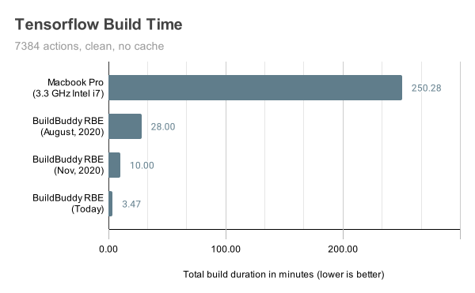
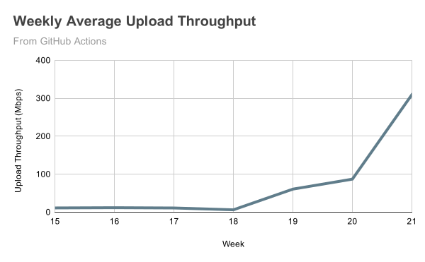

Our mission at BuildBuddy is to make developers more productive. When we released the [first version](https://blog.buildbuddy.io/blog/meet-buildbuddy) of BuildBuddy a little over a year ago, we were blown away by the demand for tools and techniques for speeding up common developer workflows like building, testing, and debugging code. We've been working hard ever since - using our own tools to build the next generation of developer tooling for all.

Today we're excited to announce v2 of BuildBuddy! We've completely revamped our caching and remote build execution infrastructure to give our users and customers the one thing they care about above all else: **speed**.

<!-- truncate -->

When optimizing the performance of a remote build execution system, there are 3 critical bottlenecks: Caching, Sandboxing, and Execution. We've made order of magnitude improvements in each of these areas, bringing clean, uncached build times for [TensorFlow](https://github.com/tensorflow/tensorflow) (7,000+ actions) on BuildBuddy RBE down from 28 minutes last August to just **3.47 minutes** with BuildBuddy v2. This build takes over **4 hours** (250 min) on a 3.3GHz i7 Macbook Pro.

## Caching

The biggest remote build execution bottleneck is right in the name: **remote**. This means we have to ship source files, tools, and other inputs needed to execute the build from the host machine to a remote cluster of build servers over the network.

In BuildBuddy v2, some of the many improvements in this area include:

- Completely revamped caching infrastructure for microsecond read/write latencies
- Improved batch performance for quickly moving 100k+ small files
- Load balancer optimizations to improve large file throughput

For a more in-depth look at optimizing for high throughput and low latency, we highly recommend [this great article from the Dropbox Engineering team](https://dropbox.tech/infrastructure/optimizing-web-servers-for-high-throughput-and-low-latency) which was incredibly helpful in identifying and fixing bottlenecks.

All of these improvements, when taken together, have driven a colossal improvement in both upload and download throughput across file sizes. We have more work to do in this area, but we're really pleased with the results in this release.

## Sandboxing

Once we've got all of the inputs we need to execute an action on a remote executor, the next step is to set up the execution root. One of Bazel's core features is the ability to perform [hermetic builds](https://georgi.hristozov.net/2020/11/01/the-power-of-hermetic-builds). In order to achieve this, we spin up a clean Docker container for each action to execute in. This is similar to Bazel's `docker` [spawn strategy](https://docs.bazel.build/versions/master/remote-execution-sandbox.html).

While this helps ensure that remotely executed actions are hermetic, there is often a trade-off between hermeticity and performance. You can make this trade-off locally using Bazel's different spawn strategies: `sandboxed`, `local`, and `worker`.

When using remote build execution, you typically don't have the ability to make these trade-offs. That's why we've introduced 3 new features that give users back some of that control. By default, actions will still be executed in clean Docker images - but if you specify one of the following execution properties, you can alter that behavior:

- `recycle-runner`: actions will still be executed in a clean execution root - but the executor will re-use an existing docker image from a pool of re-usable containers. This is similar in behavior to Bazel's `sandboxed` execution strategy.
- `preserve-workspace`: actions will re-use an execution root from a pool of re-usable workspaces and only download inputs that have been added or changed since the previously executed action, while cleaning up any outputs. This is similar in behavior to Bazel's `local` execution strategy.
- `persistent-workers`: the executor will use the [persistent-worker](https://docs.bazel.build/versions/master/persistent-workers.html) protocol to communicate with actions that support them. This can help speed up certain build actions that support persist workers (like Java, Scala, Typescript, and others) by 2-4x. This execution property can be applied at the [target level](https://docs.buildbuddy.io/docs/rbe-pools#target-level) for actions that support them. We've also added support for the proposed `persistentWorkerKey` execution property which removes the need for target-level specification. This is similar in behavior to Bazel's `worker` execution strategy.

## Execution

Now that we've got our inputs on the executor, and our execution root set up, our final step is the actual execution.

We've made significant improvements here as well:

- We've upgraded our default executor cluster to run on compute-optimized Intel Cascade Lake machines with up to 3.8 GHz sustained all-core turbo.
- Our Mac executors now run on bare-metal Mac minis, which show huge improvements over the previous [Orka](https://www.macstadium.com/orka) machines we used for I/O intensive workloads.
- Our new caching and auto-scaling infrastructure supports scaling up and down from just a few executors to hundreds of machines depending on load while still supporting the `--remote_download_minimal` flag.
- The groundwork has been laid for what we call **Bring Your Own Executors**. This will allow users to take advantage of BuildBuddy's UI and global caching infrastructure while running their own executor pools.

## Other improvements

While our focus for v2 has been on RBE performance, we've made plenty of other improvements in this release:

- Improved query performance for large customers with 1 million+ invocations
- Added hinted handoff for write failures
- Fetches are now displayed in the results UI
- Timing tab improvements
- Right click to copy downloadable artifact URLs
- Lots and lots of reliability improvements
- Default Xcode version configuration options

We have several big announcements coming in the next few weeks, so stay tuned for more!

As always, we love your feedback - join our [Slack channel](https://slack.buildbuddy.io) or email us at <hello@buildbuddy.io> with any questions, comments, or thoughts.

Happy Building!
