At BuildBuddy, we've been thinking a lot about what it means to build developer infrastructure not just for humans, but for agents. This post, which was adapted from my BazelCon talk, walks through the tools we've built to make building with agents easier and faster.

<!-- truncate -->

Writing code with agents has revolutionized how many developres work, but orchestrating agents has become a job in itself. Ideally, agents would have the tools to operate the build loop themselves.

Say you have a broken build or test you want an agent to fix. A typical flow for an agent looks like this:

1. **Understand** the failure.
2. **Write code** to fix it.
3. **Verify** the fix with a build or test.
4. **Review** the change.
5. And throughout, the process needs to be **secure**.

This post summarizes what we've built for each of these steps. These tools can be configured to use Claude or Codex.

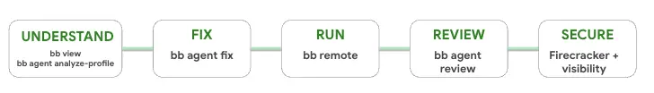

## Understanding failures

### `bb view`

`bb view` pulls build and test logs for an invocation ID.

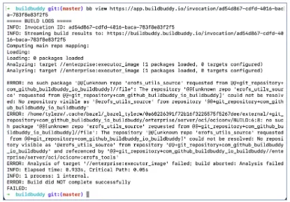

Rather than having to manually copy and paste error messages to an agent, `bb view` lets agents pull build logs themselves. Agents can be taught to use the command via a SKILLS.md file.

```SKILLS.md
---
name: view-build-logs
description: Fetch BuildBuddy invocation logs. Use when a user asks to inspect or debug logs for a specific invocation ID or invocation URL.
---

## Overview

Fetch logs for a BuildBuddy invocation by calling `bb view <invocation-id>`
```

Filters can be applied to return only errors, or only a specific failed test, to limit how much input the agent has to process.

```bash
# Return all logs for the invocation.
$ bb view <invocation-id>

# Only return errors for the invocation.
$ bb view <invocation-id> --errors

# Only return logs for the failed //foo:bar test.
$ bb view <invocation-id> //foo:bar --test_filter=TestBaz
```

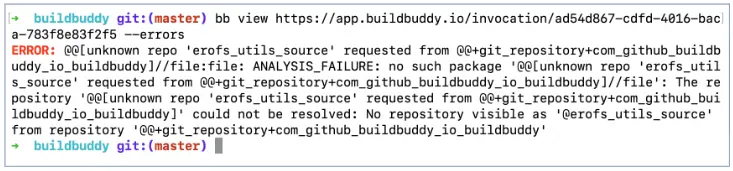

### `bb agent analyze-profile`

In addition to giving an agent build logs, you can also feed it a Bazel timing profile, so that it can evaluate the build's performance and suggest optimizations.

Bazel already collects and reports rich timing data about each build. `bb agent analyze-profile` uses the [ztracing](https://github.com/coeuvre/ztracing) tool to summarize the timing profile and feed it to an agent, so it can interpret where your build spent time and explain what could be optimized to make it faster.

```bash
# Analyze the timing profile for the invocation.
$ bb agent analyze-profile <invocation-id>
```

This command, as well as all other `bb agent` commands, can be configured to use Claude or Codex. The agent `--model` and `--effort` can also be configured.

```bash
$ bb agent --agent=claude --model=claude-opus-5-5 analyze-profile

$ bb agent --agent=codex --effort=high analyze-profile
```

This command can also be triggered from the **Timing** tab in the BuildBuddy UI.

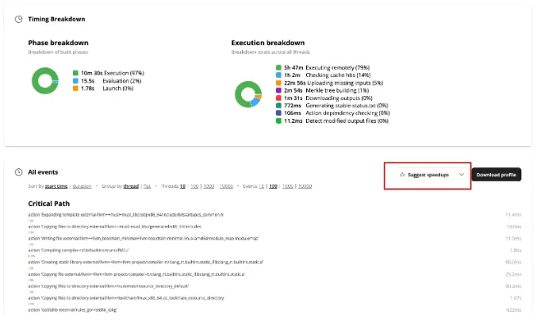

## Verifying fixes

### `bb remote`

After an agent has made a change, it needs to run builds and tests to verify it.

`bb remote` spins up a Firecracker VM that can be used as an agent sandbox. Unlike remote execution, which only runs individual actions on remote executors, `bb remote` runs the entire Bazel command, or any arbitrary bash, on a remote machine.

```bash
# Run a Bazel command on a remote machine.
$ bb remote test //...

# Run a bash command on a remote machine.
$ bb remote --script='echo "Hello, world!"'
```

`bb remote` is especially useful when running multiple agents in parallel that you don't want fighting over local CPU and memory.

Our Firecracker runners are snapshotted for fast startup. After an initial run downloads and installs tools, checks out the git repo, and warms up Bazel's analysis cache, unlimited clones of that warmed-up runner can be created, so all future workloads land on a warm runner and avoid a cold start performance penalty.

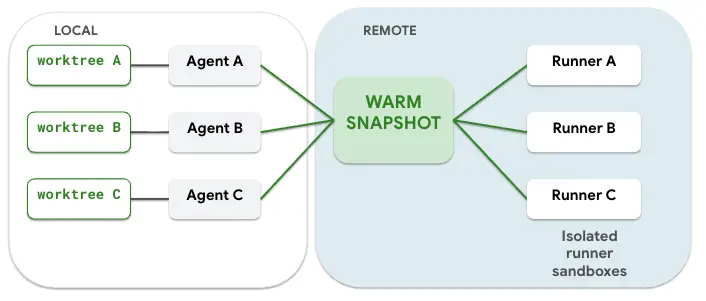

Runner OS, architecture, and container image are configurable, and we offer generous runner sizes (memory, CPU, and disk), which are often necessary for beefy Bazel builds.

```bash
# Configure the OS, architecture, and container image.
$ bb remote --os=darwin --arch=arm64 --container_image=XXX ...

# Request CPU, memory, and disk resources for the runner.
$ bb remote --runner_exec_properties=EstimatedFreeDiskBytes=100GB --runner_exec_properties=EstimatedMemory=32GB ...
```

For more details on Remote Bazel, see the [Remote Bazel docs](/docs/remote-bazel/).

## Closing the loop

### `bb agent fix`

`bb agent fix` is intended to complete the loop. Pass it an invocation ID and it will:

1. Use `bb view` to read the relevant errors and pass them to an agent.
2. Recreate the error on the original commit using `bb remote`.
3. Generate a patch.
4. Validate that the error is fixed with the patch.
5. Create a PR or push a commit with the changes, if the `--push` flag is set.

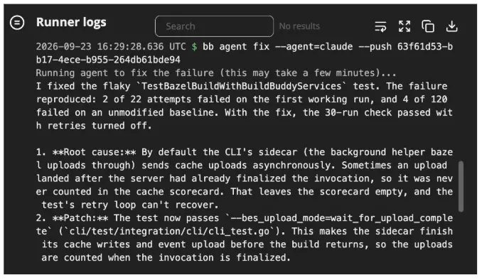

When you don't pass any arguments to the command, `bb agent fix` will find the most recent failing invocation on the git branch that is currently checked out.

You might want to alias `bb agent fix` to `fix` in your bashrc. Now when CI fails on your pull request, you can just type `fix` in your terminal and let your agent take it from there.

```.bashrc
# Pulls the logs for the most recent failing invocation on the same git branch
alias fix="bb agent fix"
```

```bash
$ fix
```

There's also a **Fix** button in the BuildBuddy UI on failed invocations.

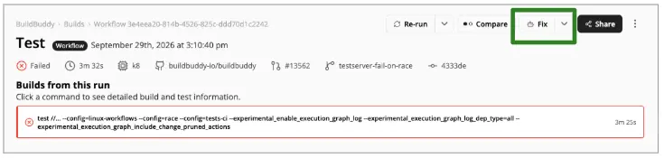
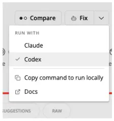

If you have the read-write BuildBuddy GitHub app installed, the button will push a commit containing the fix straight to the branch with the original error.

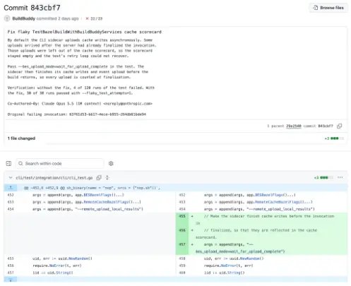

Regardless of the GithHub app you have installed, the remote runner will always upload the patch as an artifact to the invocation. The diff can be viewed directly from the Artifacts tab.

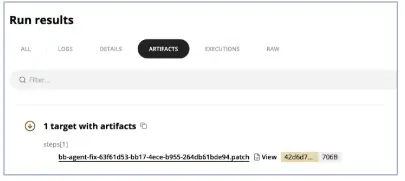
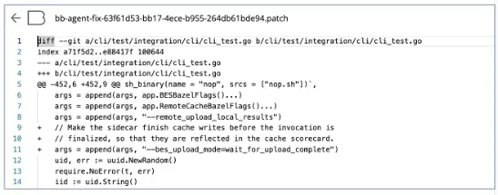

## Reviewing changes

### `bb agent review`

`bb agent review` runs an agent-driven code review and posts feedback inline on GitHub pull requests.

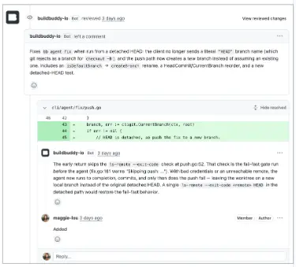

`bb agent review` can be paired with [BuildBuddy Workflows](/docs/workflows-setup/) to trigger automatically whenever a new PR is opened.

```buildbuddy.yaml
actions:
  - name: Code review
    triggers:
      pull_request:
        branches:
          - "*"
    steps:
      - run: bb agent review
```

## Security and visibility

As we give agents more and more autonomy, security and visibility into their actions become increasingly important.

Agent sandboxes like `bb remote` isolate agents in a VM, so they aren't running loose on your local machine, where you might have secrets and credentials lying around. With remote runners, you control and limit which secrets are exposed.

One area we're starting to explore is **network visibility**. All network traffic leaving a VM exits through a single virtual interface on the host. That gives us a convenient place to observe outbound traffic and log the destination IPs a runner connects to.

From there, we can start to:

- Identify new or unexpected destinations
- Generate network-access reports
- Support IP blocklists
- Notify admins when an agent accesses a new IP

This work is still experimental, so if you're interested in this area, let us know so we can prioritize it.

## Try it out

The best way to experience these features is to try them yourself. Download our [CLI](/docs/cli/) and create a free [BuildBuddy account](https://app.buildbuddy.io/) to get started!

Questions or feedback? Reach out on [Slack](https://community.buildbuddy.io/) or at [hello@buildbuddy.io](mailto:hello@buildbuddy.io).
