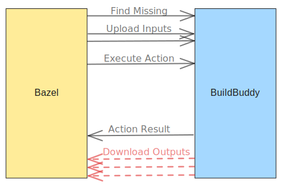

We discovered a bug in Bazel that was causing builds with `--remote_download_minimal` to download all output artifacts.

A fix has been submitted upstream to the Bazel repository and will be included in the Bazel 9.x release. It will also be cherry-picked back to versions 8.2.0 and 7.6.0.

Users on older versions of Bazel can work around this issue by setting `--experimental_remote_cache_ttl` to a large value, such as `10000d`, with some caveats.

<!-- truncate -->

## Introduction

At BuildBuddy, we not only operate a Bazel Remote Cache and Remote Build Execution service, but we can also operate Bazel, the client-side, for you.
This is done through two offerings:

- [BuildBuddy Workflows](/docs/workflows-introduction), which operates as a typical CI system that integrates directly with GitHub.
- [BuildBuddy Remote Bazel](/docs/remote-bazel-introduction), which is a Bazel-in-the-cloud service that allows you to run Bazel builds remotely.

Both of these are built on top of Firecracker MicroVMs, which allows us to take snapshots of the JVM containing Bazel's in-process Analysis Cache and restore it in a new VM in milliseconds.
The snapshots are typically chunked and stored in our Remote Cache, which allows us to share the cache across multiple machines.
This provides a fast and consistent build environment for every build.

To keep typical builds speedy, we strongly encourage our users to use this in conjunction with our Remote Cache and Remote Build Execution features.
This allows us to shift most of the compute demands to a fleet of workers (BuildBuddy Executors) instead of performing them on the MicroVMs.
Coupled with Bazel's Build without Bytes feature through the `--remote_download_minimal` flag, we also skip downloading the output artifacts back to the MicroVM.
The smaller the MicroVMs, the faster we can snapshot, cache, and restore them.
For this reason, we have invested significant effort in tracking and reducing resource usage on the MicroVMs.

## The Symptoms

In recent months, we started to notice that in some of our CI builds, the MicroVMs were downloading a lot of data.
This could reach hundreds of gigabytes according to statistics tracked by our Remote Cache server.

As we heavily utilize the `--remote_download_minimal` flag, the MicroVMs are typically sized with small disks.
With hundreds of gigabytes of data being downloaded, the MicroVMs were running out of disk space, causing builds to fail.

<figure>

<figcaption>Build without Bytes helps skip the unnecessary downloads</figcaption>
</figure>

Despite being able to restore different MicroVM states from our snapshots, we could not consistently reproduce the issue.
After closer inspection of the cache statistics, we narrowed it down to a few key observations:

1. There was little to no discrimination between the output artifacts being downloaded.
   Specifically, a large portion of what was being downloaded were our `go_test` binaries, which are never used because the test actions are always executed remotely in our CI setup.

2. Most of the download requests included `prefetcher` metadata.
   Almost all gRPC requests made by Bazel include special metadata.

   ```proto
   // An optional Metadata to attach to any RPC request to tell the server about an
   // external context of the request. The server may use this for logging or other
   // purposes. To use it, the client attaches the header to the call using the
   // canonical proto serialization:
   //
   // * name: `build.bazel.remote.execution.v2.requestmetadata-bin`
   // * contents: the base64 encoded binary `RequestMetadata` message.
   // ...
   message RequestMetadata {
    ...

    // An identifier that ties multiple requests to the same action.
    // For example, multiple requests to the CAS, Action Cache, and Execution
    // API are used in order to compile foo.cc.
    string action_id = 2;

    // An identifier that ties multiple actions together to a final result.
    // For example, multiple actions are required to build and run foo_test.
    string tool_invocation_id = 3;

    ...

    // A brief description of the kind of action, for example, CppCompile or GoLink.
    // There is no standard agreed set of values for this, and they are expected to vary between different client tools.
    string action_mnemonic = 5;

    // An identifier for the target which produced this action.
    // No guarantees are made around how many actions may relate to a single target.
    string target_id = 6;

    ...
   }
   ```

   Here is an example of what this typically looks like in a normal request:

   ```json
   {
     "action_id": "bd7fc99ea67ef952abe64d72dba270f04afe6424a1703ed12b3c935e13110597",
     "tool_invocation_id": "a3b93bf2-8b16-4a72-b52f-636bc4db47a0",
     "action_mnemonic": "GoLink",
     "target_id": "//some/package/path:mypackage_test"
   }
   ```

   However, there is a special class of request in Bazel called `prefetcher` requests.

   ```json
   {
     "action_id": "prefetcher",
     "tool_invocation_id": "8c2a7238-ce49-4149-8bfb-e7a6020294c2",
     "action_mnemonic": "GoLink",
     "target_id": "//some/package/path:mypackage_test"
   }
   ```

   These are typically observed when an action is about to be executed locally, but some of its inputs were produced by a parent action that was executed remotely.
   In such cases, Bazel would typically issue "prefetch" download requests right after the parent action finishes so that the parent action's outputs can be downloaded to the local machine before the child action starts.
   These requests are often annotated with the `prefetcher` action ID and the target ID of either the parent action or the child action.

   We know that in a typical `go_test` rule, there are a few actions involved:

   ```text
   GoCompilePkg
   GoCompilePkgExternal
   => GoLink
     => TestRunner
   ```

   and in this case, we can see that all four actions were executed remotely, eliminating the need for any local download.

## The Investigation

While the original intention of the `prefetcher` requests was to [support locally executed actions](https://github.com/bazelbuild/bazel/commit/ea4ad30d4e49b83b62df0e10b5abe2faadea7582), we found that over time, Bazel has been using this action ID for other purposes.
For example, if a user were to specify a `--remote_download_regex=` pattern to download specific artifacts, those download requests would also be annotated with the `prefetcher` action ID.

As we dug deeper into the issue, we tried to improve the traceability of prefetch downloads in Bazel with [bazebuild/bazel#25040](https://github.com/bazelbuild/bazel/pull/25040), which was backported to Bazel 8.1.0 and 7.5.0.
This change breaks down the `prefetcher` action ID into `input` downloads and `output` downloads, allowing us to narrow down the code paths that were triggering the unwanted downloads.
In the case of input downloads, the target ID would be the consuming/child action's label, while in the case of output downloads, the producing/parent action label would be used.

Once we had [upgraded to a Bazel version](/blog/bisect-bazel) with this change, we were able to see that the unwanted downloads were coming from the `output` downloads.

## The Bug

We discovered another code path in Bazel that can trigger unexpected downloads: when a blob's TTL expires.

> So... What is a blob's TTL? 🤔

As an artifact-oriented build system, Bazel relies heavily on artifacts existing in its output path to determine if a build is up-to-date.
If an artifact exists and matches the expected result, then Bazel will skip the action that produces the artifact.
However, in a remote build with minimal download, Bazel does not have the artifact locally to validate against and must establish some trust that the artifact was created and stored in the Remote Cache.

Introduced in [bazebuild/bazel#17639](https://github.com/bazelbuild/bazel/pull/17639), this "trust" is added to Bazel by storing the expected Time To Live (TTL) of the artifact in the Remote Cache.
When Bazel executes an action remotely, instead of downloading the outputs referenced inside the ActionResult, it instead just stores the references inside its in-process analysis cache (aka. Skyframe) with an expected TTL that is determined by the flag `--experimental_remote_cache_ttl` (default: 3 hours).
When the TTL expires, instead of checking if the output artifacts are up-to-date remotely, Bazel downloads the entire artifact to disk.
The problem is exacerbated when the Bazel JVM process is long-lived.
Using BuildBuddy Workflows, a typical Bazel JVM process is kept alive for hours, if not days, as we snapshot and restore it together with the Firecracker MicroVM across multiple builds.

We were able to validate this by setting the flag `--experimental_remote_cache_ttl=0s` to eagerly trigger the downloads.

```bash
# Initial build
$ bazel clean && bazel test //cli/... --config=remote-minimal --disk_cache= --experimental_remote_cache_ttl=1d
$ du -h $(bazel info output_base)/execroot | sort -h
...
1.8M	/private/var/tmp/_bazel_fmeum/412888b82b4f18156bc415025cb8faa1/execroot

# Incremental build
$ bazel clean && bazel test //cli/... --config=remote-minimal --disk_cache= --experimental_remote_cache_ttl=1d
$ du -h $(bazel info output_base)/execroot | sort -h
...
1.8M	/private/var/tmp/_bazel_fmeum/412888b82b4f18156bc415025cb8faa1/execroot

# Incremental build with TTL expired
$ bazel clean && bazel test //cli/... --config=remote-minimal --disk_cache= --experimental_remote_cache_ttl=0
$ du -h $(bazel info output_base)/execroot | sort -h
...
640M	/private/var/tmp/_bazel_fmeum/412888b82b4f18156bc415025cb8faa1/execroot
```

We fixed this issue in [bazebuild/bazel#25398](https://github.com/bazelbuild/bazel/pull/25398) by enhancing the logic that validates Bazel's blob metadata and reinforcing it with additional tests.

It's worth noting that there is also a [draft PR](https://github.com/bazelbuild/bazel/pull/23066) by a Bazel community member, [David Sanderson](https://github.com/dws), which allows binding the TTL to the lifetime of the Bazel JVM process.
This could have provided a more robust workaround by avoiding the need to hardcode a long TTL value.
However, it was incomplete and never reviewed.

## The Workaround

As Bazel 8.2.0 and 7.6.0 have not been released yet, users on older versions of Bazel can work around this issue by setting the `--experimental_remote_cache_ttl` flag to a very long value (i.e., `10000d` for 27 years) to effectively disable the TTL feature.

> This effectively disables the TTL mechanism for practical purposes, though we certainly don't recommend running Bazel continuously for decades! 😅

However, there are some caveats to this workaround:
It is possible for the local blob metadata to become out of sync with the Remote Cache.
In particular, at BuildBuddy, we employ an LRU eviction scheme to keep the Remote Cache size under control.
With a longer TTL set by Bazel, Bazel will also trust that our Remote Cache will keep the cache data around for that long, which we do not guarantee.
So, it is possible that the Remote Cache will evict the blob data before the TTL expires, which can cause Bazel to make incorrect assumptions and result in errors such as:

```bash
remote cache evicted: ...
    com.google.devtools.build.lib.remote.common.BulkTransferException: 3 errors during bulk transfer:
        com.google.devtools.build.lib.remote.common.CacheNotFoundException: Missing digest: d0387e622e30ab61e39b1b91e54ea50f9915789dde7b950fafb0863db4a32ef8/17096
        com.google.devtools.build.lib.remote.common.CacheNotFoundException: Missing digest: 9718647251c8d479142d459416079ff5cd9f45031a47aa346d8a6e719e374ffa/28630
        com.google.devtools.build.lib.remote.common.CacheNotFoundException: Missing digest: 785e0ead607a37bd9a12179051e6efe53d7fb3eb05cc291e49ad6965ee2b613d/11504
```

I have documented this problem in detail in our [Troubleshooting RBE Failures docs](https://www.buildbuddy.io/docs/troubleshooting-rbe#cachenotfoundexception-missing-digest).
The TLDR is that you can use a couple of flags together with the TTL flag to mitigate this issue:

```bash
# Set a long TTL to avoid excessive downloads.
# Not needed after Bazel 8.2.0.
# Reference: https://github.com/bazelbuild/bazel/pull/25398
common --experimental_remote_cache_ttl=10000d

# If the Remote Cache evicts the blob data before the TTL expires,
# Bazel will reset itself, dropping all the in-memory metadata before
# retrying the entire build. The value controls how many times Bazel
# would retry before giving up.
#
# Default changed from 0 to 5 since Bazel 8.0.0.
common --experimental_remote_cache_eviction_retries=5
```

We are also improving the reliability of eviction retry via [bazebuild/bazel#25358](https://github.com/bazelbuild/bazel/pull/25358) and [bazebuild/bazel#25448](https://github.com/bazelbuild/bazel/pull/25448) for future Bazel releases.
As a longer-term strategy, we are researching ways to add support for Action Rewinding to Bazel so that missing artifacts can be recreated seamlessly within a single build by re-running the actions that produced them.

## Conclusion

Thanks to BuildBuddy's unique advantage of operating Bazel for our users, we were able to discover a bug in Bazel's `--remote_download_minimal` flag that was causing excessive cache downloads, which is typically tricky to detect and reproduce in traditional CI systems.
Since then, we have submitted a fix upstream to the Bazel repository, dogfooded the workaround in our own CI, and notified major BuildBuddy Workflows users to apply the same change.
Some of our advanced Bazel users were able to cherry-pick the fix into their internal fork of Bazel to benefit from the fix earlier, while most were able to apply the workaround to reduce excessive resource consumption and speed up their builds. 🚀

Major thanks to our teammate Maggie for her help in spelunking the elusive Firecracker MicroVM snapshots and our Bazel expert Fabian for his help in navigating the Bazel codebase and submitting the fix upstream.
