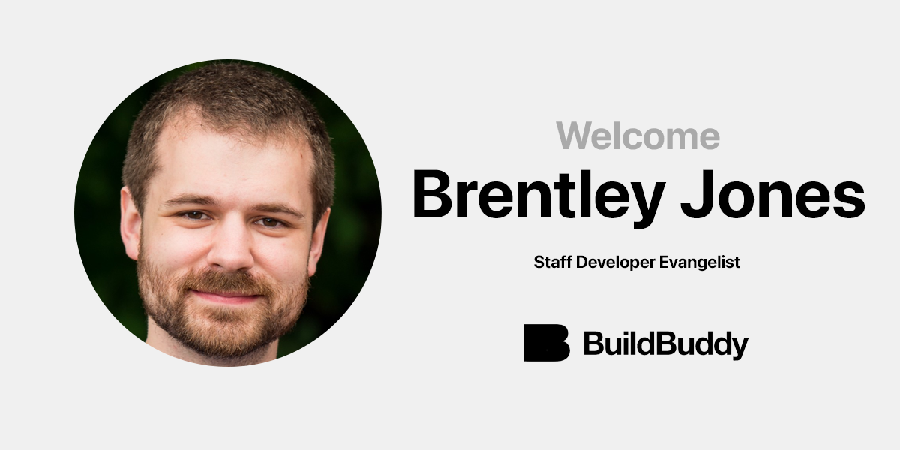

At BuildBuddy, our mission is to bring the world's best developer tools to every company. A big part of that mission involves connecting engineers across different companies, sharing knowledge, and keeping an open dialog on best practices.

That's why we're so excited to share that [**Brentley Jones**](https://brentleyjones.com) has joined BuildBuddy as a Staff Developer Evangelist. His deep experience with Bazel at scale will directly benefit BuildBuddy users and customers.

Brentley is a maintainer of Bazel's [rules_apple](https://github.com/bazelbuild/rules_apple/blob/master/MAINTENANCE.md#maintainers) and [rules_swift](https://github.com/bazelbuild/rules_swift/) which contain Bazel's support for iOS, macOS, Swift, and more. He's also a regular contributor to the [Bazel Slack](https://slack.bazel.build/), and the [Bazel GitHub repo](https://github.com/bazelbuild/bazel/issues?q=author%3Abrentleyjones).

Brentley joins us from Lyft, where he was a Staff Software Engineer on their Client Tooling team. Prior to Lyft, Brentley was an engineer at Target, where he led their migration to Bazel.

We look forward to working alongside Brentley to build the future of developer tools.

Welcome to BuildBuddy, Brentley!
