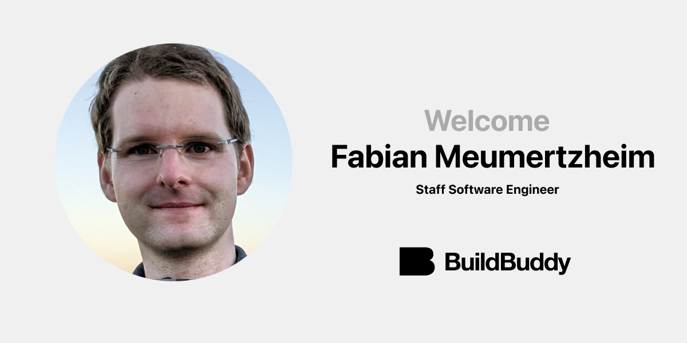

At BuildBuddy, our mission is to bring the world's best developer tools to every company. A core part of that mission involves building around the open source Bazel ecosystem to give every engineer fast, reproducible, and correct builds.

That's why we're so excited to share that [**Fabian Meumertzheim**](https://github.com/fmeum) has joined BuildBuddy as a Staff Software Engineer. His contributions to Bazel have already greatly benefited BuildBuddy users, and Fabian will continue to focus on open source Bazel contributions in his role with us.

Fabian is a maintainer of Bazel's [rules_go](https://github.com/bazelbuild/bazel-central-registry/blob/2836c4967bd3368309ebe1205552c0f8abe7d797/modules/rules_go/metadata.json#L7), [gazelle](https://github.com/bazelbuild/bazel-central-registry/blob/2836c4967bd3368309ebe1205552c0f8abe7d797/modules/gazelle/metadata.json#L7), [rules_jni](https://github.com/bazelbuild/bazel-central-registry/blob/2836c4967bd3368309ebe1205552c0f8abe7d797/modules/rules_jni/metadata.json#L7), and [with_cfg](https://github.com/bazelbuild/bazel-central-registry/blob/2836c4967bd3368309ebe1205552c0f8abe7d797/modules/with_cfg.bzl/metadata.json#L7). He's also a regular contributor to the [Bazel Slack](https://slack.bazel.build/), and has been the most prolific [Bazel contributor](https://github.com/bazelbuild/bazel/graphs/contributors?from=2022-02-01&to=2024-02-01&type=c) over the past couple of years that's not currently employed by Google.

Fabian joins us from [Code Intelligence](https://www.code-intelligence.com/), where he worked on building tools for [fuzz testing](https://en.wikipedia.org/wiki/Fuzzing).

We look forward to working alongside Fabian to build the future of developer tools.

Welcome to BuildBuddy, Fabian!
