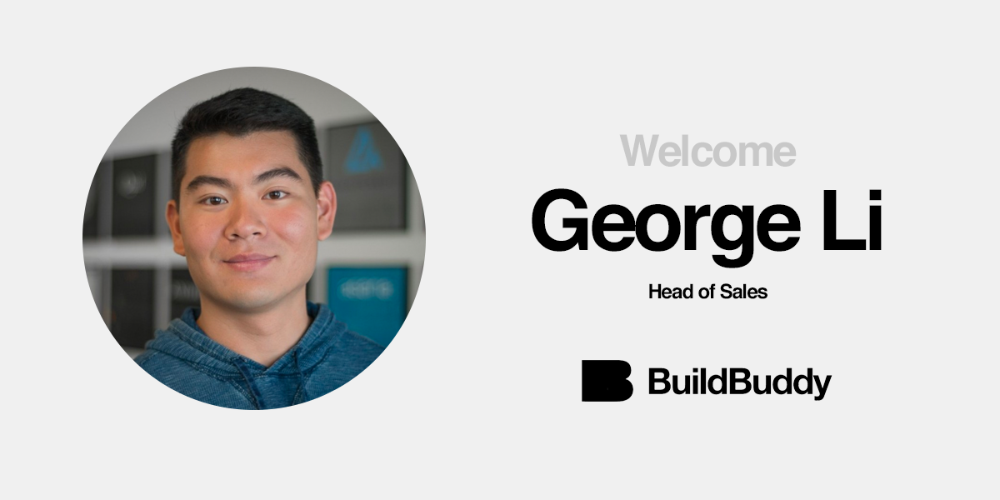

To fulfill our mission of bringing the world's best developer tools to every company, we're building a team that's ready to work with the world's best enterprises. That's why we're excited to share today that [**George Li**](https://www.linkedin.com/in/gli/) is joining BuildBuddy to lead our enterprise sales efforts as our Head of Sales.

George joins us from Looker where he served as Head of APAC Sales Engineering. He joined Google Cloud through their [acquisition](https://techcrunch.com/2020/02/13/google-closes-2-6b-looker-acquisition/) of Looker in February, having helped the company grow to a $2.6B valuation.

We look forward to working alongside George to build the future of developer tools.

Welcome to BuildBuddy, George!
