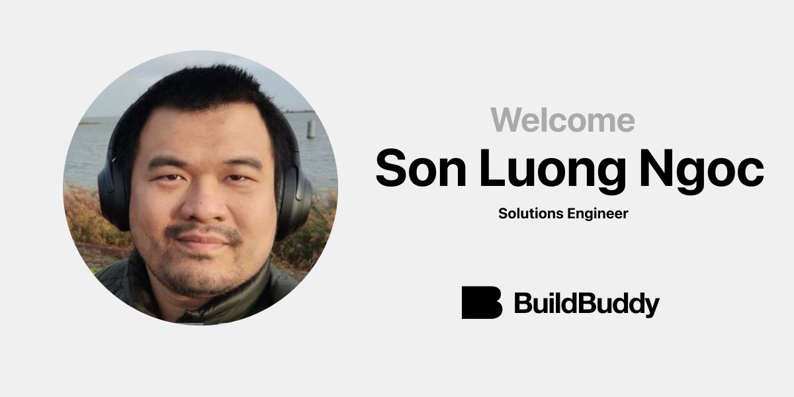

At BuildBuddy, our mission is to bring the world's best developer tools to every company. A big part of that mission involves building a team folks with deep industry experience helping companies build and scale their systems.

That's why we're so excited to share that [**Son Luong Ngoc**](https://www.linkedin.com/in/luongngocson/) has joined BuildBuddy as a Solutions Engineer. His work with Bazel at scale will directly benefit BuildBuddy users and customers.

Son Luong is a contributor to [bazel](https://github.com/bazelbuild/bazel/pulls?q=is%3Apr+author%3Asluongng), [git](http://public-inbox.org/git/?q=sluongng), [rules_go](https://github.com/bazelbuild/rules_go/pulls?q=author%3Asluongng), [rules_docker](https://github.com/bazelbuild/rules_docker/commits?author=sluongng), [bazel-gazelle](https://github.com/bazelbuild/bazel-gazelle/pulls?q=author%3Asluongng), and more. He's also a regular contributor to the [Bazel Slack](https://slack.bazel.build/) and maintains an [incredible blog](https://sluongng.hashnode.dev/) that explains the inner workings of Bazel.

Son Luong joins us from Qarik, where he helped large enterprises with Bazel and scalable build infrastructure. Prior to Qarik, Son Luong was an SRE at Booking.com, where he helped scale their Bazel monorepo.

We look forward to working alongside Son Luong to build the future of developer tools.

Welcome to BuildBuddy, Son Luong!
