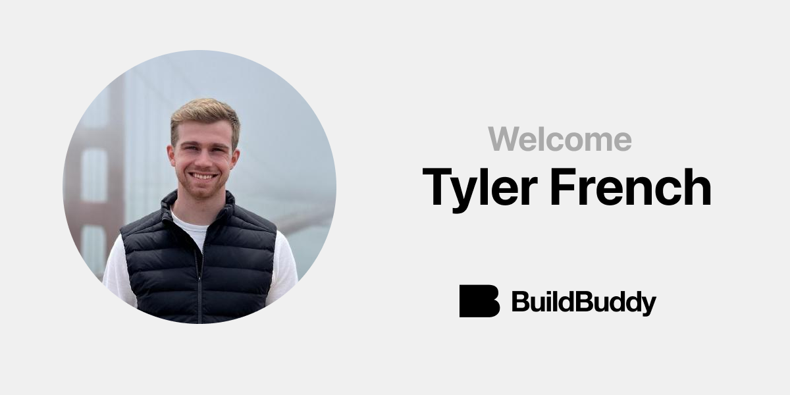

At BuildBuddy, our mission is to bring the world's best developer tools to every company. In order to achieve this mission, we need to build a team that has experience using Bazel at scale. That's why we're so excited to share that [**Tyler French**](https://github.com/tyler-french) is joining BuildBuddy's engineering team.

Tyler joins us from Uber. He's a maintainer of Bazel's rules_go and gazelle repos and has given Bazelcon talks on [Optimizing Gazelle Performance in Uber's Monorepo](https://www.youtube.com/watch?v=6NDnxHFbr6Q) and [How Uber Manages Go Dependencies with Bzlmod](https://www.youtube.com/watch?v=QLbkMdUOI48).

We look forward to working alongside Tyler to build the future of developer tools.

Welcome to BuildBuddy, Tyler!

<!-- truncate -->
