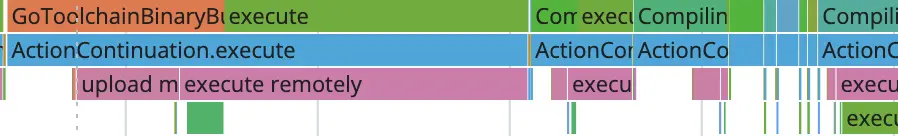

The promise of Bazel is the promise of fast builds. So what do you do if your build was slow? Curse out the developer that convinced your company to migrate to Bazel? Of course not! You’d never do that, right? 🙂

BuildBuddy is here to help. Bazel provides a lot of helpful information to debug slow builds, but it can be overwhelming to know where to look.

<!-- truncate -->

Maybe you ran two builds and you’re surprised the second build ran so slowly, when you’d expected it to be cached. Or maybe you ran one build, and you just want to understand where all the time was spent. Here are some good places to start, with some real-world examples of why our own builds were slow.

This post frequently references the BuildBuddy UI. While most of these steps are
possible without it, it will be a lot more work to find and parse the info from the build event stream yourself.
If you’re not already using it, you can stream build events to our servers for free by
adding the following flags to your builds (more setup docs [here](https://www.buildbuddy.io/docs/cloud)):

`--bes_results_url=https://app.buildbuddy.io/invocation/`

`--bes_backend=grpcs://remote.buildbuddy.io`

Once you’ve added these flags, you’ll see a line like `Streaming build results to: https://app.buildbuddy.io/invocation/XXX` in your build logs. If you follow that link to our UI, you’ll have access to many of the features discussed below.

## 1) Am I using the right set of flags?

⭐ Bazel is very configurable with a huge selection of flags, so a good gut check is to verify which flags have been applied to your build. Here are a couple you may want to add (or verify have been set) to speed up your builds:

- `--nolegacy_important_outputs`
  - This flag can significantly reduce the payload size of the uploaded build event stream by eliminating duplicate file references.
- `--remote_build_event_upload=minimal`
  - This flag can significantly reduce network bandwidth by not uploading blobs tagged with no-cache to the cache.
- `--remote_download_outputs`
  - This flag can significantly reduce network bandwidth by not downloading intermediary build artifacts from the cache.
- `--experimental_remote_cache_async`
  - This flag can improve remote cache performance by enabling cache I/O in the background.
- `--noremote_upload_local_results`
  - This flag can reduce uploads by not uploading locally executed action outputs to the remote cache. This will reduce the cache hit rate for future runs, but can be desirable if upload speed is constrained (due to a poor network connection, for example).
- `--remote_cache_compression`
  - This flag can improve remote cache throughput by compressing cache blobs.
- `--digest_function=BLAKE3`
  - This flag can improve the performance of digest calculation of large files by using a faster hashing algorithm. This is available for Bazel 6.4+.
- `--jobs`
  - This flag can improve execution throughput by allowing more actions to execute in parallel. We recommend starting with `--jobs=50` and working your way up from there.

To set these flags on every build by default, you can set them in a [.bazelrc file](https://bazel.build/run/bazelrc). We check our .bazelrc into git, so that all our developers use standardized build options.

```txt title=".bazelrc"
# Example of a .bazelrc that will configure every Bazel build to use these flags
common --nolegacy_important_outputs
common --remote_build_event_upload=minimal
...
```

⭐ The details on the top of our UI are helpful for a quick sanity check here. If I’m comparing two builds, my first step will often be to compare the details on the top of the invocation pages and verify they’re exactly the same.

For example, once I was inspecting a slow build, and realized I’d forgotten to set `--remote_download_minimal`. The build was downloading a lot more artifacts from the cache than usual, which explained the performance hit.


_The top invocation does not have –remote_download_minimal enabled, which could negatively impact performance._

## 2) Did my build use a warm Bazel instance?

To dive deeper into your build, the timing profile holds a wealth of information about where Bazel spent time during the invocation.


⭐ There’s a lot of information here, but a good starting point is to look into the [analysis phase](https://bazel.build/reference/glossary#analysis-phase) because a cold Bazel instance can frequently explain a slow build.

The first time you run a Bazel build, it will start a local Bazel server. That server will initialize and load dependencies, as well as build the dependency graph for your project. Especially for larger projects, this can take on the order of minutes.

Subsequent builds can reuse that same local Bazel server, as long as it has not been killed. They will be much faster because they can reuse much of the computation done during that first, slower build.

The timing profile contains sections with names like `skyframe evaluator 0` and `skyframe evaluator execution-0`.
The `evaluator` sections represent the time spent evaluating the build graph and
determining the tasks that need to be executed, while the `evaluator execution`
sections represent time actually spent executing actions (the total number of these
sections is determined by the `--jobs` option).

To understand where time was spent during analysis, we want to focus on the `evaluator` sections (you may need to scroll to the bottom of the timing profile to see them).


In this sample build, you can see that a lot of time and compute were spent during the analysis phase. You can hover over each event in the timing profile to get more information.


For example, we can see that a decent amount of time is spent on actions related to npm installation.


We also see a good number of actions related to setting up gazelle.

You may also see actions labeled with `package creation` - which refers to pulling external dependencies specified in your WORKSPACE file - or `MerkleTree.build` - which refers to building the dependency graph.

The more actions of this type that you see, the more likely your build did not hit a warm Bazel instance and spent a lot of time in the analysis phase. To understand why, you may want to consider:

- Has the analysis cache been initialized on your machine?
  - Even if you’re using a remote cache and remote execution, the analysis phase is run on the machine that kicked off the build - i.e. if you’re running a build on your laptop, the analysis phase is running on your laptop, regardless of where remote execution is occurring. Have you run a Bazel build for this repository on this machine yet?
- Was the in-memory state on your machine lost?
  - The analysis cache is held completely in memory in the Bazel server process, so if your machine loses its in-memory state, the cache will be lost. For example, this could happen if your machine restarts, or if you manually invalidated the analysis cache by running `bazel clean`.
- Did Bazel discard its analysis cache due to a configuration change?
  - To avoid corruption, Bazel will discard the analysis cache if a build has a different build option or configuration from previous builds. When this happens, you’ll see a log line like `WARNING: Build option --compilation_mode has changed, discarding analysis cache`.
  - For example if you use the flag `--compilation_mode fastbuild` on a series of builds and `--compilation_mode opt` on a later build, you will notice that the later build is slower because the server will have discarded the analysis cache and must restart the analysis phase from scratch.

If you’re using Bazel in CI, you may be frustrated by the lack of good options to save the analysis cache between runs on remote CI runners. Our CI solution, [BuildBuddy Workflows](https://www.buildbuddy.io/blog/meet-buildbuddy-workflows/), preserves the analysis cache by cloning CI runners to guarantee that the in-memory state is not lost. Check out our [BazelCon](https://www.youtube.com/watch?v=YycEXBlv7ZA&list=PLxNYxgaZ8Rsefrwb_ySGRi_bvQejpO_Tj&index=10) talk for more technical details.

⭐ If your build was slow due to fetching external dependencies, you may want to investigate the [repository cache](https://sluongng.hashnode.dev/bazel-caching-explained-pt-3-repository-cache). During a clean build, Bazel will fetch the external dependencies referenced in your WORKSPACE file and store the downloaded blobs in the repository cache. If the dependencies have not changed between builds, Bazel will not need to re-download them.

The repository cache is configured by default and its location can be set with `--repository_cache`. It is not wiped with `bazel clean`, but will get wiped with `bazel clean --expunge`.

⭐ You may also want to consider how many threads are working on analysis / dependency fetching. Allocating more CPUs to the build and parallelizing it further may result in performance gains.

In the example images included above, you can see that only two threads are working on analysis. Bazel tries to determine an appropriate number of threads based on the available CPU cores on your machine, but you can manually set it with the `--jobs` flag.

## 3) Does Bazel have enough memory?

Famously, Bazel loves memory. This section is short and sweet, but describes a common problem we’ve seen with our customers.

⭐ If Bazel doesn’t have enough memory, it will evict parts of the analysis cache. As described in the previous section, this can significantly slow down builds. If you notice a lot of `MerkleTree.build` actions even when you’re reusing a warm Bazel instance or see heavy garbage collection activity in the timing profile, you may want to increase the amount of RAM available to Bazel by increasing the JVM heap size with `--host_jvm_args`. For example, to increase the JVM heap size to 6GB, you would set `--host_jvm_args=-Xmx6g`.

The `--host_jvm` is considered a startup option, and should appear before the Bazel command (non-startup options, like the `--jobs` flag, go after the bazel command). Ex. `bazel --host_jvm_args=-Xmx6g build --jobs=50`.


_The timing profile for this sample build showed heavy garbage collection activity. Increasing the heap size for future builds helped reduce memory pressure and bring down build times._

## 4) Are your builds successfully sharing cached artifacts?

One of Bazel’s popular selling points is that it caches build outputs. For example, if Bazel compiles source code for one build, it will save the compiled binaries in the cache. Future builds can directly download these compiled binaries, instead of having to recompile the code to generate them.

Taking advantage of this caching behavior unlocks many of Bazel’s performance benefits. If your builds are not successfully sharing cached artifacts, this could explain your slow build times.

Building targets happens during the execution phase. To inspect this phase in more detail, you can find an execution-related thread in the timing profile (i.e. one with a name like `skyframe evaluator execution-X`).


The top row has information about which actions were run - for example `Compiling absl/container/internal/raw_hash_set.cc`.

The bottom rows contain more detailed breakdowns on what actions are being executed. In the example above, we see multiple `download outputs` sections. That indicates this build has a lot of remote cache hits, because it’s able to download the outputs from the cache, as opposed to having to execute the action itself to generate those outputs.

In the following example however, you can see multiple `upload missing input` and `execute remotely` actions. This indicates the cache does not have the necessary inputs, so the build must first upload them. Of course this adds time to the build, especially depending on the size of the input files.



If this is the first time you’ve built this target, it makes sense that you’d need to upload its inputs to the remote execution environment and execute it. But this may be surprising if you’ve run multiple builds already, and you’d expected this target to be cached.

⭐ To get more information on why a target was not cached, check out the Cache tab in the UI.


The top of the page contains helpful summary details about the build. In this example, the build uploaded and downloaded ~30GB of data, and had a large number of action cache misses. These could all explain why it took a while to run.

For more details on why a specific action wasn’t cached, you can look in the `Cache requests` table at the bottom of the Cache tab. This is especially helpful if you’re comparing two builds, and you want to understand why an action from the first build wasn’t reusable by the second build.

First, look for an action in your second build you’d expected to be cached from the first build. You can filter for `AC Misses` in the table and then arbitrarily pick one.


If you click on the row in the table, it will bring you to the `Action details` page. For an action to be cacheable between two builds, most of the information on this page - like inputs, arguments, environment variables, and platform properties - must match.


For example, these actions have different digests, so are not shareable between builds. In trying to understand why, we might first check whether they have the same inputs. The inputs are color-coded to make comparing them easier, and we can see that they are in fact the same across builds. Accordingly, the input root digest is the same between the two builds, as we’d expect.

In this case, the difference in digest was due to a difference in platform properties. These actions were built on different container images.

If you notice something similar with your builds, you may want to check the configuration of each build.

- Is there a difference in the .bazelrc that might be applying different configuration to your builds?
- Did your BUILD file change between runs?

These changes could all increase future build times.

For more examples of how you can use the cache requests card to debug slow builds, check out this [blog post](https://www.buildbuddy.io/blog/bazel-remote-cache-debugging/).

## 5) Was there a change in my project that could explain increasing build times?

Sometimes, increased build times are a result of deeper, more structural problems at the project level. These problems can’t be fixed by changing a configuration flag; they point to a problem in the code, such that no matter how you configure your builds, your code will not get built efficiently.

The BuildBuddy trends page can help highlight longer term changes in build times. The trends page contains graphs about every build streamed to BuildBuddy (yes, you really can query every single build). There are graphs on the number of builds, build time percentiles, and cache hits, for example.


In this example, you can see that there are some spiky P99 build times (even P90 build times). Between the weeks of August 30 and September 13, for example, p99 build times increased from ~20min to ~40min.

⭐ The `drilldown` tab is helpful in finding similarities between slow builds. You can highlight a cluster of slow builds, and the page will update to show you common dimensions between those builds.


In the example above, we highlighted a series of slow builds in green in the top right corner of the heat map. In the `Drilldown dimensions` tab, characteristics of the highlighted builds are shown in green, while characteristics of non-highlighted builds (i.e. the builds that were faster) are shown in purple.

You might notice that there’s a big disparity between the two groups of builds in the `pattern` section.


75% of the slow builds matched the pattern for `Baremetal tests`, even though only 13.8% of builds matched that pattern in the baseline.

If you click on that large green bar in the pattern graph, the drilldown page will add a new filter for only that pattern. It will also list all invocations matching that pattern, making it easy to click through the slow builds to look for common themes.


After we clicked through a couple of these invocations, it became obvious that the problem was a flaky test. This caused our CI workflows to rerun the test target multiple times, which significantly slowed them down.

If you notice a similar slowdown in your builds, you should try to understand the root cause.

- Did some change make your project less hermetic?
  - If an action contains a timestamp or some other random value (like a build ID), it will reduce cache hits and increase execution time.
- Does your project have a build bottleneck?
  - If many targets depend on a component that is frequently changed, every time that component is changed, it will invalidate a lot of the build graph and a lot of targets will have to be rebuilt. If this describes your repo, you may want to refactor that central component to have a more stable external API.

Watch our BazelCon presentation demoing the Drilldowns tab [here](https://www.youtube.com/watch?v=37C5zvQHnZI).

## Happy debugging!

While these steps may seem basic to more sophisticated Bazel users, we hope they’re a helpful starting point to debug slow builds. And of course, if you need help understanding a more complex problem (or just want to give us feedback on this post), we’re always happy to help. Send us a message on our Slack channel or email us at hello@buildbuddy.io.
