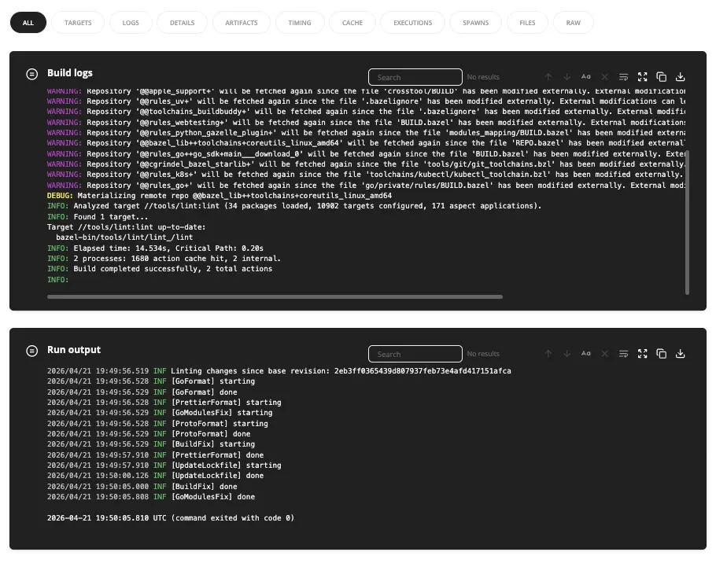

In addition to build logs, you can now use the [`bb` CLI](https://buildbuddy.io/cli) to stream `bazel run` executable output to our servers and view live-updating run logs from the UI.



This gives you a durable record of executable output, making it easy to share logs with teammates, or letting you monitor runs while away from your terminal.

To use it:

```bash
bb run //app:server --stream_run_logs
```

By default, if streaming fails, the executable will continue to run. To fail the command immediately, use `--on_stream_run_logs_failure=fail`.
