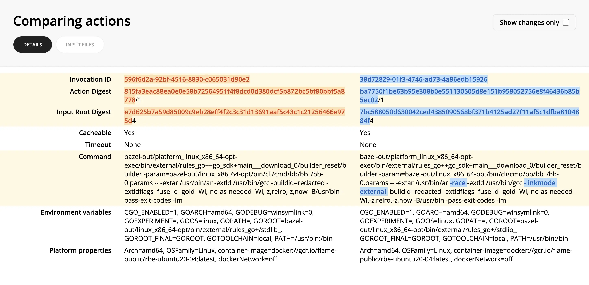

The Compare Actions view allows you to diff two actions side-by-side.

This can help pinpoint why two seemingly similar actions produced different results or didn't result in a cache hit.

To use Compare Actions:

1. From an invocation link, you can find the desired action either in the `Cache` or `Remote Execution` tabs.
1. Click through to the Action Details view.
1. Click **Compare -> Select for comparison** in the top right corner.
1. Find the other action you want to compare it against.
1. Click **Compare -> Compare with selected** in the top right corner of the second action.
