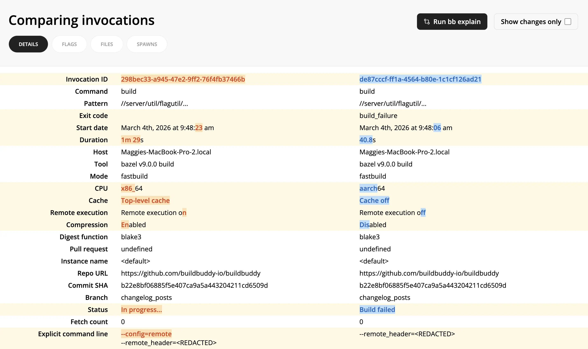

The Compare Invocations view allows you to diff two invocations side-by-side.

It can help debug why two builds produced different results by showing exactly what changed: different flags, startup options, cache/remote execution settings, status, and more.

To use Compare Invocations:

1. From one invocation link, select **Compare -> Select for comparison** in the top right corner.
2. From another invocation link, select **Compare -> Compare with selected**.
3. For even more details on differences between the two invocations, click the **Run bb explain** button on the Compare Invocations page.
