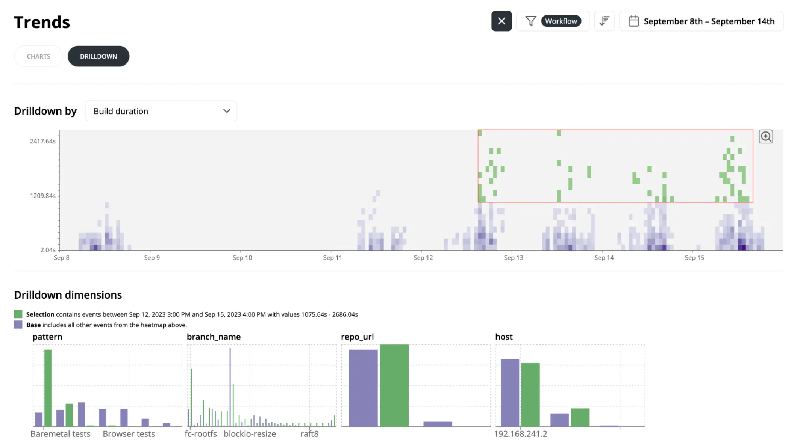

The Trends Drilldown view displays heatmaps of build and execution metrics over time. It can help isolate why a subset of builds is slower or failing more often.

You can select a region of outliers on the heatmap, and Drilldowns will compare that selection against the baseline across dimensions like branch, pattern, and tag.

This makes it easier to spot common characteristics of problematic builds.

Available on the sidebar under **Drilldowns**.
